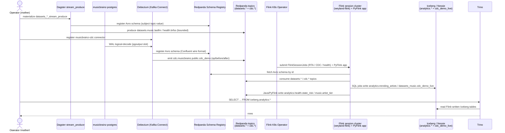

# Demo — Streaming + CDC end-to-end (produce / Debezium → Redpanda → Flink → Iceberg → Trino)

> **Pending live end-to-end validation run.** Every command below is real and pulled from the component demos it
> threads, but this cross-system walkthrough has **not** yet been executed straight through against live infra.

The streaming tier walked from source to queryable lakehouse in one arc. Two producers feed Redpanda — a
**bounded** Avro replay and a **continuous** WAL tail — and Flink's four jobs stream-process both, with the SQL
jobs writing Iceberg on the same Nessie catalog Trino reads. It threads:

1. **[streaming.md](streaming.md)** — the Dagster `datasets_<domain>_stream_produce` asset replays silver Parquet
   as Avro into `datasets.<domain>.<dataset>` (Confluent wire format, schema registered).
2. **[cdc.md](cdc.md)** — Debezium tails `musicbrainz-postgres` `public.cdc_demo` via a logical-replication slot
   and emits the envelope to `cdc.musicbrainz.public.cdc_demo`.
3. **[flink.md](flink.md)** — the four Flink jobs (RTA / CDC→lakehouse / health / PyFlink) consume those topics
   and write Iceberg `analytics.*` + `datasets_music.cdc_demo_live` and Kafka `analytics.*`.

Nothing here is new mechanism — it is the seam between three demos made explicit. Read each for per-step detail;
this file is the connective tissue.

## Sequence diagram

From [../diagrams/flow-e2e-streaming-cdc.md](../diagrams/flow-e2e-streaming-cdc.md):



## Prerequisites

The union of the three component demos' prerequisites:

- **Redpanda** — pod `redpanda-0` (ns `data-mesh`), Kafka `:9092`, schema registry `:8081`. Console at
  `https://redpanda.weyland.lab` (forward-auth).
- **Dagster** — `https://dagster.weyland.lab`, code pod `deploy/dagster-user-code` (ns `weyland`), env
  `REDPANDA_BOOTSTRAP` + `SCHEMA_REGISTRY_URL`. Silver Parquet present for the stream-allow datasets.
- **Kafka Connect** Debezium worker (`deploy/kafka-connect`, ns `data-mesh`, REST `:8083`) with the Confluent Avro
  converter.
- **musicbrainz-postgres** (`musicbrainz-postgres.data-mesh.svc:5432`, db `musicbrainz_db`, PG18) prepared for
  CDC: `wal_level=logical`, `max_slot_wal_keep_size=4GB`, `public.cdc_demo` at `REPLICA IDENTITY FULL`. Secret
  `musicbrainz-postgres-secret`.
- **Flink** — Flink K8s Operator healthy; session cluster `weyland-flink` (ns `data-mesh`) `READY`, UI
  `https://flink.weyland.lab`; `flink-jars` (nginx) serving `sql-runner.jar` + `health-job.jar`; History Server
  `https://flink-history.weyland.lab`; PyFlink image `weyland-flink-py:local`.
- **Nessie / Iceberg** (`nessie.data-mesh.svc:19120`, ref `main`) + **MinIO** for checkpoints (`s3://warehouse/_flink`).
- **Trino** — `trino.data-mesh.svc:8080` reads the Flink-written Iceberg.
- `kubectl` runs on **mother** (`emangini@mother`).

## UI walkthrough

**Step 1 — produce both sources.**
1. **Bounded replay** — `https://dagster.weyland.lab` → Assets → `datasets_music_stream_produce` → **Materialize**
   (also produces `datasets.health.brfss` via the health asset). Metadata reports `topics_produced` +
   `events_total`.
2. **CDC** — no UI to register; use the REST call in the CLI section. Then `https://redpanda.weyland.lab` →
   Topics → **`cdc.musicbrainz.public.cdc_demo`** → Messages shows the initial snapshot (`op=r`) then `op=c/u/d`.
3. Browse **`datasets.music.lastfm`** in Console (decoded Avro) and the registered subjects under Schema Registry.

**Step 2 — stream-process with Flink.**
4. Open `https://flink.weyland.lab` (JobManager UI). Running Jobs shows `cdc-cdc-demo-live` and
   `health-state-risk` as `RUNNING`; bounded jobs (RTA, PyFlink) appear while running then move to History.
5. Click a job → **Overview** (records in/out per vertex), **Checkpoints**, **FlameGraph**. Completed bounded
   jobs are browsable at `https://flink-history.weyland.lab/jobs/overview`.

**Step 3 — query the result.**
6. Query the Flink-written Iceberg tables in Trino (CLI below) — `analytics.trending_artists` (RTA) and
   `datasets_music.cdc_demo_live` (CDC upsert mirror).

## CLI walkthrough

Kubectl runs on **mother**.

**Step 0 — cluster health:**
```
[mother] kubectl -n data-mesh exec redpanda-0 -- rpk cluster health
[mother] kubectl -n data-mesh get flinkdeployment,flinksessionjob
```

**Step 1a — produce the bounded Avro replay** (RTA + PyFlink source, health source):
```
[mother] kubectl -n weyland exec deploy/dagster-user-code -- dagster asset materialize -m weyland_pipeline --select "datasets_music_stream_produce"
[mother] kubectl -n data-mesh exec redpanda-0 -- rpk topic consume datasets.music.lastfm --num 1
```
> `TODO: verify` the exact in-pod `dagster asset materialize` invocation (module flag = code-location name
> `weyland_pipeline`) — carried from [streaming.md](streaming.md).

**Step 1b — register the CDC connector and mutate the source** (the runbook's exact escaped REST call):
```
[mother] PW=$(kubectl -n data-mesh get secret musicbrainz-postgres-secret -o jsonpath='{.data.POSTGRES_PASSWORD}' | base64 -d)
[mother] jq -n --arg pw "$PW" '{name:"musicbrainz-cdc",config:{"connector.class":"io.debezium.connector.postgresql.PostgresConnector","database.hostname":"musicbrainz-postgres.data-mesh.svc.cluster.local","database.port":"5432","database.user":"postgres","database.password":$pw,"database.dbname":"musicbrainz_db","topic.prefix":"cdc.musicbrainz","plugin.name":"pgoutput","slot.name":"debezium_cdc","publication.name":"debezium_pub","publication.autocreate.mode":"filtered","table.include.list":"public.cdc_demo","snapshot.mode":"initial","tombstones.on.delete":"false"}}' | kubectl -n data-mesh exec -i deploy/kafka-connect -- curl -s -XPOST -H "Content-Type: application/json" --data-binary @- localhost:8083/connectors
[mother] kubectl -n data-mesh exec deploy/kafka-connect -- curl -s localhost:8083/connectors/musicbrainz-cdc/status
[mother] kubectl -n data-mesh exec deploy/musicbrainz-postgres -- psql -U postgres -d musicbrainz_db -c "INSERT INTO public.cdc_demo (id, note) VALUES (1, 'hello cdc');"
```
> `TODO: verify` the `public.cdc_demo` column list + the musicbrainz-postgres workload name (`deploy/` vs `sts/`)
> — carried from [cdc.md](cdc.md). Adjust the `INSERT` columns to the real schema.

**Step 2 — submit / confirm the Flink jobs:**
```
[mother] kubectl apply -f ~/flink-rta-sessionjob.yaml   # B141: no longer in the repo, the manifest lives in runbooks/flink.md
[mother] kubectl -n data-mesh get flinksessionjob rta-trending -o jsonpath='{.status.jobStatus.state}{"\n"}'
[mother] kubectl -n data-mesh get flinksessionjob cdc-cdc-demo-live -o jsonpath='{.status.jobStatus.state}{"\n"}'
```

**Step 3 — query the Flink-written Iceberg in Trino:**
```
[mother] kubectl -n data-mesh exec deploy/trino-coordinator -- trino --execute "SELECT window_start, artist_name, plays, listeners FROM iceberg.analytics.trending_artists ORDER BY plays DESC LIMIT 20"
[mother] kubectl -n data-mesh exec deploy/trino-coordinator -- trino --execute "SELECT count(*) FROM iceberg.datasets_music.cdc_demo_live"
```

The Kafka-sink jobs (health, PyFlink) land in topics rather than Iceberg — confirm they too:
```
[mother] kubectl -n data-mesh exec redpanda-0 -- rpk topic consume analytics.health.state_risk --num 8 --offset start -f '%v\n'
```

## Expected result

- **Produced:** `datasets.music.lastfm` (3 partitions, capped at 100k, key `user_id`) + `datasets.health.brfss`
  populated; `cdc.musicbrainz.public.cdc_demo` carries the snapshot (`op=r`) then one event per DML
  (`op=c/u/d`); subjects registered in the schema registry.
- **Processed:** `cdc-cdc-demo-live` + `health-state-risk` `RUNNING` continuously; RTA + PyFlink run bounded to
  `FINISHED` and archive to the History Server.
- **Landed:** `iceberg.analytics.trending_artists` populated (1-min tumbling windows all close on the bounded
  replay); `iceberg.datasets_music.cdc_demo_live` mirrors `public.cdc_demo` inserts/updates/deletes via Iceberg v2
  upsert; `analytics.health.state_risk` (~95k records) + `analytics.music.artist_tier` (~22.5k artists).
- **Queried:** Trino returns the RTA leaderboard and the CDC mirror row count — the arc's endpoint.

## Cleanup / teardown

Each leg cleans up per its own demo. The continuous CDC + health jobs are left running as the live demo.

Remove the CDC connector **and drop its slot** (deleting the connector does not — the slot keeps retaining WAL):
```
[mother] kubectl -n data-mesh exec deploy/kafka-connect -- curl -s -XDELETE localhost:8083/connectors/musicbrainz-cdc
[mother] kubectl -n data-mesh exec deploy/musicbrainz-postgres -- psql -U postgres -d musicbrainz_db -c "SELECT pg_drop_replication_slot('debezium_cdc');"
[mother] kubectl -n data-mesh exec deploy/musicbrainz-postgres -- psql -U postgres -d musicbrainz_db -c "DROP PUBLICATION IF EXISTS debezium_pub;"
[mother] kubectl -n data-mesh exec deploy/musicbrainz-postgres -- psql -U postgres -d musicbrainz_db -c "DELETE FROM public.cdc_demo WHERE id = 1;"
```

Reset the Flink-created data (RTA Iceberg + the Kafka analytics topics) and tear down the run-once PyFlink app:
```
[mother] kubectl -n data-mesh delete flinkdeployment flink-pyflink --ignore-not-found
[mother] kubectl -n data-mesh exec deploy/trino-coordinator -- trino --execute "DROP TABLE IF EXISTS iceberg.analytics.trending_artists"
[mother] kubectl -n data-mesh exec redpanda-0 -- rpk topic delete analytics.health.state_risk analytics.music.artist_tier cdc.musicbrainz.public.cdc_demo
```
Stop the continuous jobs with `kubectl -n data-mesh delete flinksessionjob cdc-cdc-demo-live health-state-risk`.
Leaving the `datasets.*` topics in place is harmless — re-materializing the asset re-produces the capped replay.
