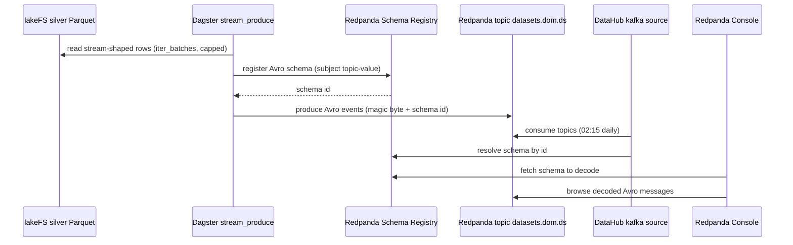

# Demo — Redpanda streaming (Avro producer + Schema Registry)

Replays stream-shaped silver datasets as **Avro events** into Redpanda topics, registering each schema in the
broker's built-in Schema Registry. The Dagster asset `datasets_<domain>_stream_produce` reads capped batches from
lakeFS silver Parquet and produces to `datasets.<domain>.<dataset>` in **Confluent wire format** (magic byte +
schema id) — so Redpanda Console, DataHub, and any standard Avro consumer decode the messages against the shared
registry. This is the bounded "Avro in motion" demo (loaded: lastfm, big_five, brfss, nhis). Runbook:
[../runbooks/streaming.md](../runbooks/streaming.md). Diagram:
[../diagrams/flow-streaming.md](../diagrams/flow-streaming.md).

## Sequence diagram



## Prerequisites

- **Redpanda** single-node StatefulSet (pod `redpanda-0`, ns `data-mesh`), `--overprovisioned` — Kafka `:9092`,
  schema registry `:8081`, http-proxy `:8082`, admin `:9644`. Sidecar OFF, RF=1 everywhere.
- **Redpanda Console** at `redpanda.weyland.lab` (forward-auth) for decoded browse.
- **Dagster** (`dagster.weyland.lab`) with the `weyland_pipeline` code location (`dagster-user-code`, ns
  `weyland`) — env `REDPANDA_BOOTSTRAP` + `SCHEMA_REGISTRY_URL`.
- **lakeFS silver** Parquet for the stream-allow datasets present in the `warehouse`/repo (`main` branch).

## UI walkthrough

1. **Trigger the producer** — `https://dagster.weyland.lab` → Assets → `datasets_music_stream_produce` (in the
   `datasets_music_stores` group, runs in the hydrate job) → **Materialize**. Run metadata reports
   `topics_produced` + `events_total`. lastfm replays with key `user_id`, capped at 100k.
2. **Browse the topic** — `https://redpanda.weyland.lab` → Topics → **`datasets.music.lastfm`** → Messages. The
   Console decodes each Avro record (raw `rpk` would show binary).
3. **Inspect the schema** — Console → Schema Registry → subject **`datasets.music.lastfm-value`**.
4. **Consumer group / partitions** — Console shows 3 partitions; DataHub's `kafka` source (subject
   `^datasets\..*`) catalogs the topic + schema on the 02:15 daily schedule.

## CLI walkthrough

Kubectl runs on **mother** (`emangini@mother`).

```
[mother] kubectl -n data-mesh get pod redpanda-0
[mother] kubectl -n data-mesh exec redpanda-0 -- rpk cluster health
```

Trigger the producer (UI is the reliable path; CLI equivalent):

```
[mother] kubectl -n weyland exec deploy/dagster-user-code -- dagster asset materialize -m weyland_pipeline --select "datasets_music_stream_produce"
```

`TODO: verify` the exact in-pod `dagster asset materialize` invocation (module flag = code-location name
`weyland_pipeline`). Normal cadence is the Dagster hydrate job, not a standalone materialize.

Inspect topics, messages, schemas:

```
[mother] kubectl -n data-mesh exec redpanda-0 -- rpk topic list
[mother] kubectl -n data-mesh exec redpanda-0 -- rpk topic consume datasets.music.lastfm --num 1
[mother] kubectl -n data-mesh exec redpanda-0 -- curl -s localhost:8081/subjects
[mother] kubectl -n data-mesh exec redpanda-0 -- curl -s localhost:8081/subjects/datasets.music.lastfm-value/versions/latest
```

## Expected result

- Topic `datasets.music.lastfm` exists (3 partitions, RF=1), populated up to the dataset cap (lastfm = 100k
  events, key `user_id`).
- Subject `datasets.music.lastfm-value` registered in the schema registry (one Avro record, all fields nullable
  union).
- `rpk topic consume` shows raw Confluent-Avro bytes (5-byte prefix `0x00` + schema id, then payload); Redpanda
  Console shows the **decoded** JSON.
- DataHub catalogs the topic + schema (native `kafka` source, `^datasets\..*`).

## Cleanup / teardown

The replay is bounded and idempotent-per-run (topic re-created if absent). To remove the demo topics
(destructive — DataHub loses the catalog entry until next produce):

```
[mother] kubectl -n data-mesh exec redpanda-0 -- rpk topic delete datasets.music.lastfm
[mother] kubectl -n data-mesh exec redpanda-0 -- rpk topic list
```

To remove the schema too:

```
[mother] kubectl -n data-mesh exec redpanda-0 -- curl -s -XDELETE localhost:8081/subjects/datasets.music.lastfm-value
```

Leaving the topic in place is harmless — re-materializing the asset simply re-produces the capped replay.
