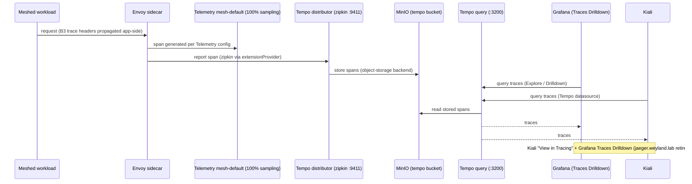

# Demo — Distributed Tracing (Tempo)

Why a trace shows up in Grafana/Kiali. **Sampling alone emits nothing** — the pipeline needs
the meshConfig `extensionProvider` (zipkin) + a `Telemetry` resource selecting it + a sidecar
restart to pick up the bootstrap. Trace context (B3 headers) must be propagated app-side across
hops. **Jaeger was retired in B48 (2026-06-21)** — spans now land in **Tempo** (monolithic →
MinIO `tempo-traces`); Grafana (Traces Drilldown) and Kiali both read from Tempo.
`jaeger.weyland.lab` is gone.

## Sequence diagram

Reused from [../diagrams/flow-tracing.md](../diagrams/flow-tracing.md):



## Prerequisites
- Istio mesh tracing wired to Tempo: `istio-install.yaml` extensionProvider `tempo` → `tempo.monitoring.svc:9411`, plus `telemetry.yaml` (`randomSamplingPercentage: 100`). Sidecars restarted after the change.
- Tempo (`grafana/tempo`, monolithic) up in ns `monitoring`, storage → MinIO.
- Grafana at `grafana.weyland.lab` (Keycloak OIDC) with the **Tempo** datasource (`:3200`).
- Kiali at `kiali.weyland.lab` (Keycloak SSO), tracing `provider: tempo`.

## UI walkthrough
1. Open `https://grafana.weyland.lab` (Keycloak login).
2. **Explore** → select the **Tempo** datasource → **Search** by service `weyland-tool-server` (or use **Traces Drilldown**).
3. Open a trace to see the span tree across the meshed hops (tool-server → backends).
4. Cross-check in Kiali: `https://kiali.weyland.lab` → workload `weyland-tool-server` → **Traces** tab (or "View in Tracing").

## CLI walkthrough
[mother] Generate traceable traffic through the meshed tool-server (each call emits spans at 100% sampling):
```
curl -s http://mother:30080/status
```
[rogueone] Or hit a per-backend health route to fan out through the mesh (exact `/context/search` request body: `TODO: verify` against `http://mother:30080/docs`):
```
curl -s http://mother:30080/qdrant/health
```
[mother] Confirm Tempo is running and ready in the monitoring namespace:
```
kubectl get pods -n monitoring -l app.kubernetes.io/name=tempo
```
[mother] If traces are missing, verify sidecars were restarted after the tracing bootstrap change (the classic half-wired symptom):
```
kubectl rollout restart deployment/weyland-tool-server -n weyland
```

## Expected result
- After a few requests, a trace for `weyland-tool-server` appears in Grafana Explore → Tempo (and Kiali Traces tab) within seconds.
- The span tree spans multiple hops (Envoy → backend), proving mesh-level tracing + app-side B3 propagation.

> Note: Tempo's Drilldown Rate/Error panels may show an "empty ring" error — the metrics-generator (span-metrics/service-graph) is not enabled. Traces themselves work; this is a documented, deferred limitation.

## Cleanup / teardown
Read-only demo — the only side effect is trace spans generated by the `curl` calls, which age out of the Tempo/MinIO store on their own. Nothing to remove.
