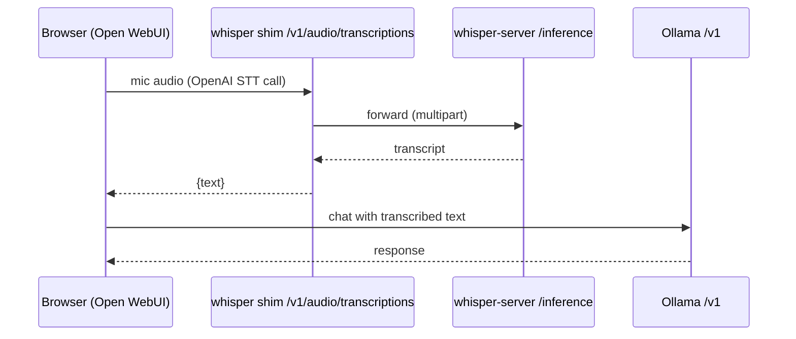

# Demo — Voice Chat (Open WebUI + whisper STT)

Speak into the browser, have on-LAN whisper.cpp transcribe it, and chat with a local Ollama model —
zero cloud STT, all on the lab. Open WebUI uses **Ollama for chat** and the **whisper shim for
voice-in** via its OpenAI-compatible Audio→STT setting.

Grounded in [runbooks/transcription-whisper.md](../runbooks/transcription-whisper.md) and
[diagrams/flow-voice-chat.md](../diagrams/flow-voice-chat.md).

## Sequence diagram

Reused from [diagrams/flow-voice-chat.md](../diagrams/flow-voice-chat.md):



## Prerequisites

- **whisper** (CT 103 on the weyland host, `192.168.1.246` / `whisper.weyland.lab`) — `whisper-server`
  (native `/inference` @ `:8080`) + `whisper-shim` (OpenAI `/v1` @ `:9000`), both systemd services.
  Model `ggml-large-v3`.
- **rogueone** (`192.168.1.230`) — Ollama at `ollama.weyland.lab:11434` for chat.
- **mother** (`192.168.1.243`) — Open WebUI on k3s (manifests `k8s/open-webui/`), fronted by Traefik.
- A browser that can reach `chat.weyland.lab` with a working microphone.

## UI walkthrough

1. Open **`https://chat.weyland.lab`** (Keycloak SSO / OIDC — log in as `emangini`).
2. Confirm STT is wired: **Settings → Audio → Speech-to-Text (STT)** set to an OpenAI-compatible
   endpoint with base URL **`http://192.168.1.246:9000/v1`** + any dummy API key (per the runbook).
3. In a chat, pick an Ollama model, click the **microphone**, speak a prompt, and stop recording.
   Open WebUI POSTs the audio to the shim's `/v1/audio/transcriptions`; the transcript fills the
   composer.
4. Send it — the model answers over the local Ollama endpoint.

## CLI walkthrough

Verify the shim end-to-end from inside CT 103 (whisper host is reached as `root@weyland` → `pct`),
using the bundled JFK sample — one command, no placeholder:

```
[weyland] pct exec 103 -- curl -s 127.0.0.1:9000/v1/audio/transcriptions -F file=@/root/whisper.cpp/samples/jfk.wav -F model=whisper-1 -F response_format=json
```

Verify the native whisper-server path the shim forwards to:

```
[weyland] pct exec 103 -- curl -s 127.0.0.1:8080/inference -F file=@/root/whisper.cpp/samples/jfk.wav -F response_format=json
```

Confirm both services are up:

```
[weyland] pct exec 103 -- systemctl status whisper-server whisper-shim --no-pager
```

Confirm the chat backend (Ollama) is reachable from the LAN:

```
[rogueone] curl -s http://ollama.weyland.lab:11434/v1/models
```

## Expected result

- Shim returns strict `{"text":" And so my fellow Americans, ask not what your country can do for
  you..."}` (the shim builds the JSON itself so Open WebUI never sees shape drift).
- In the browser, spoken input becomes composer text, and the local model replies — the voice→text→
  chat loop closes with nothing leaving the LAN.

## Cleanup / teardown

Largely **read-only** — transcription and inference create no persistent lab artifacts. The only
state is your Open WebUI **chat conversation**, which you can delete in-app (chat list → delete
conversation). The whisper services stay running (they are the live B13 consumer); no teardown
needed.
