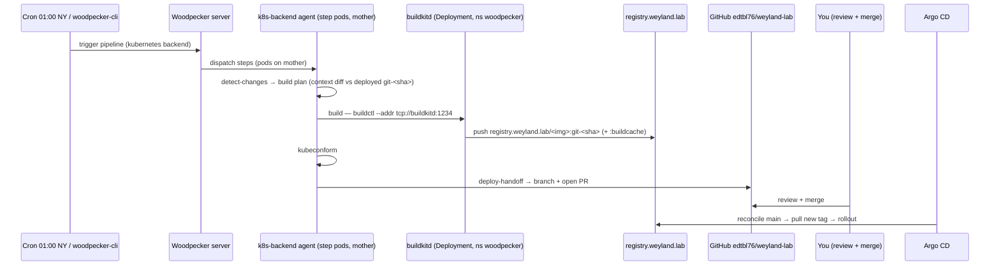

# Demo — weyland image CI → CD (B57a)

The weyland-built images (`weyland-tool-server`, `weyland-dagster-user-code`, …) build on the Woodpecker farm and
deploy via git, replacing the manual `scripts/build-push-images.sh` + hand-bumped-tag loop. The pipeline builds a
`git-<sha>` tag, pushes it to `registry.weyland.lab`, and opens a PR bumping the manifest; **you merge** → Argo CD
reconciles → rollout. Git-as-seam — CI never calls `argocd sync`. Validated live 2026-08-18 (pipelines #8/#9 →
PR #9 → `store-scaler` rolled to `git-ec59b430`).

## Sequence diagram

Reused from [../diagrams/flow-weyland-image-ci.md](../diagrams/flow-weyland-image-ci.md):



## Prerequisites
- `buildkitd` Deployment Ready in ns `woodpecker` (`k8s/woodpecker/buildkitd.yaml`, Argo app `woodpecker-buildkitd`).
- Repo `edtbl76/weyland-lab` **activated** in Woodpecker and **security-trusted** (`repo update --trusted-security`) —
  though with the daemon the build step no longer needs privilege, the flag is a harmless standing grant.
- Woodpecker repo secret **`github_token`** (fine-grained PAT: Contents+Pull-requests write; from `scripts/.env`
  `GITHUB_USER_TOKEN`).
- Mother host: **`fs.inotify.max_user_instances = 8192`** (`nodes/mother/host/sysctl.d/99-weyland-buildkit.conf`
  applied on **mother**) — BuildKit's client filesync EMFILEs at the old 512.
- `images.tsv` (`scripts/ci/images.tsv`) is the SoT mapping image → build context → tracked manifests.

## UI walkthrough (eyes-on UAT)
1. `https://woodpecker.weyland.lab` → repo **`edtbl76/weyland-lab`** → latest run. **UAT — confirm:** steps
   `detect-changes · build · kubeconform · deploy-handoff` all green; the `build` log shows
   `using buildkitd at tcp://buildkitd:1234` and `pushed registry.weyland.lab/:git-<sha>`.
2. **GitHub** → the repo's PRs → confirm a `ci: image bump … → git-<sha>` PR (branch `ci/image-bump-<sha>`)
   changing only the image tag in the tracked manifest(s). **Merge it.**
3. `https://argocd.weyland.lab` → the affected app → **UAT:** it syncs after the merge and the workload rolls
   to the new tag (Synced / Healthy).
4. Confirm the pod is on the new image (see CLI).

## CLI walkthrough
[rogueone] Trigger a build run (CLI over the `:30980` NodePort):
```
. ~/.config/studio/woodpecker-cli.env; export WOODPECKER_SERVER="http://192.168.1.243:30980"; export PATH="$HOME/.local/bin:$PATH"; woodpecker-cli pipeline create edtbl76/weyland-lab --branch main
```
[rogueone] Poll it (N = the number printed above):
```
woodpecker-cli pipeline ps edtbl76/weyland-lab N
```
[rogueone] Confirm the image tag landed in the registry (example: store-scaler):
```
curl -sk https://registry.weyland.lab/v2/store-scaler/tags/list
```
[mother] After you merge the PR, confirm Argo rolled the workload to the new tag:
```
kubectl -n data-mesh get deploy store-scaler -o jsonpath='{.spec.template.spec.containers[0].image}{"\n"}'
```

## Expected result
- Every changed image gets a `git-<sha>` tag in `registry.weyland.lab`; a single PR bumps the tracked manifest(s).
- On merge, Argo reconciles and the Deployment(s) roll to the new tag (validated: `store-scaler` → `git-ec59b430`).
- Unchanged images are skipped (context-diff vs their deployed `git-<sha>`); the nightly **01:00 NY** cron does this
  incrementally.

> **Superseded in part (B135/B131, 2026-08-22/23).** The "**you merge**" step above is no longer the only path:
> `scripts/ship-images.sh` now merges the tag-bump PR under three machine gates, syncs only the affected Argo
> apps, and verifies every bumped image is live on a probe-backed workload. The merge is still the gate — it just
> is not a human click any more. This demo remains valid for the **build half**; the automated hand-off, the gates
> and the watchdogs are demonstrated in [ship-images.md](ship-images.md).
>
> Also corrected since this was written: **change detection had never worked in CI.** A shallow clone made
> `git diff <oldsha> HEAD` fail, `2>/dev/null` swallowed it, and the failure was read as "changed" — so every
> image rebuilt on every run while the log printed per-image decisions that looked deliberate. Fixed 2026-08-22;
> first clean CI evidence is pipeline #25.

## Cleanup / teardown
- The pipeline accumulates registry tags (`:git-<sha>` per build + a `:buildcache`). The `git-<sha>` tags ARE
  the deploy history (keep); the mother `weyland-image-prune` timer + registry lifecycle handle old-tag pressure.
- One-off dev cruft from the buildkit validation: a throwaway `store-scaler:ci-selftest` tag — harmless, delete if
  desired via the registry API.
- CI branches (`ci/image-bump-<sha>`) close when their PR merges; delete stale unmerged ones on GitHub.
- Read-only otherwise — no data created; the daemon's cache PVC is reproducible.
