# The Realm of Agents — A2A Agent Roster (B17)

**Status:** ✅ **BUILT & LIVE (2026-08-01)** — deployed as the `realm-of-agents` pod (ns `weyland`, Argo-managed);
all 24 agents fleshed out with specialist prompts and grounded in real tools; proven end-to-end across all five realms.
(Originally Inception / Application Design.)
**Depends on:** B111 Bifrost buildout (241 prompts, 583 skills, 232-tool MCP surface), B66 operator, B70 weyland-agent.
**Owner:** Engineering · **Gate approver:** Program Management

> **Implementation reality (vs the design below):** the whole Realm runs on **Claude Haiku** via a `REALM_MODEL`
> override (LiteLLM `wl-agentic` lane) — the per-agent `wl-*` lanes in §3 are the *designed* routing, restored by
> clearing the override; the local rogueone lanes cold-start-hung. Tools load from the Bifrost VK in-cluster
> (`http://bifrost.weyland.svc.cluster.local:8080/mcp`, not the self-signed ingress). Every run + deliverable is an
> **MLflow trace** (experiment `realm-of-agents`). The Operator reaches the Realm via a `delegate_to_realm` tool.
> Iteration is GitOps: build `registry.weyland.lab/realm-of-agents:vN`, bump `k8s/realm-of-agents/deployment.yaml`,
> push → Argo rolls (no `kubectl apply` — selfHeal reverts). Code: `services/realm-of-agents/` (roster/roles/cards/
> agents/realms/router/app). Deferred: the Realm Console UI (§9), a dedicated LiteLLM VK, `role-<key>` in Bifrost.

---

## 0. At a glance — the decoder ring

Everything below in one table. Plain-English job on the left, the reason for the name on the right — so a mythic name never costs you a lookup.

| Agent | Realm | What it does (plain English) | Why the name |
|---|---|---|---|
| **the Operator** | Root | Top boss. Takes your Telegram request, decides who handles it, runs the confirm rails. | Odin's high seat *Hlidskjalf* — sees into every realm. |
| **Gná** | Root | Dispatcher. Given a task, picks which agent should do it. | Frigg's swift messenger who rides everywhere. |
| **Odin** | Valhalla | Engineering lead. Breaks a goal into steps, delegates, merges the results, owns the outcome. | The Allfather, master of Valhalla. |
| **Mímir** | Valhalla | Architect. Decides structure, interfaces, and tradeoffs *before* code is written. | The well of wisdom Odin consults. |
| **Brokkr** | Valhalla | Engineer. Writes the actual code. | The dwarf-smith who forged the gods' weapons. |
| **Forseti** | Valhalla | Test. Verifies behavior, edge cases, regressions, acceptance criteria. | God of justice who settles every dispute. |
| **Hermóðr** | Valhalla | DevOps. Deploy, environments, observability, operational flow. | The messenger who *rides* to deliver. |
| **Heimdall** | Valhalla | Security. Guards boundaries; authz/authn, data exposure, vulnerabilities. | Guardian of the **Bifröst** — literally our gateway's name. |
| **Huginn** | Valhalla | Code review. Correctness and architectural alignment. | Odin's raven **Thought** — flies out and reports back. |
| **Muninn** | Valhalla | Code quality. Consistency, simplification, conventions. | Odin's raven **Memory** — flies out and reports back. |
| **Kvasir** | Vanaheim | Strategy. Applies the consulting frameworks; synthesizes insight. | The wisest being, born of the gods' truce. |
| **Njörðr** | Vanaheim | AIDLC delivery. Runs the delivery-lifecycle stages methodically. | Vanir god of order and safe passage. |
| **Freyja** | Vanaheim | Industry lens. Analyzes a problem through a vertical's lens. | Vanir seeress who sees across the worlds. |
| **Bragi** | Vanaheim | Prompt engineering. Writes and critiques prompts. | God of poetic craft and eloquence. |
| **Verðandi** | Midgard | Observability. What's happening *right now* in metrics/logs/traces. | The Norn of the present — "that which is happening." |
| **Vör** | Midgard | Data quality. Is the data true and correct? DQ contracts. | Goddess from whom **nothing can be concealed**. |
| **Sága** | Midgard | SQL / analytics. Queries the data for answers. | Seeress who drinks wisdom from the deep. |
| **Yggdrasil** | Midgard | Graph / lineage. Relationships and lineage across the estate. | The world-tree that connects everything. |
| **Fulla** | Midgard | Catalog steward. Keeps the catalog, descriptions, lineage tidy. | Keeper of Frigg's casket and secrets. |
| **Tyr** | The Well | Eval judge. Scores the quality of an output. | God of law and oaths. |
| **Óðrœrir** | The Well | RAG. Grounded answers from the corpus *(= the existing weyland-agent, B70)*. | The vessel holding the mead of knowledge. |
| **Ratatoskr** | The Well | Web research. Fetches and synthesizes information from the web. | The squirrel messenger who runs Yggdrasil carrying news. |
| **Snotra** | The Well | Scribe. Summaries, changelogs, release notes, postmortems. | Goddess of eloquence and good order. |
| **Syn** | The Well | Safety. PII / injection / grounding guard on inputs and outputs. | Goddess who guards the door and **denies entry**. |

---

## 1. Why this exists

The lab now has three ingredients sitting in Bifrost but no *agents* to wield them as peers:

- **Prompts** — 241 model-agnostic system/task prompts (roles + playbooks).
- **Skills** — 583 installable Agent Skills (runbooks, the 52 AIDLC stages, 511 KB entries).
- **Tools** — a 232-tool MCP surface (95-tool read fleet + Context7/Linear/GitHub/Perplexity/Playwright/HF).

**MCP is agent↔tools. A2A is agent↔agent.** B17 is the second axis: standing up *small, single-purpose agents* that a supervisor can discover (via Agent Cards) and delegate to. Each agent is a thin composition:

> **agent = (a role prompt from the Prompt Repo) + (a skill family from the Skills Repo) + (a slice of MCP tools) + (a `wl-*` brain)**

All $0 — every brain is a local/hosted `wl-*` lane. Nothing here needs a paid provider.

---

## 2. Supervision model

The **Realm of Agents** is one org under a single top supervisor, split into four realms plus a root.

- **The Operator** (B66) is the root supervisor — the seat that sees all realms (Hlidskjalf). It already owns Telegram in/out and the 4-rail act confirmation. It delegates down.
- **Gná** (skill-router) is the dispatcher — Frigg's swift messenger. Given a task, it picks the realm/agent and routes. Backed by the `skill-selector` prompt over the 583-skill corpus.
- Each realm has a lead that can run solo or fan out to its members:
  - **Valhalla** → led by **Odin**
  - **Vanaheim** → led by **Kvasir**
  - **Midgard** → led by **Verðandi**
  - **Mímisbrunnr (the Well)** → led by **Tyr**

```mermaid
flowchart TD
  OP["the Operator · root supervisor"]
  GNA["Gná · skill-router / dispatch"]
  OP --> GNA

  OP --> ODIN
  subgraph VALHALLA["Valhalla · Engineering"]
    ODIN["Odin · orchestrator"]
    ODIN --> MIMIR["Mímir · architect"]
    ODIN --> BROKKR["Brokkr · engineer"]
    ODIN --> FORSETI["Forseti · test"]
    ODIN --> HERMODR["Hermóðr · devops"]
    ODIN --> HEIMDALL["Heimdall · security"]
    ODIN --> HUGINN["Huginn · code review"]
    ODIN --> MUNINN["Muninn · code quality"]
  end

  OP --> KVASIR
  subgraph VANAHEIM["Vanaheim · Knowledge"]
    KVASIR["Kvasir · strategy / frameworks"]
    NJORDR["Njörðr · AIDLC delivery"]
    FREYJA["Freyja · industry lens"]
    BRAGI["Bragi · prompt engineering"]
  end

  OP --> VERDANDI
  subgraph MIDGARD["Midgard · Data & Platform"]
    VERDANDI["Verðandi · observability"]
    VOR["Vör · data quality"]
    SAGA["Sága · SQL / analytics"]
    YGG["Yggdrasil · graph / lineage"]
    FULLA["Fulla · catalog steward"]
  end

  OP --> TYR
  subgraph WELL["Mímisbrunnr · the Well"]
    TYR["Tyr · eval judge"]
    ODRERIR["Óðrœrir · RAG / retrieval"]
    RATATOSKR["Ratatoskr · web research"]
    SNOTRA["Snotra · scribe / content"]
    SYN["Syn · safety / guardrails"]
  end
```

---

## 3. The roster

### Root

| Agent | God | Role | Backed by | Tools | Brain |
|---|---|---|---|---|---|
| the Operator *(exists, B66)* | Hlidskjalf | Top supervisor; Telegram + act/confirm; delegates | operator prompts | act rails | `wl-agentic` |
| skill-router | **Gná** | Dispatcher — route a task to the right realm/agent | `skill-selector` over 583 skills | — | `wl-router` |

### Valhalla — Engineering (led by Odin)

| Agent | Role | Backed by | Tools | Brain |
|---|---|---|---|---|
| **Odin** | Orchestrator — decompose, delegate, reconcile, own the result | `aidlc-*` construction stages + `plan-decompose` / `next-action` | A2A delegation, Linear | `wl-agentic` |
| **Mímir** | Architect — boundaries, interfaces, tradeoffs, tech direction | `ek-*` patterns + `tech-decision` + C4/LikeC4 model | Context7, datahub (schemas) | `wl-reason-thinking` |
| **Brokkr** | Engineer — implement the design, produce maintainable code | `coding` prompts | GitHub, repo | `wl-coding` |
| **Forseti** | Test — expected behavior, edge cases, regressions, acceptance | `write-unit-tests` + property-based + TDD | GitHub, CI | `wl-coding` |
| **Hermóðr** | DevOps — delivery, environments, deploy, observability, ops flow | `deploy-via-argo` / `dagster-redeploy` / `sealed-secrets` + cluster/incident skills | k8s (read), grafana, argo | `wl-agentic` |
| **Heimdall** | Security — guards the boundary (the Bifröst); authz/authn, exposure, vulns | `security-baseline` / `security-posture` + guardrails | GitHub secret-scan, trivy | `wl-reason-thinking` |
| **Huginn** | Code Review — correctness, maintainability, architectural alignment | `code-review` prompts | GitHub PR read | `wl-coding` |
| **Muninn** | Code Quality — consistency, simplification, conventions | `code-simplify` | GitHub, linters | `wl-coding` |

> Huginn (Thought) + Muninn (Memory) are Odin's ravens — they fly out and report back: a review→orchestrator feedback loop, verbatim. Heimdall guards the **Bifröst** — and the gateway is literally named Bifrost.

### Vanaheim — Knowledge (led by Kvasir)

| Agent | Role | Backed by | Brain |
|---|---|---|---|
| **Kvasir** | Strategy — apply the 60 `ct-*` consulting frameworks; synthesize insight | `apply-<framework>` prompts | `wl-reason-thinking` |
| **Njörðr** | AIDLC delivery — run the 52 delivery stages methodically | `run-<aidlc-stage>` prompts | `wl-agentic` |
| **Freyja** | Industry lens — analyze through the 56 `iv-*` verticals | industry-lens prompts | `wl-chat` |
| **Bragi** | Prompt engineering — improve/critique/generate prompts | `meta-prompt-eng` | `wl-reason-thinking` |

### Midgard — Data & Platform (led by Verðandi)

| Agent | Role | Backed by | Tools | Brain |
|---|---|---|---|---|
| **Verðandi** | Observability — "what is happening now"; metrics/logs/traces | grafana skills; **first job = B109 dashboard audit** | grafana MCP | `wl-agentic` |
| **Vör** | Data quality — truth; nothing concealed; DQ contracts | `soda-checks` + `data-analytics` | Soda, trino MCP | `wl-coding` |
| **Sága** | SQL / analytics — draw answers from the deep | `data-analytics` prompts | trino + postgres MCP | `wl-coding` |
| **Yggdrasil** | Graph / lineage — the world-tree connecting all | neo4j/graph skills | neo4j MCP | `wl-reason-thinking` |
| **Fulla** | Catalog steward — keeper of the casket; catalog/lineage/descriptions | datahub skills | datahub MCP | `wl-chat` |

### Mímisbrunnr — the Well: Research, Eval, Content, Safety (led by Tyr)

| Agent | Role | Backed by | Tools | Brain |
|---|---|---|---|---|
| **Tyr** | Eval judge — god of law; judge output quality | `eval-judge` prompts + `wl-judge` (extends B84) | — | `wl-judge` |
| **Óðrœrir** *(exists = weyland-agent, B70)* | RAG — grounded recall from the corpus | retrieval prompts | context fleet | `wl-rag` |
| **Ratatoskr** | Web research — the messenger running Yggdrasil, carrying news | `search-web` prompts | Perplexity MCP | `wl-agentic` |
| **Snotra** | Scribe — summaries, changelogs, release notes, postmortems | `content-ops` | — | `wl-chat` |
| **Syn** | Safety — the goddess who guards the door and denies entry; PII/injection/grounding | `guardrails-safety` + weyland-guard | guard svc | `wl-reason-thinking` |

**Totals:** 24 agents across 5 groups. 2 already exist (the Operator, Óðrœrir/weyland-agent); 22 net-new.

---

## 4. What makes each an A2A peer

Every agent publishes an **Agent Card** (the A2A discovery artifact): name, description, skills it exposes, input/output modes, and endpoint. That is what lets Odin (or the Operator) discover a peer and delegate to it without hard-wiring. Concretely each agent is a small service that:

1. Loads its role prompt from the Bifrost Prompt Repo.
2. Installs its skill family from the Bifrost skill marketplace.
3. Binds its slice of the 232-tool MCP surface via the `coding-agents` VK.
4. Routes its LLM calls to its `wl-*` lane through LiteLLM (transparent, tool-calling preserved).

---

## 5. Framework decision

- **A2A Protocol** (Linux Foundation) — the cross-service standard: Agent Cards + task/message envelopes. This is the interop target that makes B17 a *real* evaluation rather than a hidden function call.
- **LangGraph** — already in-lab (B66 operator, B70 weyland-agent). Supervisor/swarm topologies for the *in-process* delegation inside a realm (e.g., Odin → its seven). Use for intra-realm fan-out.
- Runners-up considered: Google ADK, CrewAI, AutoGen/AG2, Agno, OpenAI Agents SDK — not adopted; LangGraph + A2A Protocol covers both the in-process and cross-service cases at $0.

**Split:** LangGraph inside a realm, A2A Protocol between realms / to the Operator.

---

## 6. The two-mode pattern (applies to every realm lead, Odin first)

- **Solo** — for small work, the lead runs the loop itself, skill-swapping per phase. One agent, whole lane.
- **Delegating** — for real work, the lead is a sub-supervisor that fans out to its members and reassembles. This is the rich multi-hop delegation graph the A2A eval measures.

Valhalla's loop (Odin): **spec → plan → build → test → review → secure → ship** — the `agent-skills` extension already in the corpus is Odin's playbook.

---

## 7. First wave + eval criteria

Build the minimum that proves discovery → delegate → result across **both** in-process and cross-service:

1. **Gná** (dispatch) — proves routing.
2. **Kvasir** (Vanaheim, pure-corpus peer) — proves a knowledge agent with no tools.
3. **Verðandi** (Midgard, real-tool peer) — proves a tool-bound agent; first job is the concrete **B109 dashboard audit**.
4. **Odin + two Valhalla members** (Mímir, Brokkr) — proves intra-realm LangGraph fan-out.

**Eval criteria:** (a) the Operator discovers each Agent Card without hard-coding; (b) a task routed through Gná reaches the right agent; (c) Odin delegates a 2-hop task and reconciles; (d) an A2A-Protocol call crosses a service boundary; (e) all at $0 on `wl-*` lanes.

---

## 8. Build order & durability

1. Author the 4 first-wave Agent Cards + role bindings.
2. Stand up the A2A endpoint shape (protocol server) + register cards with the Operator.
3. Wire Gná dispatch.
4. Odin + Valhalla intra-realm graph.
5. Expand realm by realm (Vanaheim → Midgard → the Well).

Durability follows the B111 pattern: role prompts + skills already restore from the Bifrost registration scripts; Agent Cards + bindings become their own idempotent registration step in the mcp-gateway runbook.

---

## 9. UI — eval concluded (2026-08-02); three tiers

The UI splits into three jobs, each settled by an **evaluate-the-real-tools-first** pass (bake-off, not assumption):

**① Debug / inspect → ADOPTED: the A2A Inspector.** `github.com/a2aproject/a2a-inspector` (FastAPI + TS, fetches the
card **server-side**), promoted from a throwaway spike to a **managed Argo app** at **`inspector.weyland.lab`**
(`k8s/a2a-inspector/`, Keycloak forward-auth, connects in-cluster to `realm-of-agents.svc:8080`). It validates the card
and chats through Gná. **Bake-off vs [a2a-ui](https://github.com/a2anet/a2a-ui)** (a2anet, client-side Next.js): a2a-ui
**lost** — prettier at a glance but the Inspector was the better working tool (user: "inspector is WAY better").
Usefully, a2a-ui's strict same-origin card check is what surfaced our `http`-vs-`https` card-URL bug and drove the
`--proxy-headers` fix. **Rejected: LangGraph Studio + Agent Chat UI** — both require reshaping the raw
`create_react_agent`s into a LangGraph **Server** (`langgraph.json` + `langgraph dev`); a restructure that fights the
A2A-first design, and neither does the show-off piece.

**What the eval required (A2A-server hardening — DONE, realm v14):** the native REST surface was A2A-*shaped*, not
A2A-*Protocol*. Added `a2a.py` = a JSON-RPC `message/send` binding (`POST /a2a` = Gná dispatch, `/a2a/{key}` = one
agent) translating the A2A envelope ↔ the same `dispatch`/`run_agent` (no agent-logic change). Card fixes the a2a-sdk
enforces: `protocolVersion` + `preferredTransport:"JSONRPC"`, `provider{organization,url}` (both required), and a
**request-derived** `url` (+ uvicorn `--proxy-headers`) so cards advertise `https://realm.weyland.lab/a2a` through the
ingress instead of a same-origin-mismatching `http`. CORS added for browser A2A clients. Front door = **`realm.weyland.lab`**
Ingress (wildcard TLS, **no forward-auth** — a programmatic API like the registry, since A2A clients can't do SSO redirects).

**② Observability → DONE: MLflow traces.** `mlflow.langchain.autolog()` in the Realm lifespan → every A2A hop is an
MLflow GenAI trace (experiment `realm-of-agents`, **Traces** tab). No LangSmith (SaaS/paid, off-LAN).

**③ Show-off console → BUILT (2026-08-02), served at `realm.weyland.lab/`.** No off-the-shelf tool does the
map-of-24-gods with the answering one lighting up — the bake-off confirmed it, so we rolled our own. A single
self-contained page served by the Realm pod at `GET /` (`console.html`, bundled in the image): black-and-white chrome +
realm color-coding, Uncial-Antiqua title, embedded font (data-URI). It drives **`POST /route/stream`** (SSE, `stream.py`
= `astream_events` normalized to `{type,id,parents,…}`) and builds the tree from `id`/`parents`, so the concurrent
nested fan-out (Operator → {Kvasir, Odin→Brokkr, Verðandi} + tools) animates correctly. **Realized as designed:**
- **Directory** — the five realms, 24 gods, the decoder ring (the showpiece backdrop).
- **Live prompt bar** — type a task → `POST /route` → the answering god's card lights up, answer renders (markdown);
  toggle *let Gná route* vs *send to a specific god*. `realm.weyland.lab` + CORS already exist, so a browser page can
  drive it directly now.

**Two open decisions for ③ (settle at build time):**
1. **Delegation-path visualization (the wow feature):** have `/route` also emit the hop path
   (Gná → Verðandi → {Vör, Sága, Yggdrasil, Fulla}) so the console can *animate the hops lighting up across realms*.
   Costs a small Realm change to surface the path. Leaning yes.
2. **Streaming vs one-shot:** stream tokens as the answer builds (livelier, more work) or spinner-then-answer.
