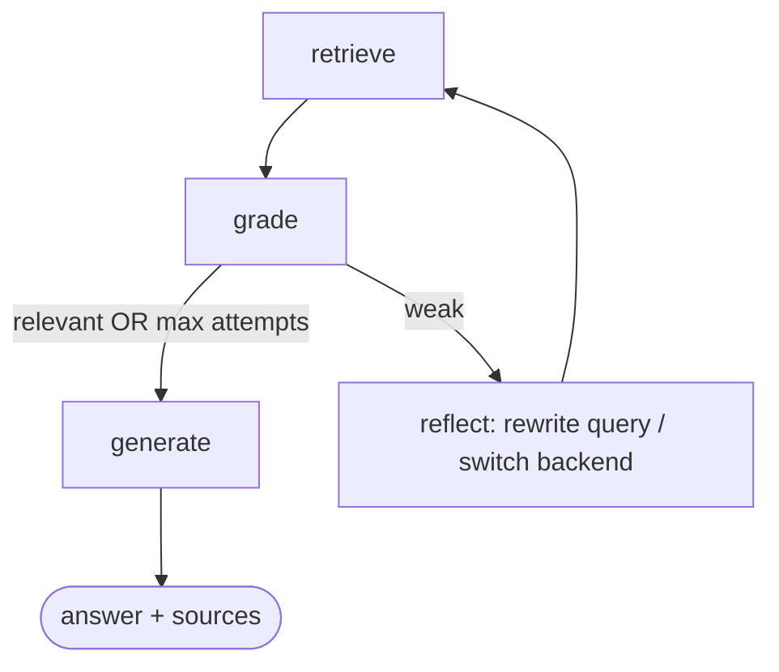

# B70 — Agentic RAG on LangGraph + LlamaIndex + MLflow tracing (design)

**Status:** Design — pending approval. **Owner:** Engineering. **Feeds:** B66 (Operator Agent Platform) — this is the
LangGraph framework-viability spike. **$0 constraint:** local models only.

## 1. Goal
Replace the single-shot `/context/ask` (retrieve-once → LLM → answer) with a **self-reflective agentic loop**:
retrieve → grade → *reflect / re-retrieve if weak* → answer — and make every step observable as an MLflow **Trace**.
More capable retrieval + per-step GenAI observability the mesh traces (Tempo) structurally can't give.

## 2. As-is (what we extend, not replace)
`weyland-tool-server` `/context/ask` (`main.py:522`) is single-shot: one backend, one top-k pull, static prompt, one
Ollama call, INPUT+OUTPUT guardrails. LlamaIndex is used there for **embeddings only**; retrieval is hand-written
per-backend. The single-shot path **stays as-is** — B70 is a new sibling service, not a rewrite.

## 3. Locked decisions (from the reconciliation)
| # | decision | rationale |
|---|---|---|
| Framework | **LangGraph (control) + LlamaIndex (retrieval)** | complementary if split cleanly; LangGraph is also the B66 spike |
| Location | **new sibling service `weyland-agent`**, registry-built image | isolates heavy deps; dodges the B69 `:local`/`Never` gap; seeds B66; first cut of tool-server decomposition |
| Generation | **LangChain `ChatOpenAI` → Ollama direct** (`192.168.1.230:11434`, `gpt-oss:20b`) | autolog captures each call; matches the stack's model path |
| Query embedding | **rogueone `rag-embed` service** (`192.168.1.230:8900`, bge-small 384-dim) | exact match to the existing collections' vectors; keeps the image slim (no model bake) |
| Guardrails | **extract B14 guards to a shared `weyland-guard` service**; tool-server migrates fail-open (§9) | models load once (~1.5 Gi, not ~3 Gi); shared by tool-server + agent + future B66; first cut of tool-server decomposition |

## 4. Division of labor
- **LlamaIndex = retrieval.** `VectorStoreIndex`/retrievers over the 4 backends via native vector-store integrations
  (postgres/qdrant/weaviate/neo4j), query embedding via `rag-embed`, node postprocessors (similarity cutoff, optional
  rerank). Answers *"fetch the best chunks."* This is the retrieval-quality upside (ties to B74).
- **LangGraph = control flow.** The stateful graph below; LlamaIndex retrievers are invoked *inside* nodes as tools.
  Answers *"re-retrieve or done?"*
- **MLflow = observability.** Both `mlflow.langchain.autolog()` (graph + LLM spans) and `mlflow.llama_index.autolog()`
  (retrieval spans) → one unified per-run Trace.
- **Boundary rule:** no LlamaIndex agent/router (LangGraph's job), no LangChain retrievers (LlamaIndex's job).

## 5. The agentic loop (LangGraph)

**State:** `{ query, original_query, backend, chunks, grade, attempts, max_attempts, answer }`

**Nodes:** `retrieve` (LlamaIndex retriever for current backend+query) → `grade` (LLM: are chunks relevant/sufficient?
structured yes/no + reason) → conditional: relevant **or** `attempts >= max_attempts` → `generate` (grounded answer);
else → `reflect` (LLM rewrites the query and/or switches backend; `attempts += 1`) → back to `retrieve`.

**Bounding ($0/latency):** `max_attempts = 2` (default) — at most 3 retrievals per query. Multiple LLM calls per
request (grade + reflect + generate) is accepted cost; local models = slow but free.

**Reflect strategy (proposed):** attempt 1 → rewrite the query on the same backend; attempt 2 → switch backend
(default `pgvector` → rotate to a dense peer or `neo4j` for graph-connected context). The reflect LLM picks; the graph
records the choice in state (visible in the trace).

## 6. Retrieval layer (LlamaIndex) — CUSTOM retrievers (verified 2026-07-22)
**Native LlamaIndex vector stores do NOT fit the existing collections.** The B-RAG-STREAM indexer stores chunk text
under `content` (never LlamaIndex's `text`) and writes no `_node_content` node blob, so `PGVectorStore`/`QdrantVectorStore`
can't reconstruct nodes (pgvector is also a two-table `rag_chunks⋈rag_documents` join vs LlamaIndex's single `data_X`).
Weaviate/Neo4j are native-*with-overrides* but lossy + version-fragile. **Decision: uniform custom retrievers.**
- **4 thin LlamaIndex `BaseRetriever`s**, one per backend, each wrapping the tool-server's already-proven raw query
  (`_search_pgvector/qdrant/weaviate/neo4j`, `main.py:254-334`) and returning
  `NodeWithScore(TextNode(text=content, metadata={source, chunk_index}))`. Uniform, reuses working code, zero re-index,
  no native-store version gamble. LlamaIndex value retained: the retriever interface, node postprocessors, query
  composition — just not its schema auto-mappers (which don't fit a bespoke corpus).
- Embeddings: a thin custom `BaseEmbedding` POSTing to `rag-embed` `POST /embed` (bge-small 384-dim, L2-normalized) —
  vector-space parity with the collections. (Fallback: in-process `HuggingFaceEmbedding`, if `rag-embed` is unreachable.)
- Postprocessors: `SimilarityPostprocessor` cutoff; rerank deferred (→ B74).
- **Long-term (not B70):** fixing the *writer* (B-RAG-STREAM emits `_node_content` + `text` keys) would unlock native
  stores — a future RAG-STREAM item.

## 7. Model access — configurable `base_url`, two phases
The agent's LLM handle is `ChatOpenAI(base_url=$AGENT_LLM_BASE_URL, model=$AGENT_LLM_MODEL, api_key=...)`, shared across
grade / reflect / generate. `base_url` is env config → the endpoint swaps with no code change. Because the loop makes
**3+ calls/query** (vs single-shot's 1), throughput matters — this is where vLLM earns its place.
- **Phase A (get the loop working):** point at **Ollama direct** (`192.168.1.230:11434/v1`, `gpt-oss:20b`) — the proven,
  in-use path. Validate the LangGraph loop + dual MLflow traces here.
- **Phase B (fold vLLM in):** wire the **LiteLLM gateway** (:30400) to front the local box (`ollama/*` + `vllm/*` — its
  config already flags this as planned), stand up **vLLM** on a 16 GB-fit (quantized) model, repoint
  `AGENT_LLM_BASE_URL` → LiteLLM → **vLLM primary / Ollama fallback**. Buys GPU throughput for the multi-call loop +
  centralized routing/observability + fallback, and advances LiteLLM's own "fold local" goal. A base_url swap once the
  loop works — low risk.
- **Current state (verified):** LiteLLM today routes only free-tier cloud (`gemini/*`, `openrouter/*`), NOT the local
  box; vLLM is present on rogueone but not serving the RAG model (Ollama is). So Phase B is real setup work, sequenced
  after the agent works on Ollama.
- Ollama / `rag-embed` / vLLM are LAN hosts (outside the mesh) — reached by IP; Istio egress is PERMISSIVE (the
  tool-server already calls Ollama from a meshed pod, so the path is proven). All three live on rogueone (sleeps) — a
  shared availability dependency, mitigated for embeddings by the in-process fallback.

## 8. Observability
- **MLflow:** `MLFLOW_TRACKING_URI=http://mlflow.weyland.svc.cluster.local:5000`, experiment `agentic-rag`; both
  autologs on. Each `/agent/ask` = one Trace with retrieve/grade/reflect/generate spans (prompt/context/answer per
  step). This is the headline deliverable.
- **Prometheus** `/metrics`: request latency, `attempts` histogram, backend-switch counter, error counter. Pod is
  covered by B98 node/pod alerts; add a Kuma uptime monitor.

## 9. Guardrails (B14) — extracted to a shared `weyland-guard` service
**Decision: full extraction.** The B14 `guardrails/` package (already cleanly factored: `pipeline`/`validators`/
`verdict`/`store`) is lifted into a new **`weyland-guard`** FastAPI service exposing `POST /guard/{input,output,act}`.
The 3 transformer models (LLM Guard injection + toxicity + CrossEncoder NLI ≈ 1.5 Gi) load **once**, there.
- **`weyland-agent`** calls it for the **outer** query (INPUT) + **final** answer (OUTPUT). Intermediate
  grade/reflect/generate steps are captured in MLflow but not guarded (future hardening — possibly a new intermediate hook).
- **`weyland-tool-server` migrates too**: drops its in-process guard models, calls `weyland-guard` over HTTP. Because
  the guards run **SHADOW** (record-only, non-blocking), the tool-server calls **fail-open** — a guard-service outage
  degrades to "not guarded," never "no answers," so the stable `/context/ask` path stays functionally independent.
- Net memory: **one** model copy (~1.5 Gi in `weyland-guard`) instead of the ~3 Gi two-copy alternative; the
  tool-server pod gets *lighter*. The Prometheus verdict metrics + `guardrail_verdicts` Postgres writes move to the
  service (`store.py` comes along).
- This is the first real cut of the **tool-server decomposition** (related to B31): the guard layer becomes shared
  infrastructure for the tool-server, this agent, and the future B66 fleet.

## 10. Deployment + B69 completeness gate
- **Namespace `weyland`** (co-located with pgvector/qdrant/weaviate/neo4j), **meshed** (`sidecar.istio.io/inject`)
  — required for STRICT-mTLS Postgres/pgvector; Neo4j via the existing `neo4j-bolt` DestinationRule (queries are short,
  so the long-connection stall risk is low, but stay meshed).
- **Image:** FastAPI service, **registry-built** (`registry.weyland.lab`, immutable tag, `IfNotPresent`) — NOT `:local`.
  Deps: fastapi, uvicorn, langgraph, langchain-openai, llama-index core + the 4 vector-store integrations, mlflow, httpx.
- **GitOps:** manifests in `k8s/weyland-agent/`, Argo app in `k8s/argocd/applications/`.
- **Access:** ClusterIP svc + ingress `agent.weyland.lab` (Keycloak forward-auth) for browser/curl testing; MCP-tool
  exposure deferred to B66.
- **Completeness:** trigger = on-demand HTTP (N/A scheduled) · lineage = MLflow Traces · GitOps = registry+Argo ·
  monitoring = Prometheus `/metrics` + Kuma + B98 · docs = `runbooks/agentic-rag.md` + arch.md + hosts.md.

## 11. Out of scope (B70 is a spike, not the platform)
Not: multi-tool agents beyond retrieval, MCP-tool exposure (→B66), reranking (→B74), guarding intermediate steps,
LiteLLM routing, decomposing the tool-server (own item, related to B31), retiring the single-shot `/context/ask`.

## 12. Resolved design choices
1. **Guardrails** — full extraction to a shared `weyland-guard` service; tool-server migrates fail-open (§9). ✔
2. **Reflect strategy** — *default:* **LLM-chosen** in the reflect node (it decides rewrite vs backend-switch; the choice
   is written to state → visible in the trace), with a fixed rotation as fallback. Fits the "evaluate LangGraph's
   decision-making" spike intent. ← flag if you'd rather a fixed rotation.
3. **Ingress** — *default:* **`agent.weyland.lab` + Keycloak forward-auth**, matching every other lab UI. ← flag if you'd
   rather NodePort/ClusterIP-only.

## 13. Build sequence (3 parts, in order)
1. **`weyland-guard`** — wrap the extracted `guardrails/` package in a FastAPI app; registry image; k8s + Argo; meshed
   (STRICT Postgres for `guardrail_verdicts`); Prometheus `/metrics`. Verify verdicts still land.
2. **Migrate `weyland-tool-server`** — replace in-process `_guard()` calls with fail-open HTTP calls to `weyland-guard`;
   drop the guard-model deps from its image (lighter pod); redeploy; verify `/context/ask` unchanged + verdicts still flow.
3. **`weyland-agent`** — LangGraph loop + LlamaIndex retrieval + dual MLflow autolog; calls `weyland-guard` for outer
   I/O; registry image; k8s + Argo; ingress; runbook + arch/hosts docs. Verify a Trace with per-step spans in MLflow.
