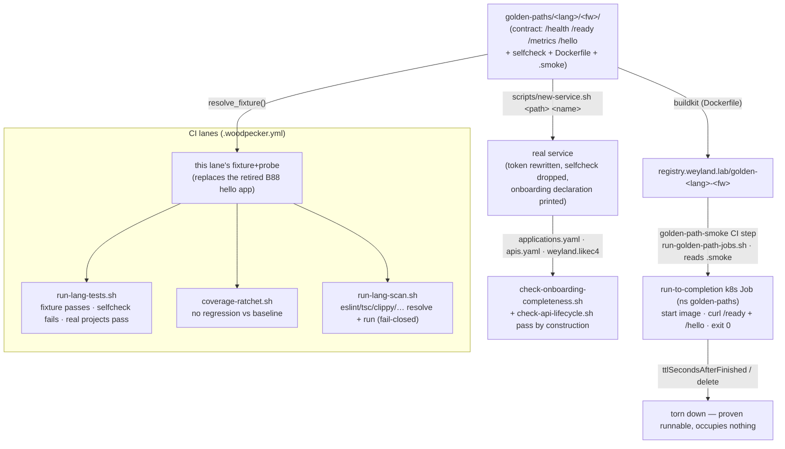

# Golden paths — blessed per-language service templates (B153)

> Visual index: **[Golden Paths Map](../golden-paths-map.html)** — the contract + the language×framework×status matrix (also in [maps.md](../maps.md)).

A **golden path** is a blessed, paved-road starting point for a service in a given language + framework.
It is **runnable, ephemeral, and extendable**: it builds a real image, spins up as a **run-to-completion
k8s Job** that exercises itself in-cluster and exits (never a Deployment), and is the **template a real
service is scaffolded from**. Each golden path both (a) replaces the B88 hello fixture as the CI
build-infra probe for its language, and (b) lands already-compliant with the onboarding gates (B154) and
the API lifecycle (B155), so "start a new service" is one command that begins in a DoD-passing state.

## The altitude: one contract, many frameworks

The "one paved road" is the **contract** below — the shape every golden path satisfies. The *framework*
lives beneath that altitude, so a language can have several golden paths (Java: Spring **and** Quarkus
**and** Micronaut) that all conform to the same contract. The onboarding gates + CI lanes check the
CONTRACT, never the framework — frameworks are interchangeable implementations.

### The contract (framework-agnostic)

| Facet | Requirement |
|---|---|
| **HTTP surface** | `GET /health` (liveness) · `GET /ready` (readiness — the SMOKE-gate probe) · `GET /metrics` (Prometheus exposition) · `GET /hello` (a demo endpoint returning a known JSON payload). |
| **Self-test** | a test suite discoverable by the lane's marker (`pom.xml`/`go.mod`/`package.json`/`pyproject.toml`/`Cargo.toml`) + a `selfcheck` (a deliberately-failing test proving the runner propagates failure) + a `coverage-baseline` entry. Replaces the language's hello fixture. |
| **Build** | a multi-stage, non-root, minimal **Dockerfile** buildkit builds to `registry.weyland.lab/golden-<lang>-<framework>`; a `readinessProbe`-compatible `/ready`. |
| **Ephemeral run** | a **k8s Job** (run-to-completion, `restartPolicy: Never`) that starts the built image, hits its own `/ready` + `/hello`, asserts the known payload, and exits 0 — proving the image runs on the real platform — then is torn down. Never a Deployment. |
| **Onboarding declaration** | a commented `applications.yaml` entry (`deployed`/`metrics`/`ingress`/`likec4`/`port_component`) + an `apis.yaml` entry (owner/kind/status/version/spec) + a LikeC4 element, as a TEMPLATE the scaffolder fills — so a scaffolded real service passes `check-onboarding-completeness.sh` + `check-api-lifecycle.sh` by construction. |
| **Observability** | structured logging + `/metrics`; an OTel hook (or a documented stub). |
| **Scaffold seam** | parameterized name/port placeholders so `scripts/new-service.sh <golden-path> <name>` stamps a real service. |

## The locked framework matrix (B153 — 21 golden paths; B160 adds 14 more, §"B160 — extended language wave" below → 35 total)

| Language | Frameworks | Lane runner |
|---|---|---|
| **Python** | FastAPI · Flask · Litestar · Django | pytest |
| **Java** | Spring Boot · Quarkus · Micronaut | mvn |
| **Go** | net/http (stdlib) · Gin · Echo · Fiber | go |
| **Rust** | Axum · Actix-web · Rocket | cargo |
| **Node (TS/JS)** | Express · Fastify · NestJS | node |
| **Frontend (React/Next)** | Next.js · Remix · Vite+React · Astro | node |

Frontend golden paths satisfy an adapted contract: `/health`+`/ready` via the framework's server (or a
tiny sidecar route), a build that produces the static/SSR bundle, a smoke that renders the demo route.

## Lifecycle flow

The golden path is one artifact that flows through the whole paved road — from "start a service" to a
gate-passing, running-on-the-platform deployment. It is also its own language's CI fixture+probe.

The left path is scaffolding a real service; the right/centre is the golden path proving itself as the
lane fixture and as a buildable, run-to-completion image on the real platform. Both start from the same
directory and the same contract.

## Layout + hello replacement

Golden paths live at `golden-paths/<language>/<framework>/`. Each is lane-discoverable (carries the
marker) and carries a `selfcheck` + a coverage-baseline row. Once a language's golden paths cover it, the
old `tests/lang/<lang>/` hello fixture is retired (the golden path is the leaner replacement — one
artifact that is both the blessed template and the build-infra probe). The lane runners
(`run-lang-tests.sh`, `run-lang-scan.sh`) discover golden paths by the same marker mechanism.

**Fixture-switch — DONE 2026-09-08.** Each lane's fixture is now its golden path, resolved by
`scripts/lib/lang-fixtures.sh` `resolve_fixture()` (shared by `run-lang-tests.sh`, `run-lang-scan.sh`,
`coverage-ratchet.sh`): python→python/fastapi, java→java/spring-boot, go→go/nethttp, rust→rust/axum,
javascript→node/express, typescript→node/nestjs, react→frontend/vite-react, nextjs→frontend/nextjs.
`shell` has no golden path, so it keeps its hello fixture. The `WEYLAND_LANG_FIXTURE_DIR` override
still means `<dir>/<lang>` (the seam the bats guards inject through); only the DEFAULT changed. The
resolved fixture is excluded from real-project discovery so it is counted once. The eight B88 hello
fixtures under `tests/lang/` are retired (shell + `coverage-baseline.tsv` remain).

**Scan-lane hardening (prerequisite, DONE 2026-09-08).** Making golden paths the scan fixtures surfaced
two fail-open bugs in `run-lang-scan.sh`, both fixed + pinned by `scripts/tests/lang-scan-guard.bats`:
(1) `run_tool`'s "missing scanner" guard matched only old npm strings, so current npm's
`npx canceled due to missing packages` read as a finding instead of `LANE BROKEN`; (2) `scan_node`/
`scan_rust`/`scan_java` returned only the LAST tool's status (no `set -e`), masking an earlier missing
scanner — now they aggregate. `scan_node`'s `tsc`/`next lint` are CAPABILITY-driven (tsconfig / a `next`
dep) not lane-driven, so a plain-JS path discovered under the TS/React/Next lanes isn't asked for a
tsconfig or Next. Every golden path carries the estate's eslint config + scan devDeps and scans clean.

## Ephemeral-Job harness

`scripts/run-golden-path-jobs.sh` is the exerciser: for each golden path it builds the image against
the estate's persistent **buildkitd** (the Woodpecker CI builder in the `woodpecker` namespace — the
same `buildctl` invocation and `registry.insecure=true`/buildcache flags as `scripts/ci/build-images.sh`),
applies a run-to-completion Job that starts the image, curls `/ready` + `/hello`, asserts exit 0, and
deletes it. Fail-closed: a build/apply failure is exit 2, a smoke failure exit 1.

**It runs in CI, not by hand.** `.woodpecker.yml`'s `golden-path-smoke` step invokes it (in a
`moby/buildkit` step pod that also installs `kubectl`), so the golden paths are built + smoked
in-cluster on every pipeline run. The Jobs run in a dedicated **`golden-paths`** namespace (no istio
injection → no sidecar blocking completion), and `k8s/golden-paths/golden-paths-rbac.yaml` grants a
**dedicated** SA — `golden-path-runner` (in the `woodpecker` namespace, where step pods run) — Job
management ONLY there. The step runs as that SA via `backend_options.kubernetes.serviceAccountName`,
which the agent honours because `WOODPECKER_BACKEND_K8S_SERVICE_ACCOUNT_NAME_ALLOW_FROM_STEP=true`
(woodpecker-values.yaml). It is deliberately NOT the namespace `default` SA: the B95 automount
hardening (`k8s/rbac-default-sa-noautomount.yaml`) disables automount on every `default` SA, and
`scripts/check-sa-automount-collisions.sh` fails closed on any RoleBinding to a `default` SA. The
namespace + RBAC + SA are onboarded by the Argo app `k8s/argocd/applications/golden-paths.yaml`. The
script is still runnable by hand from any in-cluster context (or where `buildkitd` is reachable) for a
one-off.

## Build checklist (21) — durable tracking

Legend: ☐ not started · ◐ template built · ● lane-verified · ★ Job-verified + onboarding-decl + hello-retired

**ALL 21 ★ COMPLETE — pipeline #95, 2026-09-08.** `golden-path-smoke` green end-to-end: every path built via buildkitd + served as a run-to-completion Job in ns `golden-paths` (dedicated `golden-path-runner` SA) + torn down — *"OK — all 21 golden path(s) served in-cluster and were torn down."* The B88 hello fixtures are retired (fixture-switch) and each path carries the onboarding-declaration template, so all 21 are at ★. Demo: [demos/golden-paths.md](../demos/golden-paths.md).

**Python** — ★ FastAPI · ★ Flask · ★ Litestar · ★ Django *(all 4 lane-verified 2026-09-07: 4 tests pass + selfcheck fails + coverage 100% baselined + smoke.py serves; the lane runs fixture + 4 projects green. FastAPI is the reference; the `.coveragerc` (omit test/smoke/selfcheck) keeps coverage on the service code. ★ Job-verified in-cluster #95.)*
**Java** — ★ Spring Boot · ★ Quarkus · ★ Micronaut *(all 3 verified 2026-09-07 via `mvn test`: 4 contract tests pass + BUILD SUCCESS + `-Pselfcheck` fails; the java lane discovers all 3 on JDK 21. Contract via a REST controller/resource + micrometer `/metrics`. Multi-stage Dockerfile (maven→JRE, curl for the smoke) + `smoke.sh` + `.smoke`. ★ Job-verified in-cluster #95 — runtime stage copies smoke.sh from context (fixed micronaut/spring-boot).)*
**Go** — ★ net/http · ★ Gin · ★ Echo · ★ Fiber *(all 4 verified 2026-09-07 on go 1.26 + `-race`: 4 contract tests pass + coverage baselined (86.7/92.3/86.7/91.7) + the `deliberate`-tagged selfcheck fails; go lane discovers all 4. prometheus/client_golang `/metrics`; go.mod/go.sum committed; alpine runtime + `smoke.sh`. Fiber = fasthttp, tested via `app.Test`.)*
**Rust** — ★ Axum · ★ Actix-web · ★ Rocket *(all 3 verified 2026-09-08 on rust:1-slim: 4 contract tests pass + the `#[ignore]` selfcheck fails under `cargo test -- --ignored`; rust lane discovers all 3. prometheus `/metrics` via TextEncoder; Cargo.lock committed; debian-slim runtime + `smoke.sh` (Rocket binds 8080 via ROCKET_* env). Axum tested via tower `oneshot`, Actix via `test::init_service`, Rocket via `local::blocking::Client`.)*
**Node** — ★ Express · ★ Fastify · ★ NestJS *(all 3 verified 2026-09-08 on node:24-alpine, the CI image: 4 contract tests pass + selfcheck exits non-zero + coverage baselined. Three framework-idiomatic test strategies on the one node runner: Express = jest + supertest (100%), Fastify = node:test + `fastify.inject()`, dependency-light (100%), NestJS = @nestjs/testing + supertest via ts-jest (78.31% — Nest's decorator metadata is counted but not unit-testable). `prom-client` `/metrics`; alpine runtime (NestJS: tsc → `dist/`) + `smoke.sh`. package-lock.json committed; node_modules/dist/coverage gitignored. NOTE: the four node lanes (typescript/javascript/react/nextjs) share one repo-wide glob, so each path is discovered under all four — baseline rows are recorded once per path under its semantic lane (express/fastify → javascript, nestjs → typescript); the other lanes auto-record and pass.)*
**Frontend** — ★ Next.js · ★ Remix · ★ Vite+React · ★ Astro *(all 4 verified 2026-09-08 on node:24-alpine, the CI image: contract tests pass + selfcheck exits non-zero + coverage 100% baselined, AND each was built + served in-container with the smoke curling `/health` `/ready` `/metrics` `/hello` + the demo route. The adapted frontend contract is met four ways: Next.js (App Router route handlers + SSR page, `output: standalone`), Remix (resource routes + SSR via Remix+Vite, `json()` helper), Vite+React (SPA + a stdlib static server carrying the endpoints — the "sidecar route"), Astro (SSR `@astrojs/node` endpoints + SSR page). `prom-client` `/metrics`; `Hello` renders one template literal so the SSR HTML carries the greeting contiguously. Same quad-lane discovery + baseline note as the Node batch — recorded under react (nextjs → nextjs lane).)*

Build order: **FastAPI is the reference** (matches the estate; establishes the contract + Dockerfile +
Job + onboarding-decl + hello-retirement pattern end-to-end). Then the rest roll out per-language in
batches, each conforming to the locked contract.

## B160 — extended language wave (14 more paths → 35 total)

B160 adds a second wave of blessed paths, one complete ecosystem at a time, each verified through the
same build → k8s Job → curl smoke (its own scoped pipeline via `--var GOLDEN_PATH_ONLY=<lang/fw ...>`,
which scopes only `golden-path-smoke`; the test/scan lanes always run all languages). **11 ecosystems,
14 paths, all ★ Job-verified in-cluster.** Each non-frontend ecosystem is a **net-new test + scan lane**
in `run-lang-tests.sh` / `run-lang-scan.sh` (runner + `test_glob` + `root_marker` + a fail-closed
selfcheck) plus a `.woodpecker.yml` runner image and a `quality-tools.yaml` scanner registration.

- **.NET** — ★ ASP.NET Core (minimal API · xunit + WebApplicationFactory · `Category=selfcheck` trait · `dotnet format`) — #97
- **Kotlin** — ★ Ktor (`testApplication` · shadow jar · JUnit `@Tag("selfcheck")` · ktlint) — #100
- **Scala** — ★ http4s (Ember · munit-cats-effect · `Tests.Filter` selfcheck · scalafmt; `sbt stage`, launcher chmod'd) — #102
- **PHP** — ★ Slim (app driven in-process · phpunit `--group selfcheck` · phpstan; runner is `composer`, the on-PATH entry that installs vendor-local phpunit) — #104
- **Ruby** — ★ Rails (flagship, the lane fixture) + ★ Sinatra (lean) — minitest, `rake test:selfcheck`, rubocop. **Rails needs `~> 8.0`, not 7.2**: ActiveSupport 8 dropped the `quirks_mode` arg to `JSON.generate` that the current `json` 3.x gem removed, so `render json:` 500s on 7.2 — a patch bump can't fix it — #106
- **Elixir** — ★ Phoenix (flagship; `mix phx.new` generated then trimmed — `force_ssl` dropped for the LAN plain-HTTP canary, root-scope contract controller) + ★ Plug (lean) — ExUnit, `mix release` on debian-slim. The elixir selfcheck is **fail-closed by asserting the failure REASON** (`mix test --only <tag>` exits non-zero on zero-match too, so a bare exit check would fail open); `deps/`/`_build/` were added to `is_excluded` (they carry deps' own `*_test.exs`) — #107
- **Clojure** — ★ Ring+Compojure (flagship) + ★ Ring (lean) — Leiningen, `lein uberjar` on temurin-21-jre, clojure.test `:selfcheck` selector. Scan = **clj-kondo** (the lein-cljfmt plugin ArityExceptions on current cljfmt), run in the `cljkondo/clj-kondo` image — #108
- **C++** — ★ cpp-httplib (single-header, CMake-`FetchContent`ed — swapped from the backlog's Crow example to avoid the asio build and vendoring a 10k-line header) + doctest suite selfcheck — #109
- **C** — ★ libmicrohttpd (system dep; a `CHECK`-macro harness, **not `assert()`** which `-DNDEBUG` compiles away; `--selfcheck` arg). **C/C++ both need a `trixie-slim` runtime** — `gcc:14` is GLIBC 2.41 and a `bookworm-slim` runtime (2.36) is too old for the binary — #109
- **Angular** — ★ (frontend; reuses the node lanes) `ng build` SPA, its Karma/browser `ng test` swapped for **headless jest** on the pure greeting (the node lane has no browser); the built app is proven by the smoke — #111
- **Vue 3 + Vite** — ★ (frontend; reuses the node lanes) `vite build` SPA · vitest + `@vue/test-utils` · **`@vitest/coverage-v8`** so the coverage ratchet gets a figure — #111

**Contract variants (three, one altitude):** the **service** variant serves the four HTTP endpoints
directly (the JVM/native/scripting ecosystems); the **frontend** variant (Angular/Vue, like B153's
Next/Remix/Vite/Astro) is an SPA fronted by a stdlib `http` + `prom-client` `server.mjs` sidecar that
serves the built bundle + the four endpoints, with the service name in `<title>` for the smoke's
demo-route check; C/C++ additionally **unit-test the pure payload-builders** (no in-process HTTP mock
exists) with the real server proven by the curl smoke. Angular/Vue add **no net-new lane** — they are
auto-discovered by the existing node lanes (`package.json` + `*.test.ts`). The **mobile** client/bundle
variant is tracked separately as **B164**.

Every path's whole chain (tests + selfcheck + scan + image build & serve) was **proven locally in docker
in the toolchain's own image before each CI run** — which caught, ahead of a wasted round-trip: the Rails
json-3.x break, the Elixir `deps/` discovery leak, lein-cljfmt's breakage, the gcc-14/glibc skew, a
comment-parse parity bug, and the vitest coverage gap.

## B164 — extended golden paths: additional-language wave + mobile clients (built + wired 2026-09-11)

B164 (the "extended golden paths" umbrella) adds a second SERVICE-language wave beyond B160, same
framework-agnostic contract + the prove-in-Docker-before-push cadence. **Clean keeps (5), all built +
docker-verified on rogueone** (tests pass · selfcheck fails · non-root multi-stage image · all four
endpoints served): **Erlang**/Cowboy (`rebar3`, eunit) · **Julia**/Oxygen.jl (`Pkg.test`, env-gated selfcheck) ·
**Lua**/OpenResty (busted, hand-rolled JSON+metrics — nginx as uid 10001) · **Swift**/Vapor (server-side Linux
toolchain, `swift test`, `swift:6.0-jammy-slim` runtime — NOT the hardware-gated iOS Swift, which stays B164
workstream 1) · **Dart**/shelf (`dart compile exe`, `-t selfcheck --run-skipped`). Lanes wired: `run-lang-tests.sh`
(markers + dispatch) + `lib/lang-fixtures.sh` (fixtures) + `run-lang-scan.sh` (scanners: `rebar3 xref` · JuliaFormatter ·
`luacheck` · `swift format lint` · `dart analyze`) + `quality-tools.yaml` (26 lang-scan tools) + `.woodpecker.yml`
(`test-*`/`scan-*` per lang) + `golden-path-smoke` auto-discovers the 5 Dockerfiles. **Optional/breadth (4), also all built + docker-verified + wired (2026-09-11):** **R**/plumber (`testthat`,
`lintr`) · **Perl**/Mojolicious (`prove` + Test::Mojo, `perlcritic`) · **Haskell**/Scotty (`cabal test` + hspec,
`hlint` — path is hlint-clean) · **Ada**/AWS (Alire binary GNAT 14.2.1, AUnit, scan = compiler `-gnatwa -gnaty`
since gnatcheck/libadalang-tools is a heavy separate crate). All 9 wired into `run-lang-tests.sh` +
`lib/lang-fixtures.sh` + `run-lang-scan.sh` + `quality-tools.yaml` + `.woodpecker.yml`
(`test-*`/`scan-*` per lang). **Pending:** first CI run (golden-path-smoke builds+serves the 9 Dockerfiles
in-cluster + the new test/scan lanes run) confirms them → then the matrix total moves **35 → 44**.

### Workstream 1 — mobile clients (RN + Flutter + Swift-iOS Linux surface), built + wired 2026-09-11

Mobile is a **CLIENT, not a service**: no HTTP contract, no Dockerfile, no k8s Job — so `golden-path-smoke`
auto-skips these dirs (Dockerfile-less), and each lane's smoke is instead a **headless bundle/render**, the
client analogue of a service path's run-to-completion Job. All three built + docker-verified on rogueone:
- **React Native**/Expo — `jest-expo` (4/4 pass · selfcheck fails) · bundle smoke `expo export --platform web` ·
  `eslint` scan. Lane image `node:24` (Debian/glibc — expo's export pulls native modules that fail on musl).
- **Flutter** — `flutter test` (widget test pass · skip-tagged selfcheck forced with `-t selfcheck --run-skipped`) ·
  render smoke `flutter build web` · `flutter analyze` scan. Lane image `ghcr.io/cirruslabs/flutter:stable`.
- **Swift-iOS** — the **Linux-verifiable** part only: a pure-Swift `Greeting` module (5/5) tested by `swift test`;
  the SwiftUI/iOS surface is `#if canImport(SwiftUI)`-guarded so the Linux build stays green. It needs **no lane
  of its own** — it rides `test-swift`'s discovery (`Package.swift` + `*Tests.swift`, verified as 1 discovered
  project). The iOS/SwiftUI UI is **parked on the Mac hardware gate** (no $0 Linux path to an iOS simulator).

**Discovery collision handling (why the wiring is more than "add a lang"):** react-native shares
`package.json` + `*.test.tsx` with the node lanes and flutter shares `pubspec.yaml` + `*_test.dart` with the
dart lane. Fixed in both directions — a path exclusion in `is_excluded()` keeps the node/dart lanes off the
mobile fixtures (which run directly via `resolve_fixture`, so no coverage is lost), and a distinctive test glob
keeps the mobile lanes off their siblings: flutter keys on `widget_test.dart` (already unique vs shelf's
`contract_test.dart`), and RN's test files were renamed to `*.rn.test.tsx` (still matched by jest's default
discovery) so the react-native lane can't pick up vite-react/nextjs/remix. Verified: react-native + flutter
each discover **0 real projects** (fixture-only), dart no longer sees flutter, the node lanes no longer see RN,
and swift still discovers swift-ios. Wired across all 5 surfaces (`run-lang-tests.sh` · `lib/lang-fixtures.sh` ·
`run-lang-scan.sh` · `quality-tools.yaml` — 31 lang-scan tools, `flutter-analyze` added + `eslint` reused ·
`.woodpecker.yml` `test-react-native`/`test-flutter`/`scan-react-native`/`scan-flutter`). **Pending:** the same
first CI run confirms the mobile lanes; the matrix then moves **44 → 47** (44 service + 3 mobile), and B164 closes
except the parked iOS/SwiftUI UI hardware gate.

## Definition of Done (per golden path + the system)

Per path: lane-runs (test + selfcheck + coverage) · buildkit image · ephemeral Job exits 0 · onboarding
declaration template present · hello retired (once the language is covered). System: `golden-paths.md`
(this) + a flow diagram + a demo (the CLI/Job walkthrough RUN) + the scaffolder + backlog/Linear.
