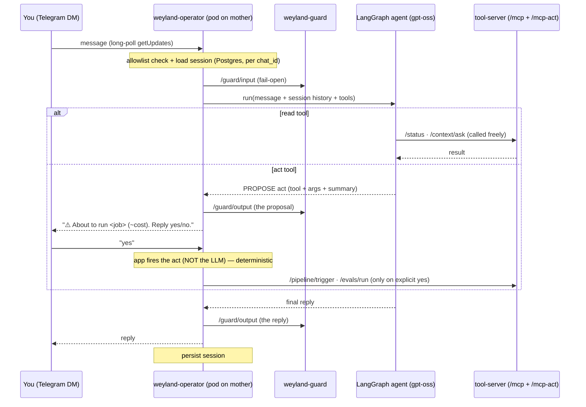

# B66 — Operator Agent Platform (design)

**Status:** Design — pending approval. **Owner:** Engineering. **Replaces:** Hermes (B2, retired + destroyed 2026-07-23)
+ OpenClaw (B28, canceled). The agent lane collapses to ONE thing: a single LangGraph pod on mother.

## 1. Goal
*Text it from anywhere → it acts on the lab.* A Telegram-fronted operator agent that reasons over the tool-server's
read + act tools: you DM it an ops request → it calls the right tool(s) → replies, grounded in live state. Expensive/
irreversible actions require an explicit human confirm.

## 2. Settled decisions (from this session's investigation)
| decision | choice | evidence |
|---|---|---|
| **Brain** | **`gpt-oss:20b`** (local, Ollama on rogueone); **Haiku (API, ~cents/mo) = documented fallback** | bake-off: gpt-oss ties Claude Haiku on tool-selection (8/8), the full agent loop (3/3), AND the act-path safety test (8/8, declined every trap) — `docs/demos/brain-bakeoff.md` |
| **Framework** | **LangGraph** (+ LangChain `ChatOpenAI` → Ollama) | proven in B70 `weyland-agent`; gpt-oss speaks native tool-calling |
| **Shell** | **fresh** (not Hermes/OpenClaw — both retired) | Hermes was a 3rd-party framework; the brain (its weakness) is fixed; we own the confirm-step rail on LangGraph |
| **Deployment** | **k8s pod on mother** (weyland ns), NOT a container | it's a LangGraph service like weyland-agent; lighter than an LXC; frees CT-104's 6Gi/4vCPU |
| **Ingress** | **Telegram long-poll** (`getUpdates`, outbound-only) | LAN can't receive webhooks; a meshed pod egresses to `api.telegram.org` (LiteLLM already egresses to public APIs) |
| **Tools** | the tool-server MCP plane — `/mcp` (read) + `/mcp-act` (act) | existing, guarded, audited |
| **ToS** | non-issue | everything is human-triggered personal lab use; and the brain is local anyway |

## 3. Architecture (the operator loop)

**Components** (one pod, `weyland-operator`):
- **Ingress loop** — Telegram `getUpdates` long-poll; per message: allowlist check → load session → guard-in → agent → guard-out → `sendMessage` → persist session.
- **LangGraph agent** — a tool-calling ReAct loop (like the bake-off full-loop, productionized): gpt-oss with the tool-server tools bound. Read tools called freely; act tools are **PROPOSE-only** (see §5).
- **Session store** — Postgres, per `chat_id` (§4).
- **Guard** — weyland-guard INPUT on the user message + OUTPUT on the reply/proposal, fail-open.
- **Observability** — MLflow Traces (dual autolog, reused from weyland-agent) + Prometheus `/metrics`.

## 4. Session / memory (Postgres, STRICT-mTLS → meshed)
Table `operator_sessions`: `chat_id` (PK) · `history` (JSONB — the last N turns, bounded to fit context + avoid
unbounded growth) · `pending_action` (JSONB — a proposed act awaiting confirm, or null) · `updated_at`. Per-chat, so
multiple allowlisted users don't cross-talk. Survives pod restarts (unlike an in-memory agent).

## 5. The confirm-step (the safety-critical bit) — PROPOSED
Act tools (`pipeline_trigger`, `evals_run`, `evals_score`) fire real, expensive, irreversible jobs. The rail keeps the
**fire decision out of the LLM's hands**:
- **A (recommended) — app-level pending-action.** The LLM can only call `propose_act(tool, args, summary)` (act tools
  are not directly callable). The app stores the proposal in `session.pending_action`, replies with a confirm prompt,
  and on the next message — **if it's an explicit "yes" from the same allowlisted chat** — the *app* (not the LLM)
  fires the real act tool. "no"/anything-else clears it. Deterministic, LLM-out-of-the-loop on the actual fire.
- **B (alternative) — LangGraph human-in-the-loop `interrupt`.** The idiomatic LangGraph pattern: interrupt before an
  act tool, persist graph state (Postgres checkpointer), resume on the user's reply. More idiomatic but heavier
  (checkpointer + resuming across async Telegram turns), and it leaves the fire closer to the graph.

**Defense-in-depth regardless (all three layers):** (1) Telegram **allowlist** — only allowlisted chat_ids command it;
(2) **confirm-step** — human yes before any act; (3) the tool-server already **validates `job_name`** against defined
jobs (a hallucinated job 400s, never fires). The bake-off showed gpt-oss declines destructive/ambiguous/unknown asks,
but these rails hold even when the brain errs.

## 6. Model access
`ChatOpenAI(base_url=<Ollama>, model="gpt-oss:20b")` — the loop's reasoning/tool-calling. **Haiku fallback:** an env
switch (`OPERATOR_LLM=local|haiku`) to repoint at Haiku (API) if rogueone is asleep or you want cloud offload — a
config flip, no code change (same as the B70 Phase-A/B pattern).

## 7. Deployment (registry + Argo, reuses the weyland-agent pattern)
- Image `registry.weyland.lab/weyland-operator:v1`; deps: langgraph, langchain-openai, python-telegram-bot, httpx,
  psycopg2-binary, mlflow, prometheus-client, fastapi/uvicorn (for the `/health` + `/metrics` probe/scrape server —
  there's no inbound Telegram server, long-poll is outbound).
- `k8s/weyland-operator/`: Deployment (**meshed** — STRICT Postgres for sessions; egress to `api.telegram.org` + Ollama
  on rogueone + tool-server in-cluster), Service (ClusterIP, for `/metrics`), ServiceMonitor, Secret (Telegram bot
  token + allowlist), Argo app in `subdir-apps.yaml`. No ingress (long-poll worker).
- Guard + tool-server URLs + Ollama via env; actor for `/mcp-act` audit = `operator:<telegram_user>`.

## 8. Observability
MLflow dual-autolog (langchain + llama_index) → one Trace per handled message (experiment `operator`). Prometheus
`/metrics`: messages handled, tool calls, act proposals/confirms, guard verdicts, errors. Kuma can't HTTP-monitor a
long-poll worker → rely on `/metrics` + B98 node/pod alerts.

## 9. Reuse from `weyland-agent` (B70)
The operator is weyland-agent's cousin: same LangGraph + `ChatOpenAI`→Ollama + weyland-guard client + MLflow autolog +
registry/Argo deploy. New parts: Telegram ingress, the tool-server MCP tools (vs custom retrievers), session memory,
and the confirm-step. Lift the shared plumbing.

## 10. Open decisions to confirm
1. **Confirm-step impl** — app-level pending-action (§5-A, recommended) vs LangGraph `interrupt` (§5-B)?
2. **Bot token** — RESOLVED 2026-07-23: the Hermes token lived in `~/.hermes/.env` on the destroyed CT-104 → **mint a
   FRESH Telegram bot** for the operator (@BotFather `/newbot` → new token → k8s Secret). Separate bot from the
   Kuma/Alertmanager paging (don't touch alerting). ⚠️ **Verify the alerting Telegram still pages** — Kuma should still
   hold its own copy of the old token in its SQLite (destroying CT-104 doesn't touch it), but confirm a test alert
   reaches Telegram; if that path shared the now-unavailable token, it needs its own bot too.
3. **Session history bound** — last N turns (propose N=10) + a summarize-older step later, or start turn-window only?
4. **Haiku fallback** — wire the env switch now, or local-only for v1 and add the switch when a rogueone-asleep gap bites?

## 11. Build sequence (proposed)
1. Scaffold `weyland-operator` (LangGraph agent + tool binding + guard client, lifted from weyland-agent) — the agent
   loop, tested against the tool-server read tools first (no Telegram, no acts).
2. Add the Telegram long-poll ingress + allowlist + session (Postgres).
3. Add the confirm-step (propose→confirm→fire) for the act tools.
4. Deploy (registry + k8s + Argo), MLflow + Prometheus, docs (runbook + arch/api/hosts/platform-map) + a `demos/operator.md`.
