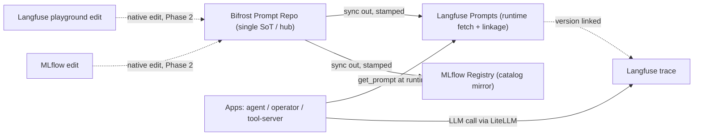

# Prompt Federation — Design

**Status:** Phase 1 in build (2026-08-09). Sub-workstream of **B103** (Langfuse). Not a separate B-number.

## Goal

Broad runtime **prompt → trace linkage** — every LLM call traced with the exact prompt *version* that produced it —
with **Bifrost as the single authoring source of truth**.

## Current state (three stores, being unified)

| Store | Population | Format | Runtime→obs linkage today |
|---|---|---|---|
| **Bifrost** Prompt Repo | 241 reusable, model-agnostic prompts (11 folders) | chat messages `[{role,content}]`, `{{var}}` (auto-extracted) | **none** |
| **MLflow** Prompt Registry | app-integrated: `rag_system`, `operator_system`, `agent_grade`, `agent_reflect`, … | plain-string templates, `{var}` (`str.format`) | **yes** — apps `prompts.load_prompt` (TTL-cache + fail-safe fallback + `loaded_version` for trace tagging) |
| **Langfuse** Prompts | empty (B103 just deployed) | chat or text, `{{var}}` | — |

The historical Bifrost(library)/MLflow(app) split was deliberate; this design **unifies authoring into Bifrost**.

## Decisions

1. **Bifrost = single SoT.** Everything authored/managed in the Bifrost Prompt Repository (best management UX).
2. **Langfuse = runtime fetch surface → linkage.** Apps `get_prompt` from Langfuse; their calls are already traced
   (LiteLLM → Langfuse, B103), so the fetch is what creates trace↔version linkage. **Linkage is created at fetch
   time, so SoT is orthogonal to it** — that is why author-in-Bifrost + fetch-from-Langfuse both work.
3. **MLflow = catalog mirror.** Keeps a synced copy; apps stop *fetching* app prompts from it (they move to Langfuse).
4. **Bidirectional reconcile.** Native edits made in Langfuse/MLflow flow back to Bifrost, which re-propagates.

## Architecture (hub-and-spoke, Bifrost = hub)

## The normalizer (format impedance — the core of the reconciler)

The three tools model prompts differently, so the sync is a **normalizer**, not a copy:

- **Bifrost → Langfuse:** near-identity — both chat + `{{var}}`. Upsert as Langfuse `type="chat"`.
- **Bifrost → MLflow:** flatten messages → string; translate `{{var}}` → `{var}`.
- **MLflow → Bifrost** (the 1a migration + Phase-2 inbound): wrap string → single message (role heuristic: `system`
  for `*_system`, else `user`); translate `{var}` → `{{var}}`.
- **Runtime render:** Langfuse `.compile(**vars)` fills `{{var}}`. The app's `render_prompt` (today `str.format`
  `{var}`) switches to `compile`, keeping the **baked `{var}` fallback** for the Langfuse-unreachable path.

## Identity + idempotency

- Prompt identity = name (+ folder). Version identity = **content hash** of the normalized messages (NOT per-tool
  version numbers, which drift independently across three tools).
- **Manifest** — Postgres table `prompt_federation_manifest`: `name → {bifrost_hash, langfuse_version,
  mlflow_version, last_sync}`. Push a new downstream version **only when the canonical hash changes** (no churn).

## Loop prevention (Phase 2, inbound)

Every sync-propagated version is **stamped** (Langfuse label / MLflow tag / Bifrost commit_message =
`synced-from-bifrost:<hash>`). The inbound pass reads only **unstamped (natively-authored)** versions — this breaks
the `A → B → A` loop.

## Conflict policy (Phase 2 — decision deferred)

If >1 tool has new native content for the same prompt since last sync → conflict. Proposed default:
**last-write-wins by version timestamp + a logged WARNING** (optional Kuma/Telegram alert); **Bifrost-always-wins**
is the safe alternative. Settle when Phase 2 starts — it does not affect Phase 1 (outbound is conflict-free).

## Linkage mechanism (build-time probe, not a guess)

- **Path A:** LiteLLM's Langfuse callback forwards a `langfuse_prompt` link via request metadata → the app just
  passes the prompt name/version.
- **Path B:** the app uses the Langfuse SDK / LangChain callback handler directly around the generation with the
  fetched prompt object.

Determine empirically — probe whether the LiteLLM callback links the prompt; if not, use Path B (weyland-agent is
LangGraph → the Langfuse LangChain handler is the likely robust path).

## Phasing

- **Phase 1 (this build) — outbound + linkage (the payoff):**
  - **1a** migrate the MLflow app prompts into Bifrost (normalized `{var}`→`{{var}}`) — one authoring home.
  - **1b** `sync_prompts.py`: Bifrost read → normalize → upsert Langfuse `production` (stamped) + MLflow mirror.
  - **1c** retrofit **weyland-agent** `load_prompt` → Langfuse; prove one traced call shows the linked version.
  - Then roll 1c to operator + tool-server.
- **Phase 2 — inbound reconcile:** Langfuse/MLflow → Bifrost (skip-stamped + conflict policy). Bidirectional done.

## Components / files

- **New:** `services/weyland-dagster/scripts/sync_prompts.py` — the reconciler (Phase 1 outbound; Phase 2 adds
  inbound). Wired into the Dagster `registrations` group (weekly + on-demand), like `bifrost_prompts_registered`.
- **New/extended:** the app-prompt migration into Bifrost (1a) — extend `register_bifrost_prompts.py` or a one-shot.
- **Modified:** `weyland-agent/prompts.py` (fetch backend → Langfuse; keep TTL + fallback) + `graph.py` (link the
  prompt on the generation); then `weyland-operator` + `weyland-tool-server` `prompts.py`.
- **Manifest:** Postgres table `prompt_federation_manifest`.

## Verification

- **1a:** app prompts appear in the Bifrost repo (`GET /api/prompt-repo/prompts`).
- **1b:** `langfuse.get_prompt(name)` returns each; MLflow mirror present.
- **1c:** fire a weyland-agent RAG call → the Langfuse trace shows the **linked prompt version** — the payoff.
