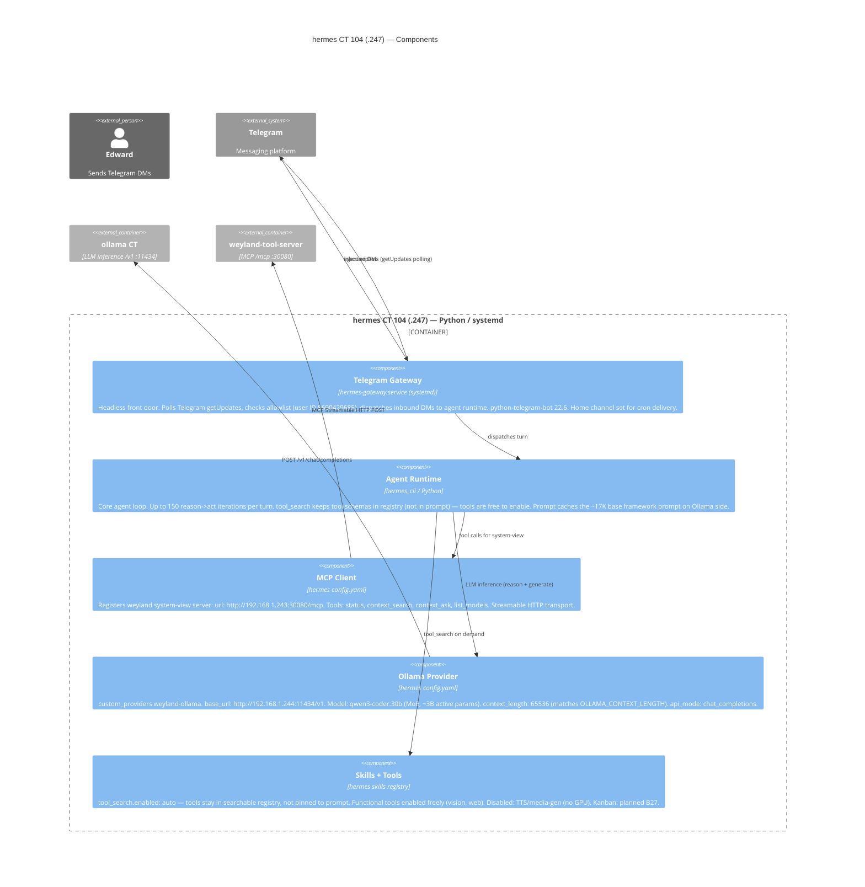

# C4 Component — hermes CT (CT 104)

Level 3: components inside the Hermes agent container. See [c4-container.md](c4-container.md) for the container view.

```mermaid
C4Component
    title hermes CT 104 (.247) — Components

    Person_Ext(user, "Edward", "Sends Telegram DMs")
    System_Ext(telegram, "Telegram", "Messaging platform")
    Container_Ext(ollama_ct, "ollama CT", "LLM inference /v1 :11434")
    Container_Ext(tool_server, "weyland-tool-server", "MCP /mcp :30080")

    Container_Boundary(hermes_ct, "hermes CT 104 (.247) — Python / systemd") {

        Component(gateway, "Telegram Gateway", "hermes-gateway.service (systemd)", "Headless front door. Polls Telegram getUpdates, checks allowlist (user ID 8690429685), dispatches inbound DMs to agent runtime. python-telegram-bot 22.6. Home channel set for cron delivery.")

        Component(agent_runtime, "Agent Runtime", "hermes_cli / Python", "Core agent loop. Up to 150 reason->act iterations per turn. tool_search keeps tool schemas in registry (not in prompt) — tools are free to enable. Prompt caches the ~17K base framework prompt on Ollama side.")

        Component(mcp_client, "MCP Client", "hermes config.yaml", "Registers weyland system-view server: url: http://192.168.1.243:30080/mcp. Tools: status, context_search, context_ask, list_models. Streamable HTTP transport.")

        Component(ollama_provider, "Ollama Provider", "hermes config.yaml", "custom_providers weyland-ollama. base_url: http://192.168.1.244:11434/v1. Model: qwen3-coder:30b (MoE, ~3B active params). context_length: 65536 (matches OLLAMA_CONTEXT_LENGTH). api_mode: chat_completions.")

        Component(skills, "Skills + Tools", "hermes skills registry", "tool_search.enabled: auto — tools stay in searchable registry, not pinned to prompt. Functional tools enabled freely (vision, web). Disabled: TTS/media-gen (no GPU). Kanban: planned B27.")
    }

    Rel(telegram, gateway, "inbound DMs (getUpdates polling)")
    Rel(gateway, agent_runtime, "dispatches turn")
    Rel(agent_runtime, mcp_client, "tool calls for system-view")
    Rel(mcp_client, tool_server, "MCP Streamable HTTP POST")
    Rel(agent_runtime, ollama_provider, "LLM inference (reason + generate)")
    Rel(ollama_provider, ollama_ct, "POST /v1/chat/completions")
    Rel(agent_runtime, skills, "tool_search on demand")
    Rel(gateway, telegram, "agent replies")
```
