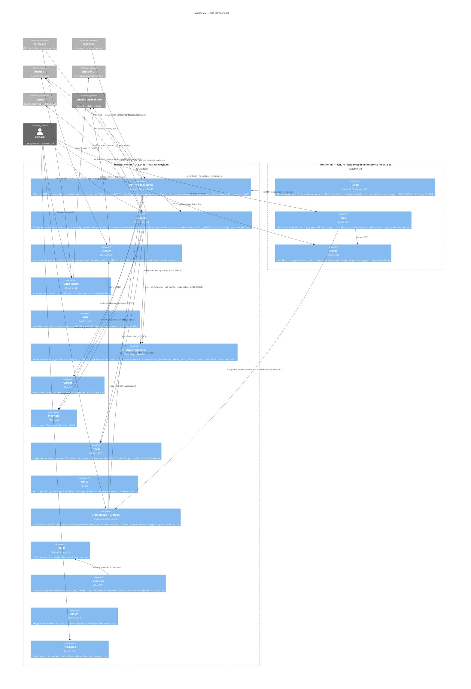

# C4 Component — mother VM (k3s)

Level 3: components inside the mother k3s container. See [c4-container.md](c4-container.md) for the container view.

```mermaid
C4Component
    title mother VM — k3s Components

    Container_Ext(hermes, "hermes CT", "MCP client + LiteLLM planning client")
    Container_Ext(rogueone, "rogueone", "Claude Code — MCP client")
    Container_Ext(ollama_ct, "ollama CT", "LLM inference /v1")
    Container_Ext(whisper_ct, "whisper CT", "STT /v1/audio/transcriptions")
    Container_Ext(github, "GitHub", "weyland-lab repo — RAG source")
    System_Ext(hostedmodels, "Gemini / OpenRouter", "hosted LLMs (free tiers)")
    Person_Ext(user, "Edward", "Lab operator — browser UIs")

    Container_Boundary(mother, "mother VM vm-101 (.243) — k3s, ns: weyland") {

        Component(tool_server, "weyland-tool-server", "FastAPI / Python v0.4.0", "Platform HTTP boundary. RAG retrieval (4 backends), /context/ask (RAG gen), /evals/*, /pipeline/trigger, /health, /ready, /status. Exposes /mcp system-view MCP server (fastapi-mcp, Streamable HTTP, read-only). :30080")

        Component(dagster, "Dagster", "Python / Helm", "Pipeline orchestration. weyland_ingestion_job (git-pull docs/+nodes/ -> chunk -> embed -> 4-backend write). weyland_eval_job + weyland_eval_score_job. weyland_catalog_job (6h -> model_catalog). dagster.weyland.lab")

        Component(litellm, "LiteLLM", "LiteLLM / k8s", "Hosted-model gateway. Gemini + OpenRouter (wildcard) behind OpenAI /v1. Off-box cut-off valve + spend alerts. mother:30400, litellm.weyland.lab")

        Component(open_webui, "Open WebUI", "Docker / k8s", "Browser voice/chat UI. chat -> Ollama, STT -> whisper shim. chat.weyland.lab")

        Component(n8n, "n8n", "Node.js / k8s", "Workflow automation. Ingestion role retired (-> Dagster). Retained for other automation. n8n.weyland.lab")

        Component(pgvector, "Postgres / pgvector", "PostgreSQL + pgvector", "Primary RAG store: rag_documents + rag_chunks (384-dim bge vectors). Eval tables: eval_runs/questions/results/scores + eval_leaderboard. model_catalog (hosted-model lookup, 6h). In-cluster only :5432")

        Component(qdrant, "Qdrant", "Qdrant", "Vector store. Collection: weyland_chunks. :30083 (HTTP) :30084 (gRPC)")

        Component(weaviate, "Weaviate", "Weaviate", "Vector store. Class: WeylandChunk. :30087")

        Component(neo4j, "Neo4j", "Neo4j + APOC", "Graph + vector index. GraphRAG foundation: Document/Chunk nodes, BELONGS_TO + NEXT edges. :30085 (HTTP) :30086 (Bolt)")

        Component(minio, "MinIO", "MinIO", "S3-compatible object storage. 8TB USB passthrough. s3.weyland.lab (API) files.weyland.lab (Filestash UI)")

        Component(prometheus, "Prometheus + Grafana", "kube-prometheus-stack", "Observability: cluster/node/pod dashboards, ServiceMonitors (Qdrant/Weaviate/APISIX/CoreDNS), Alertmanager -> Telegram. grafana.weyland.lab")

        Component(traefik, "Traefik", "k3s built-in ingress", "TLS termination for *.weyland.lab. mkcert wildcard cert.")

        Component(coredns, "CoreDNS", "CoreDNS", "LAN DNS. *.weyland.lab wildcard -> mother (Traefik). CT-specific zones: ollama.weyland.lab -> .244, whisper.weyland.lab -> .246. :53")

        Component(apisix, "APISIX", "APISIX / etcd", "API gateway for external routes. :30090 (data plane) apisix.weyland.lab (dashboard)")

        Component(headlamp, "Headlamp", "React / k8s", "Kubernetes UI. Permanent cluster-admin SA token. headlamp.weyland.lab")
    }

    Container_Boundary(istiosystem, "mother VM — k3s, ns: istio-system (Istio service mesh, B8)") {

        Component(istiod, "istiod", "Istio 1.30 / minimal profile", "Mesh control plane. Per-pod sidecar injection (LABEL sidecar.istio.io/inject). Meshed: tool-server + 4 backends + Dagster, PERMISSIVE mTLS; Postgres STRICT.")

        Component(kiali, "Kiali", "Kiali / k8s", "Mesh observability UI: topology graph, mTLS lock status, traces. Read-only + RBAC-tightened. dev-password ingress. kiali.weyland.lab")

        Component(jaeger, "Jaeger", "Jaeger / k8s", "Distributed tracing UI for mesh spans (Telemetry + extensionProvider). dev-password ingress. jaeger.weyland.lab")
    }

    Rel(hermes, tool_server, "MCP /mcp — status, context_search, context_ask, list_models")
    Rel(rogueone, tool_server, "MCP /mcp (Claude Code)")
    Rel(user, open_webui, "browser voice/chat")
    Rel(user, dagster, "pipeline UI")
    Rel(user, prometheus, "observability dashboards")
    Rel(user, headlamp, "k8s management")
    Rel(tool_server, pgvector, "embed + retrieve rag_chunks (mTLS, STRICT)")
    Rel(tool_server, qdrant, "retrieve (mTLS)")
    Rel(tool_server, weaviate, "retrieve (mTLS)")
    Rel(tool_server, neo4j, "retrieve (mTLS)")
    Rel(tool_server, ollama_ct, "RAG generate + eval judge /v1")
    Rel(tool_server, dagster, "POST /pipeline/trigger launchRun")
    Rel(dagster, github, "git-pull docs/ + nodes/ (B25b — replaced Obsidian SSH)")
    Rel(dagster, hostedmodels, "model_catalog: fetch OpenRouter/Gemini model lists")
    Rel(dagster, pgvector, "write rag_documents + rag_chunks + model_catalog (mTLS, STRICT)")
    Rel(dagster, qdrant, "write weyland_chunks (mTLS)")
    Rel(dagster, weaviate, "write WeylandChunk (mTLS)")
    Rel(dagster, neo4j, "write nodes + edges (mTLS)")
    Rel(dagster, ollama_ct, "eval: generate questions + judge responses")
    Rel(open_webui, ollama_ct, "chat completions /v1")
    Rel(open_webui, whisper_ct, "STT /v1/audio/transcriptions")
    Rel(prometheus, tool_server, "scrape /metrics + ServiceMonitors")
    Rel(prometheus, litellm, "scrape /metrics (request/spend)")
    Rel(hermes, litellm, "planning turns /v1 (Gemini-free)")
    Rel(litellm, hostedmodels, "egress: Gemini / OpenRouter")
    Rel(coredns, traefik, "*.weyland.lab wildcard resolution")
    Rel(user, kiali, "mesh graph + mTLS status (dev-password)")
    Rel(user, jaeger, "trace UI (dev-password)")
    Rel(istiod, tool_server, "injects + configures Envoy sidecars")
    Rel(kiali, prometheus, "Envoy mesh metrics (consolidated onto kube-prometheus-stack)")
    Rel(kiali, jaeger, "traces :16685")
    Rel(prometheus, tool_server, "scrape Envoy /stats (PodMonitor)")
```
