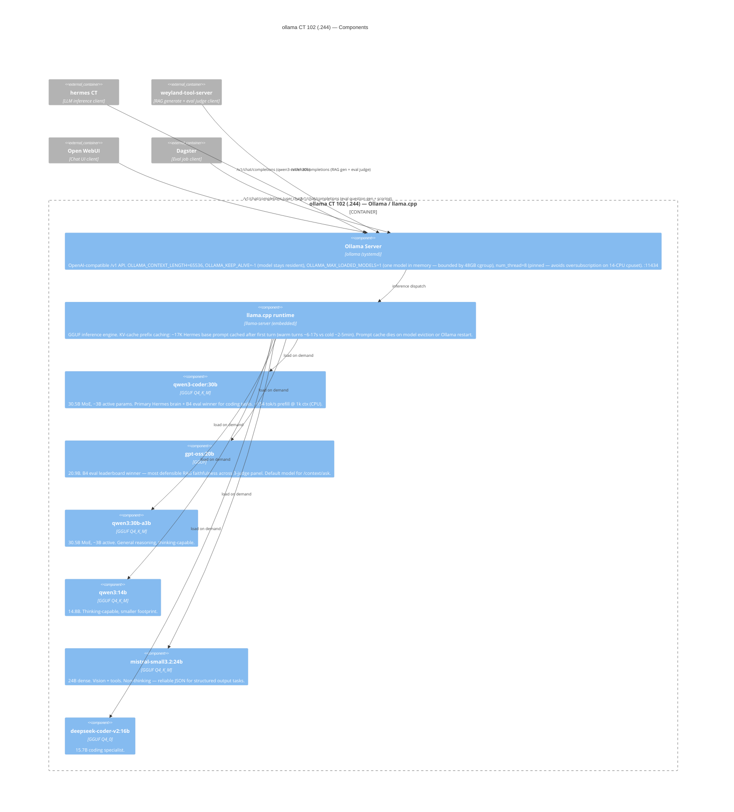

# C4 Component — ollama CT (CT 102)

Level 3: components inside the Ollama LLM serving container. See [c4-container.md](c4-container.md) for the container view.

```mermaid
C4Component
    title ollama CT 102 (.244) — Components

    Container_Ext(hermes, "hermes CT", "LLM inference client")
    Container_Ext(tool_server, "weyland-tool-server", "RAG generate + eval judge client")
    Container_Ext(open_webui, "Open WebUI", "Chat UI client")
    Container_Ext(dagster, "Dagster", "Eval job client")

    Container_Boundary(ollama_ct, "ollama CT 102 (.244) — Ollama / llama.cpp") {

        Component(ollama_server, "Ollama Server", "ollama (systemd)", "OpenAI-compatible /v1 API. OLLAMA_CONTEXT_LENGTH=65536, OLLAMA_KEEP_ALIVE=-1 (model stays resident), OLLAMA_MAX_LOADED_MODELS=1 (one model in memory — bounded by 48GB cgroup), num_thread=8 (pinned — avoids oversubscription on 14-CPU cpuset). :11434")

        Component(llama_cpp, "llama.cpp runtime", "llama-server (embedded)", "GGUF inference engine. KV-cache prefix caching: ~17K Hermes base prompt cached after first turn (warm turns ~6-17s vs cold ~2-5min). Prompt cache dies on model eviction or Ollama restart.")

        Component(model_qwen3_coder, "qwen3-coder:30b", "GGUF Q4_K_M", "30.5B MoE, ~3B active params. Primary Hermes brain + B4 eval winner for coding tasks. ~154 tok/s prefill @ 1k ctx (CPU).")

        Component(model_gpt_oss, "gpt-oss:20b", "GGUF", "20.9B. B4 eval leaderboard winner — most defensible RAG faithfulness across 3-judge panel. Default model for /context/ask.")

        Component(model_qwen3, "qwen3:30b-a3b", "GGUF Q4_K_M", "30.5B MoE, ~3B active. General reasoning, thinking-capable.")

        Component(model_qwen3_14b, "qwen3:14b", "GGUF Q4_K_M", "14.8B. Thinking-capable, smaller footprint.")

        Component(model_mistral, "mistral-small3.2:24b", "GGUF Q4_K_M", "24B dense. Vision + tools. Non-thinking — reliable JSON for structured output tasks.")

        Component(model_deepseek, "deepseek-coder-v2:16b", "GGUF Q4_0", "15.7B coding specialist.")
    }

    Rel(hermes, ollama_server, "/v1/chat/completions (qwen3-coder:30b)")
    Rel(tool_server, ollama_server, "/v1/chat/completions (RAG gen + eval judge)")
    Rel(open_webui, ollama_server, "/v1/chat/completions (user chat)")
    Rel(dagster, ollama_server, "/v1/chat/completions (eval question gen + scoring)")
    Rel(ollama_server, llama_cpp, "inference dispatch")
    Rel(llama_cpp, model_qwen3_coder, "load on demand")
    Rel(llama_cpp, model_gpt_oss, "load on demand")
    Rel(llama_cpp, model_qwen3, "load on demand")
    Rel(llama_cpp, model_qwen3_14b, "load on demand")
    Rel(llama_cpp, model_mistral, "load on demand")
    Rel(llama_cpp, model_deepseek, "load on demand")
```
