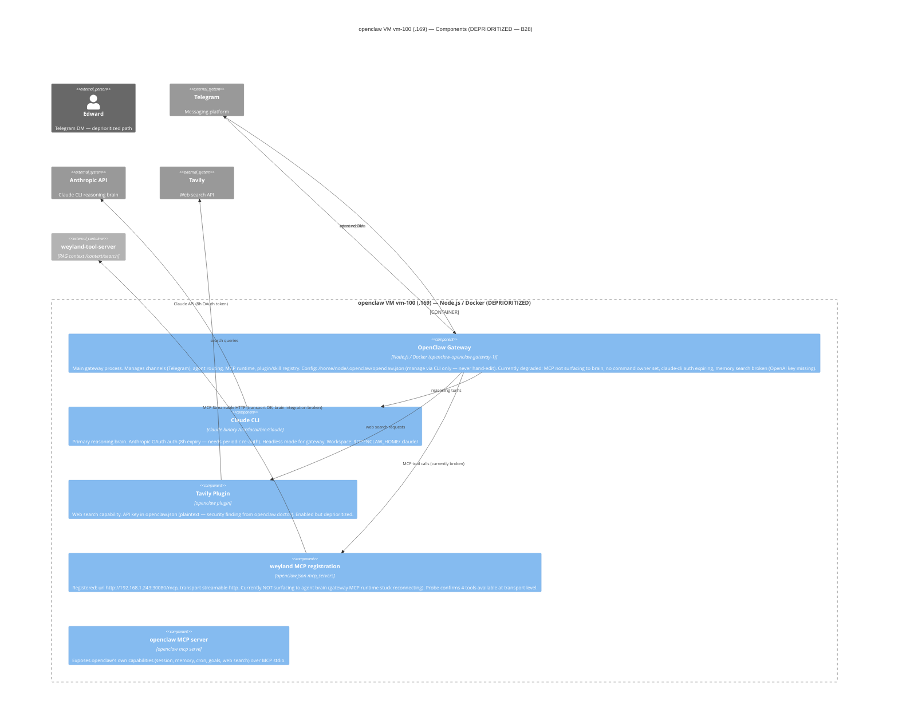

# C4 Component — openclaw VM (vm-100)

Level 3: components inside the OpenClaw VM. **DEPRIORITIZED (B28)** — running but not the active agent path. See [c4-container.md](c4-container.md) for context.

