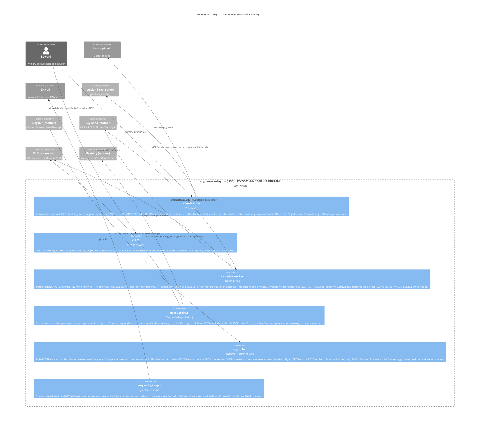

# C4 Component — rogueone (external)

Level 3: components on the rogueone laptop. rogueone is an EXTERNAL system to weyland (separate physical machine on the same LAN). See [c4-context.md](c4-context.md) for system context.

