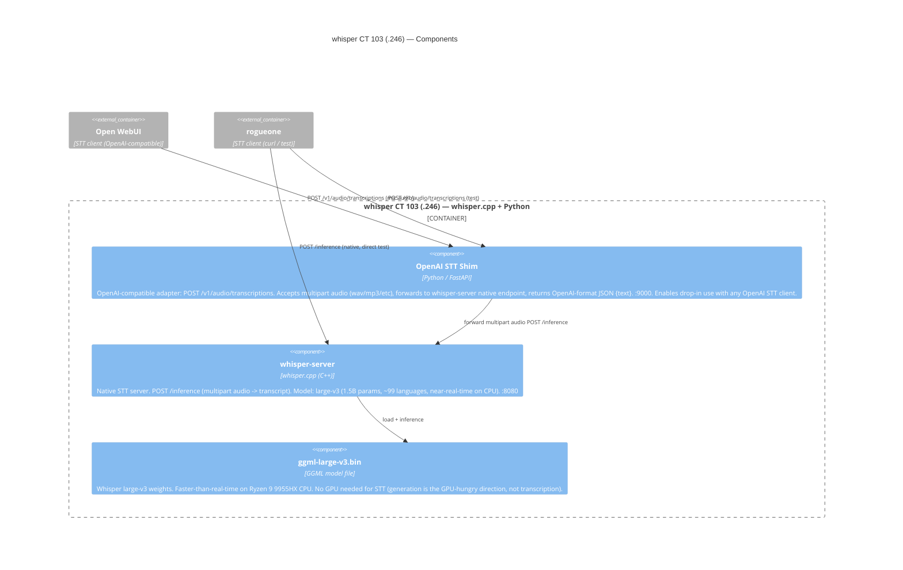

# C4 Component — whisper CT (CT 103)

Level 3: components inside the whisper speech-to-text container. See [c4-container.md](c4-container.md) for the container view.

```mermaid
C4Component
    title whisper CT 103 (.246) — Components

    Container_Ext(open_webui, "Open WebUI", "STT client (OpenAI-compatible)")
    Container_Ext(rogueone, "rogueone", "STT client (curl / test)")

    Container_Boundary(whisper_ct, "whisper CT 103 (.246) — whisper.cpp + Python") {

        Component(openai_shim, "OpenAI STT Shim", "Python / FastAPI", "OpenAI-compatible adapter: POST /v1/audio/transcriptions. Accepts multipart audio (wav/mp3/etc), forwards to whisper-server native endpoint, returns OpenAI-format JSON {text}. :9000. Enables drop-in use with any OpenAI STT client.")

        Component(whisper_server, "whisper-server", "whisper.cpp (C++)", "Native STT server. POST /inference (multipart audio -> transcript). Model: large-v3 (1.5B params, ~99 languages, near-real-time on CPU). :8080")

        Component(model_large_v3, "ggml-large-v3.bin", "GGML model file", "Whisper large-v3 weights. Faster-than-real-time on Ryzen 9 9955HX CPU. No GPU needed for STT (generation is the GPU-hungry direction, not transcription).")
    }

    Rel(open_webui, openai_shim, "POST /v1/audio/transcriptions (mic audio)")
    Rel(rogueone, openai_shim, "POST /v1/audio/transcriptions (test)")
    Rel(rogueone, whisper_server, "POST /inference (native, direct test)")
    Rel(openai_shim, whisper_server, "forward multipart audio POST /inference")
    Rel(whisper_server, model_large_v3, "load + inference")
```
