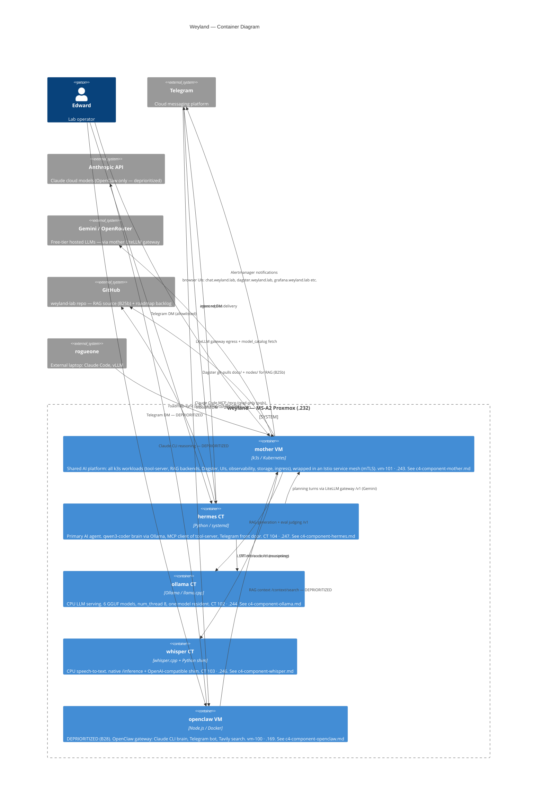

# C4 Container — Weyland

Level 2: deployable containers inside the weyland system boundary. For external context see [c4-context.md](c4-context.md). For component detail see the component files linked below.

**Component diagrams:** [mother k3s](c4-component-mother.md) · [hermes CT](c4-component-hermes.md) · [ollama CT](c4-component-ollama.md) · [whisper CT](c4-component-whisper.md) · [openclaw VM](c4-component-openclaw.md) · [rogueone](c4-component-rogueone.md)

