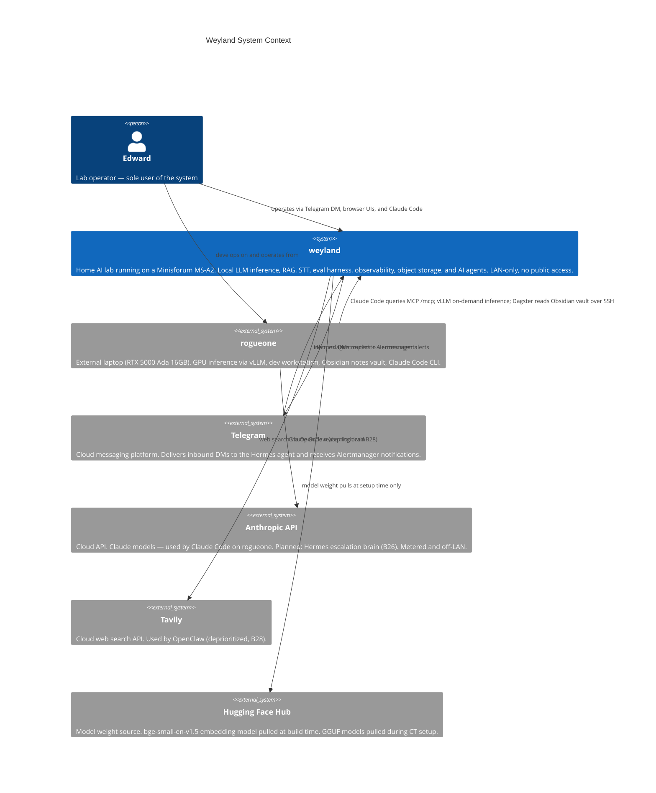

# C4 Context — Weyland

Level 1: weyland in the world. Shows system boundaries and external actors. For internal containers see [c4-container.md](c4-container.md).

```mermaid
C4Context
    title Weyland System Context

    Person(user, "Edward", "Lab operator — sole user of the system")

    System(weyland, "weyland", "Home AI lab running on a Minisforum MS-A2. Local LLM inference, RAG, STT, eval harness, observability, object storage, and AI agents. LAN-only, no public access.")

    System_Ext(rogueone, "rogueone", "External laptop (RTX 5000 Ada 16GB). GPU inference via vLLM, dev workstation, Obsidian notes vault, Claude Code CLI.")

    System_Ext(telegram, "Telegram", "Cloud messaging platform. Delivers inbound DMs to the Hermes agent and receives Alertmanager notifications.")
    System_Ext(anthropic, "Anthropic API", "Cloud API. Claude models — used by Claude Code on rogueone. Planned: Hermes escalation brain (B26). Metered and off-LAN.")
    System_Ext(tavily, "Tavily", "Cloud web search API. Used by OpenClaw (deprioritized, B28).")
    System_Ext(hf, "Hugging Face Hub", "Model weight source. bge-small-en-v1.5 embedding model pulled at build time. GGUF models pulled during CT setup.")

    Rel(user, weyland, "operates via Telegram DM, browser UIs, and Claude Code")
    Rel(user, rogueone, "develops on and operates from")
    Rel(weyland, telegram, "Hermes agent replies + Alertmanager alerts")
    Rel(telegram, weyland, "inbound DMs routed to Hermes agent")
    Rel(rogueone, weyland, "Claude Code queries MCP /mcp; vLLM on-demand inference; Dagster reads Obsidian vault over SSH")
    Rel(rogueone, anthropic, "Claude Code reasoning brain")
    Rel(weyland, tavily, "web search via OpenClaw (deprioritized B28)")
    Rel(weyland, hf, "model weight pulls at setup time only")
```
