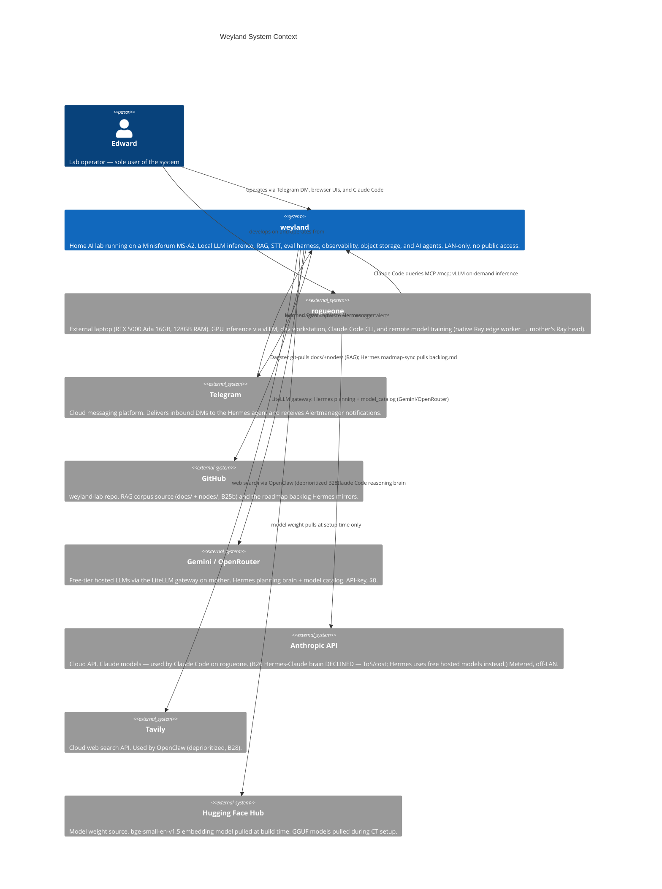

# C4 Context — Weyland

Level 1: weyland in the world. Shows system boundaries and external actors. For internal containers see [c4-container.md](c4-container.md).



## Same view in D2 (B64 evaluation)

Rendered to SVG at build time by `mkdocs-d2-plugin` (dagre layout). This block is the spike proof — compare legibility/layout with the Mermaid above. If this reads well, the structural diagrams (C4 + flowcharts) migrate to D2; the sequence diagrams stay in Mermaid.

```d2
# B64 spike — C4 context authored in D2. Compare with the Mermaid above.
direction: right

classes: {
  person: {
    shape: person
    style: { fill: "#08427b"; stroke: "#052e56"; font-color: "#ffffff" }
  }
  core: {
    style: { fill: "#1168bd"; stroke: "#0b4884"; font-color: "#ffffff" }
  }
  ext: {
    style: { fill: "#8b8b8b"; stroke: "#5f5f5f"; font-color: "#ffffff" }
  }
}

user: "Edward — lab operator (sole user)" { class: person }
weyland: "weyland — home AI lab (MS-A2): LLM inference, RAG, STT, eval, observability, object storage, agents. LAN-only." { class: core }
rogueone: "rogueone — RTX 5000 Ada laptop: vLLM GPU, dev + Claude Code, native Ray edge worker → mother's head" { class: ext }
telegram: "Telegram — inbound DMs to Hermes, Alertmanager alerts out" { class: ext }
github: "GitHub — weyland-lab repo: RAG corpus (docs/+nodes/) + roadmap backlog" { class: ext }
hostedmodels: "Gemini / OpenRouter — free-tier hosted LLMs via LiteLLM ($0)" { class: ext }
anthropic: "Anthropic API — Claude for Claude Code on rogueone (Hermes-Claude declined)" { class: ext }
tavily: "Tavily — cloud web search (OpenClaw, deprioritized B28)" { class: ext }
hf: "Hugging Face Hub — model weights (bge-small + GGUF) at build time" { class: ext }

user -> weyland: "Telegram DM, browser UIs, Claude Code"
user -> rogueone: "develops on / operates from"
weyland -> telegram: "Hermes replies + alerts"
telegram -> weyland: "inbound DMs → Hermes"
rogueone -> weyland: "MCP /mcp; vLLM on-demand"
rogueone -> anthropic: "Claude Code brain"
weyland -> github: "Dagster git-pull (RAG); roadmap-sync"
weyland -> hostedmodels: "LiteLLM: Hermes planning + model_catalog"
weyland -> tavily: "web search via OpenClaw"
weyland -> hf: "model weight pulls at setup"
```

