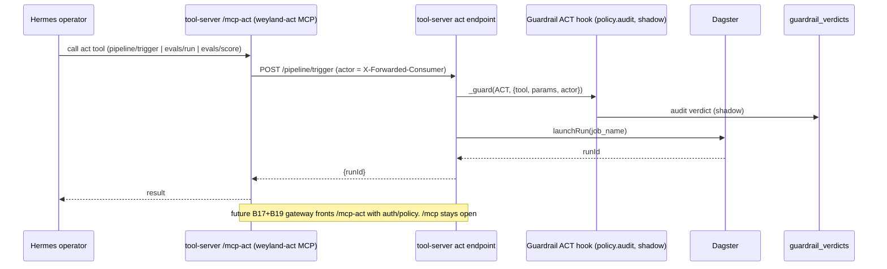

# Flow: Audited Act-Tool (`/mcp-act`, B14 read+act)

Read tools live on `/mcp` (open). Action tools live on a **separate `/mcp-act` mount** (`FastApiMCP`,
`include_tags=["mcp-act"]`) — agents must register it explicitly, so **read access never implies act
access**. Every act call passes the **ACT hook** (`policy.audit`, shadow → audited, not yet enforced).
This is the Hermes operator lane; Claude Code stays read-only on `/mcp`. Enforcing gate + gateway fronting
= B35 / B17+B19.

