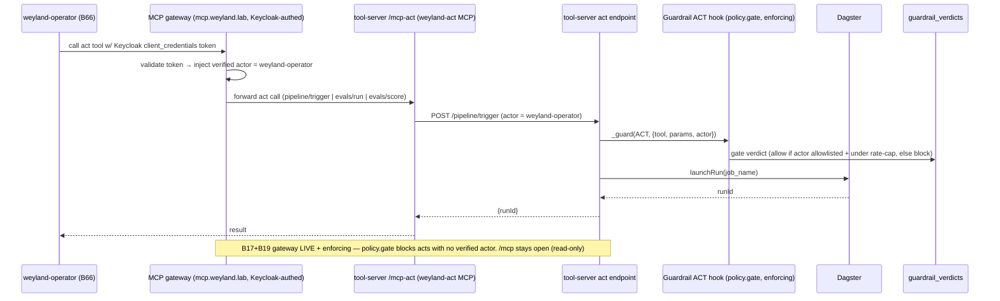

# Flow: Audited Act-Tool (`/mcp-act`, B14 read+act)

Read tools live on `/mcp` (open). Action tools live on a **separate `/mcp-act` mount** (`FastApiMCP`,
`include_tags=["mcp-act"]`) — agents must register it explicitly, so **read access never implies act
access**. Every act call passes the **ACT hook** — now the enforcing **`policy.gate`** (identity-required
allowlist + per-actor rate-cap). This is the **weyland-operator** (B66) lane; Claude Code stays read-only on
`/mcp`. The **B17+B19 MCP gateway** (`mcp.weyland.lab`) fronts `/mcp-act` — Keycloak-authed, injecting a
verified actor — and is **LIVE + enforcing** (not future).

