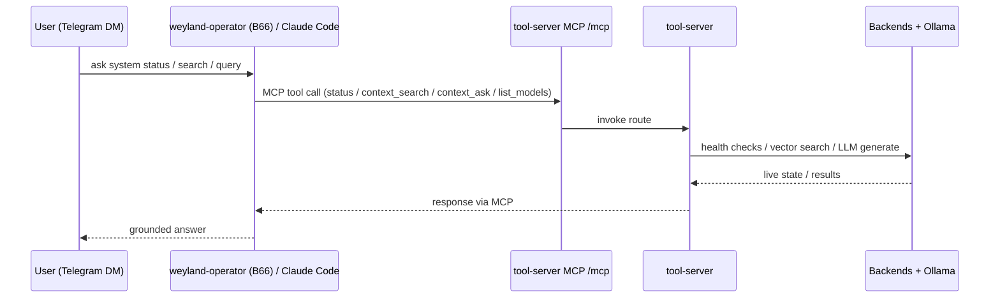

# Flow: Agent System-View (weyland-operator / Claude Code -> MCP -> tool-server)

B2 v1, validated 2026-06-14. The `/mcp` path is **read-only**; write/act tools live on the separate `/mcp-act`
mount, now fronted by the **live B17+B19 MCP gateway** (`mcp.weyland.lab`, Keycloak-authed, enforcing).

**Consumers:** the **weyland-operator** (B66, replaced Hermes CT-104, retired 2026-07-23) · Claude Code on rogueone (registered via `claude mcp add weyland`).
**Write/act routes** (`/pipeline/trigger`, `/evals/run`, `/evals/score`) live on the separate `/mcp-act` mount — excluded from `/mcp`, and now **LIVE + enforcing** behind the B17+B19 MCP gateway (Keycloak-verified actor + the guard's `policy.gate`). See [flow-act-tool.md](flow-act-tool.md).
