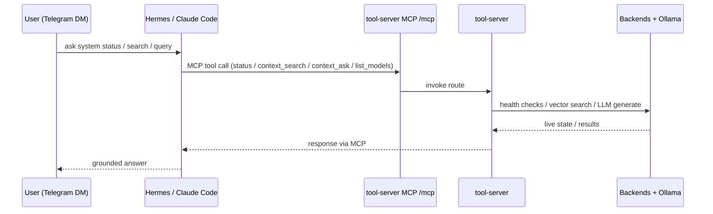

# Flow: Agent System-View (Hermes / Claude Code -> MCP -> tool-server)

B2 v1, validated 2026-06-14. The MCP path is read-only (write/act tools gated on B14).

**Consumers:** Hermes CT 104 (registered in `~/.hermes/config.yaml`) · Claude Code on rogueone (registered via `claude mcp add weyland`).
**Write/act routes** (`/pipeline/trigger`, `/evals/run`, `/evals/score`) are untagged — excluded from MCP v1. Enabled in B14.
