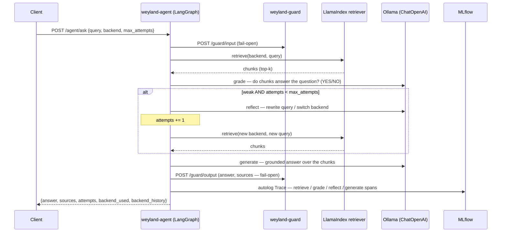

# Flow: Agentic RAG (`weyland-agent`, B70)

The self-reflective loop — **retrieve → grade → reflect/re-retrieve → generate** — bounded by `max_attempts` (default
2). LangGraph owns the control flow; 4 custom LlamaIndex retrievers do the fetching (in-process bge query embedding);
a LangChain `ChatOpenAI` → Ollama does grade/reflect/generate. Guards the outer query + final answer via the shared
`weyland-guard` service (fail-open). Every LLM + retrieval step is captured by MLflow's langchain + llama_index
autolog → one per-query Trace in the `agentic-rag` experiment. See [demos/agentic-rag.md](../demos/agentic-rag.md) +
[runbooks/agentic-rag.md](../runbooks/agentic-rag.md).

