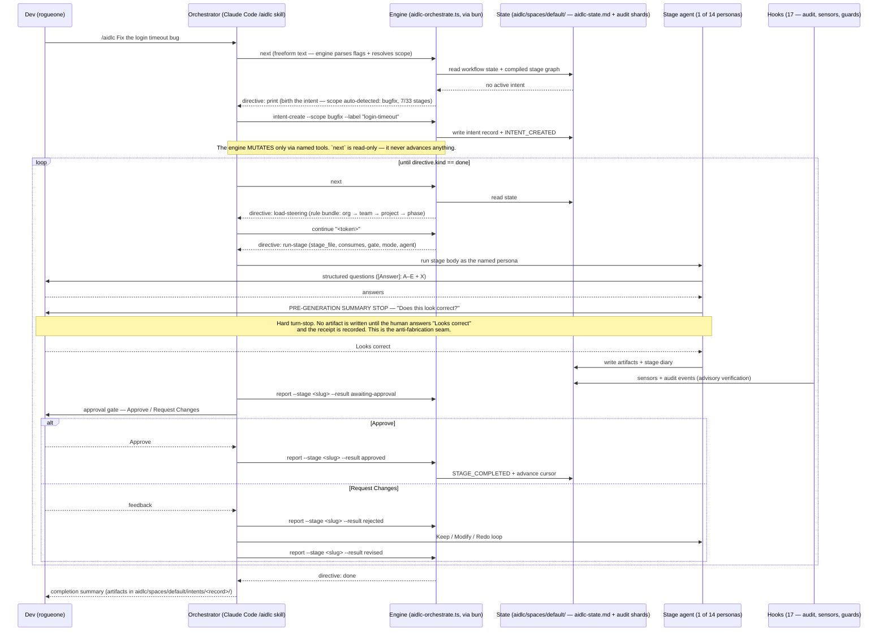

# Flow: AI-DLC workflow (B133 — the `/aidlc` forwarding loop)

A `/aidlc` run is **not** a prompt that asks a model to "follow a process." It is a deterministic loop around a
TypeScript engine: the orchestrator asks `aidlc-orchestrate.ts next` what to do, gets back **exactly one typed
directive**, executes that single move, then `report`s the outcome so the next `next` reads freshly-committed state.
All between-stage routing — scope resolution, sequencing, gate status, resume guards — lives in the engine. The model
owns only execution quality *inside* a stage.

That split is the point. Because every state transition is **tool-emitted**, a stage cannot be marked complete by a
model narrating that it finished — the transition has to go through `report`, which validates it and writes the audit
event. The gate below is a genuine turn-stop: the loop ends the turn and waits for a human.

Engine: `.claude/tools/` (run via **bun**, absolute path — hook subprocesses don't inherit `PATH`). Content:
`.claude/aidlc-common/stages/` + `agents/`. State + artifacts: `aidlc/spaces/default/`. See
[runbooks/aidlc-workflow.md](../runbooks/aidlc-workflow.md), [arch.md §8c](../arch.md#8c-development-lifecycle-ai-dlc-v2-b133).

**Why a typed directive instead of "just prompt it."** The failure mode of a prose-driven workflow is that the model
believes it followed the process. Here the engine hands back one of eight `kind`s — `run-stage`, `ask`,
`load-steering`, `print`, `error`, `done`, `parked`, `invoke-swarm` — and anything else is a malformed-directive stop,
not an invitation to improvise. The orchestrator is explicitly forbidden from re-deriving routing in prose.

**Where the human is load-bearing.** Two hard turn-stops per gated stage: the **pre-generation summary confirmation**
(before any artifact exists) and the **approval gate** (after the reviewer and learnings ritual). Neither can be
self-answered — the skill's rules state autonomy is *never inferred*, and "go with recommended" on one stage does not
carry to the next.

**Parking.** A long run (enterprise spans 33 stages) needn't finish in one session. `park` stops cleanly at an
inter-stage boundary and emits a `parked` directive; `/aidlc --resume` picks it up. The alternative — marking stages
complete to reach `done` — is exactly what the audit trail exists to make impossible.

**Scope sets the loop length.** The same machinery runs 7 stages for `bugfix` and 33 for `enterprise`; the compiled
scope grid decides which stages are EXECUTE vs SKIP. See the scope table in
[runbooks/aidlc-workflow.md](../runbooks/aidlc-workflow.md#scopes-how-much-process-the-change-gets).
