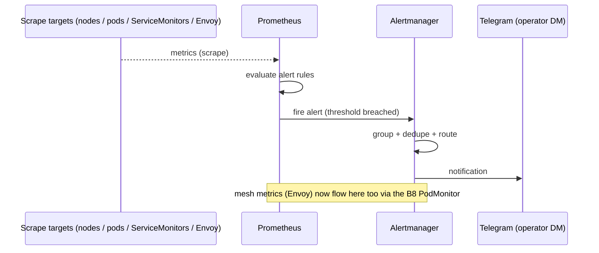

# Flow: Alerting (B5)

Prometheus evaluates alert rules over scraped metrics; Alertmanager groups/dedupes/routes; the operator
gets a Telegram DM. Same Telegram bot surface the agents use, different sender.

