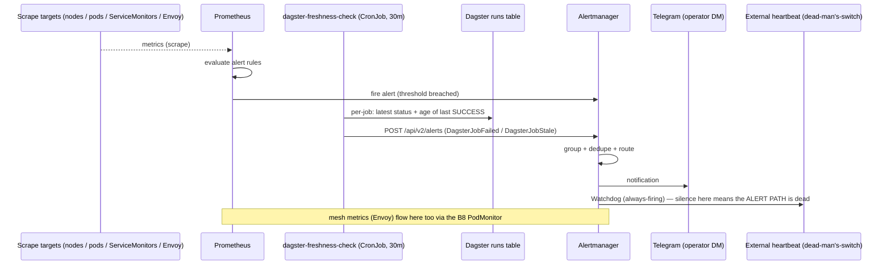

# Flow: Alerting (B5)

Prometheus evaluates alert rules over scraped metrics; Alertmanager groups/dedupes/routes; the operator
gets a Telegram DM. Same Telegram bot surface the agents use, different sender.

**Two non-Prometheus paths on this diagram, both deliberate:**

- **`dagster-freshness-check` posts directly to Alertmanager** rather than exposing metrics for Prometheus to
  scrape. Dagster run state lives in Postgres, not in a metrics endpoint, and the native `run_status_sensor` is
  broken on this Dagster line (1.13.14, dagster#21526) — so the watchdog queries the DB and pushes. It checks
  **per job**, two ways: `DagsterJobFailed` (latest run FAILURE) and `DagsterJobStale` (no success within that
  job's own cadence). The stale check is what catches "stopped running entirely" — a failure-only alert cannot,
  because nothing is failing. **Silence is not health.**
  *History:* the previous version asked "has ANY run succeeded recently?" globally, so constantly-succeeding 4-6h
  jobs kept it permanently green while `weyland_dbt_job` failed 3 weekly runs in a row unnoticed (B94).
- **The Watchdog → external heartbeat** is the dead-man's-switch: Alertmanager's always-firing `Watchdog` alert is
  routed OUT to an external endpoint. If Prometheus or Alertmanager dies, no alert can be raised *about* that —
  the absence of the heartbeat is the alarm. Same reasoning as pairing `up == 0` with `absent(up)` in the
  LGTM self-monitoring rules (`k8s/monitoring/lgtm-self-monitoring.yaml`).
