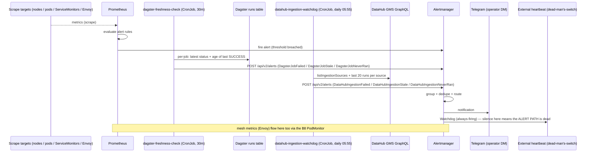

# Flow: Alerting (B5)

Prometheus evaluates alert rules over scraped metrics; Alertmanager groups/dedupes/routes; the operator
gets a Telegram DM. Same Telegram bot surface the agents use, different sender.

```mermaid
sequenceDiagram
    participant Tgt as Scrape targets (nodes / pods / ServiceMonitors / Envoy)
    participant Pr as Prometheus
    participant WD as dagster-freshness-check (CronJob, 30m)
    participant PGD as Dagster runs table
    participant DW as datahub-ingestion-watchdog (CronJob, daily 05:55)
    participant GMS as DataHub GMS GraphQL
    participant AM as Alertmanager
    participant Tg as Telegram (operator DM)
    participant HC as External heartbeat (dead-man's-switch)
    Tgt-->>Pr: metrics (scrape)
    Pr->>Pr: evaluate alert rules
    Pr->>AM: fire alert (threshold breached)
    WD->>PGD: per-job: latest status + age of last SUCCESS
    WD->>AM: POST /api/v2/alerts (DagsterJobFailed / DagsterJobStale / DagsterJobNeverRan)
    DW->>GMS: listIngestionSources + last 20 runs per source
    DW->>AM: POST /api/v2/alerts (DataHubIngestionFailed / DataHubIngestionStale / DataHubIngestionNeverRan)
    AM->>AM: group + dedupe + route
    AM->>Tg: notification
    AM->>HC: Watchdog (always-firing) — silence here means the ALERT PATH is dead
    Note over Pr,AM: mesh metrics (Envoy) flow here too via the B8 PodMonitor
```

**Two non-Prometheus paths on this diagram, both deliberate:**

- **`dagster-freshness-check` posts directly to Alertmanager** rather than exposing metrics for Prometheus to
  scrape. Dagster run state lives in Postgres, not in a metrics endpoint, and the native `run_status_sensor` is
  broken on this Dagster line (1.13.14, dagster#21526) — so the watchdog queries the DB and pushes. It checks
  **per job**, three ways: `DagsterJobFailed` (latest run FAILURE), `DagsterJobStale` (no success within that
  job's own cadence) and `DagsterJobNeverRan` (budgeted but no run at all — B196; such a job had no row for the
  query to find). The stale check is what catches "stopped running entirely" — a failure-only alert cannot,
  because nothing is failing. **Silence is not health.** The budgets are guarded against the schedules by
  `scripts/check-dagster-watchdog-budgets.sh` in `repo-guards` (B196).
  *History:* the previous version asked "has ANY run succeeded recently?" globally, so constantly-succeeding 4-6h
  jobs kept it permanently green while `weyland_dbt_job` failed 3 weekly runs in a row unnoticed (B94).
- **`datahub-ingestion-watchdog` also posts directly to Alertmanager** (B197, daily 05:55 NY): run status lives in
  DataHub GMS, not in a metrics endpoint. Per source: `DataHubIngestionFailed` (latest run FAILURE/ABORTED),
  `DataHubIngestionStale` (no success within 2x its schedule), `DataHubIngestionNeverRan`. It exists because the dbt and
  MLflow sources failed daily for 10+ days with nothing firing. If it cannot read GMS, its Job fails and
  `ScheduledJobFailed` pages instead. Runbook: [datahub.md](../runbooks/datahub.md#ingestion-watchdog-b197-2026-09-28).
- **The Watchdog → external heartbeat** is the dead-man's-switch: Alertmanager's always-firing `Watchdog` alert is
  routed OUT to an external endpoint. If Prometheus or Alertmanager dies, no alert can be raised *about* that —
  the absence of the heartbeat is the alarm. Same reasoning as pairing `up == 0` with `absent(up)` in the
  LGTM self-monitoring rules (`k8s/monitoring/lgtm-self-monitoring.yaml`).
