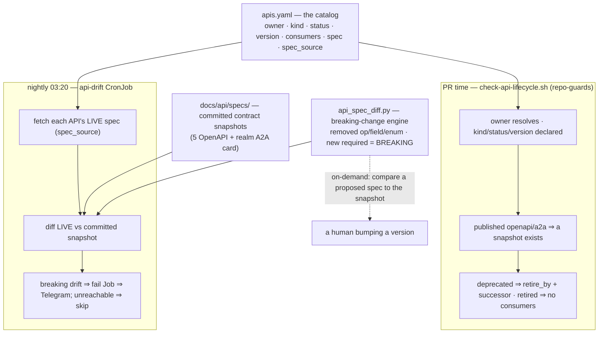
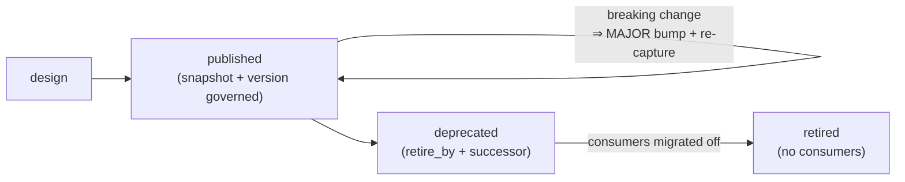

# Flow — API lifecycle governance (B155)

The estate's APIs are governed across their whole lifecycle from one catalog (`apis.yaml`): a PR-time
lifecycle guard + a runtime drift cron, both over the same catalog + committed contract snapshots, with
one breaking-change engine. Concept: [api-lifecycle.md](../concepts/api-lifecycle.md); demo:
[api-lifecycle.md](../demos/api-lifecycle.md). The `api-drift` CronJob is modelled in LikeC4 as
`apiDrift` (obs group); the CI guard + engine are repo tooling (LikeC4 N/A).

## Two enforcement points, one catalog + one engine

## Lifecycle stages the catalog governs

- **One catalog, two enforcement points:** the lifecycle guard governs the *declaration* at PR time; the
  drift cron governs the *deployed reality* nightly. Both read `apis.yaml`; both fail-closed.
- **The engine is the objective arbiter of "breaking":** the same classifier runs in the cron (live vs
  snapshot) and on-demand (a human comparing a proposed spec before bumping). It never guesses — an
  unknown/mismatched pair is *cannot-compare*, not a silent pass.
- **Honest scope:** only typed contracts (OpenAPI/A2A) get snapshots + drift detection; MCP/OpenAI-shape
  APIs are catalogued (owner/version/status) but not yet snapshotted, and the guard says so.
