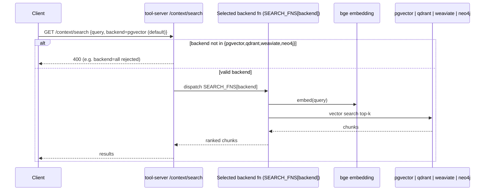

# Flow: Backend Selection / Dispatch (detail of RAG retrieval)

Zoom-in on `/context/*`: how one of the 4 vector backends is chosen. Selection is a **single-dispatch** per
request — a `backend` param (query param for `/context/search`, body field for `/context/ask`), defaulting to
`pgvector`. There is **no fan-out / compare-all mode**: `backend=all` (or any unknown value) is rejected with a
`400`. The chosen backend's function embeds the query (bge) and runs the vector search; all hops are mTLS under
the mesh (see [flow-mesh-mtls.md](flow-mesh-mtls.md)). For the end-to-end query+generate path see
[flow-rag-query.md](flow-rag-query.md).

