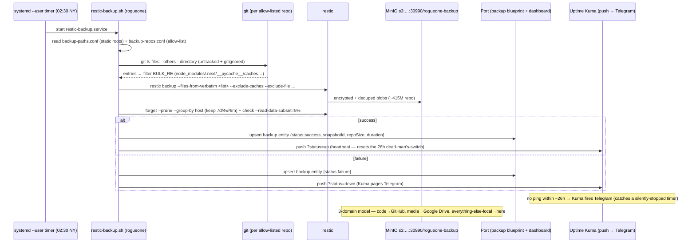

# Flow: rogueone backup — restic → MinIO + reporting (B130)

How rogueone's daily backup runs and reports. A systemd **user** timer (02:30 NY + jitter) fires the script, which
builds a file list — the static include roots **plus**, for each allow-listed git repo, `git ls-files --others`
(untracked + gitignored) with reproducible bulk filtered out **in the script** (restic won't exclude a path handed
to it explicitly). restic backs that up encrypted+deduped to the lab MinIO, prunes, and does a light integrity
check. Then it reports to **both** layers: a Port `backup` entity (the "see" dashboard) and an Uptime Kuma **push**
heartbeat (the dead-man's-switch → Telegram if it ever goes silent). Both reporters are fail-safe — a reporting
outage never fails the backup.

