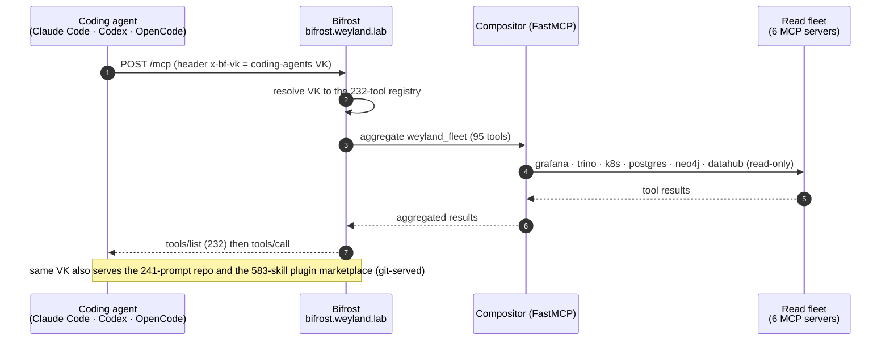

# Flow: Bifrost — agent MCP edge (B17+B19 / B111)

Bifrost (`bifrost.weyland.lab`) is the coding-agent front door: one `coding-agents` virtual key exposes a 232-tool
MCP surface (the 95-tool read fleet via the FastMCP compositor + external MCPs), a 241-prompt repository, and a
583-skill plugin marketplace — the same VK across Claude Code, Codex, and OpenCode.

**Read-only fleet;** write/act tools live on the separate `/mcp-act` mount (Keycloak-authed, `policy.gate`).
Demo: [demos/bifrost.md](../demos/bifrost.md). Runbook: [runbooks/mcp-gateway.md](../runbooks/mcp-gateway.md).
