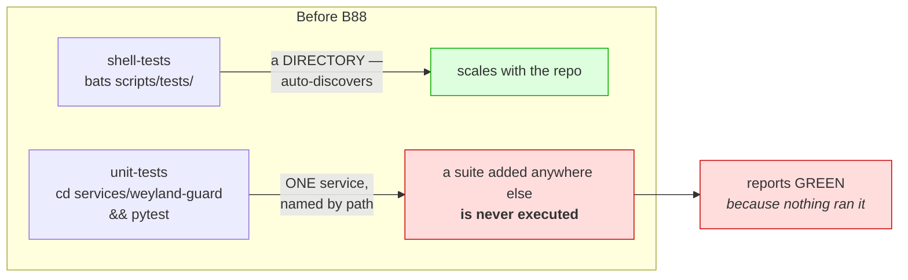
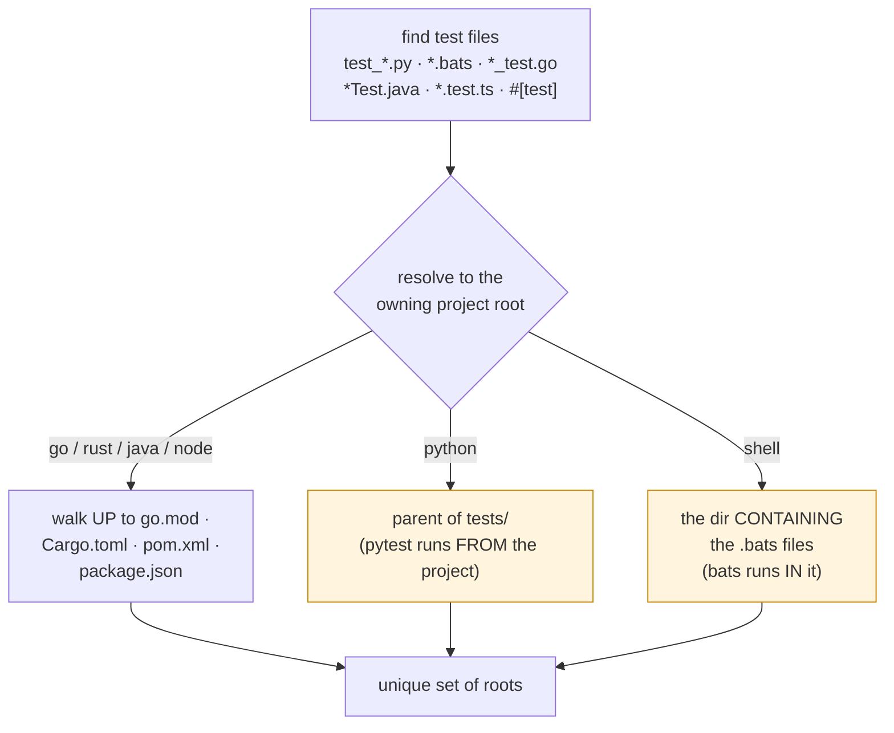
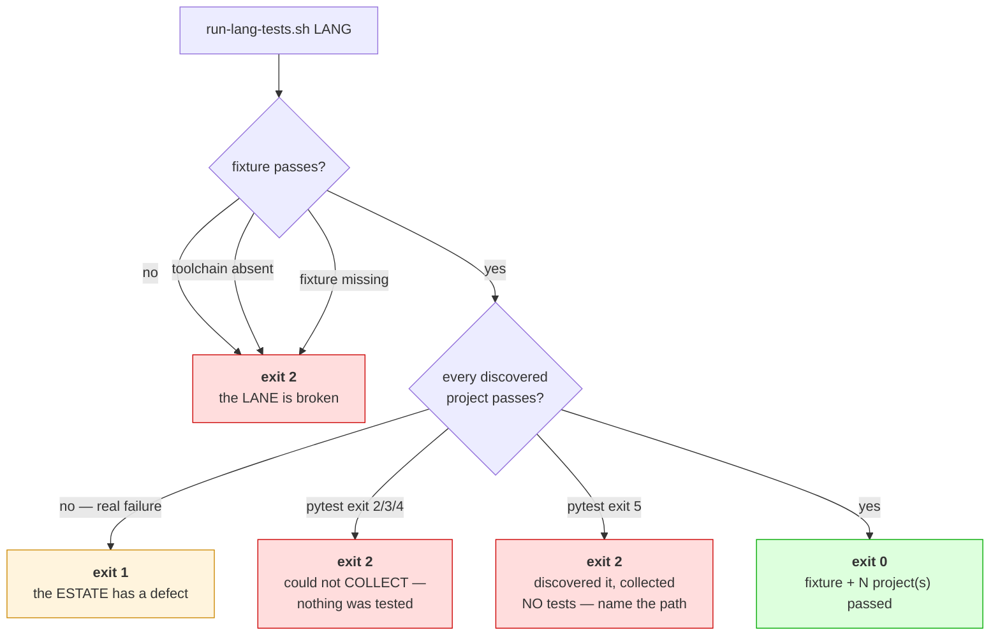
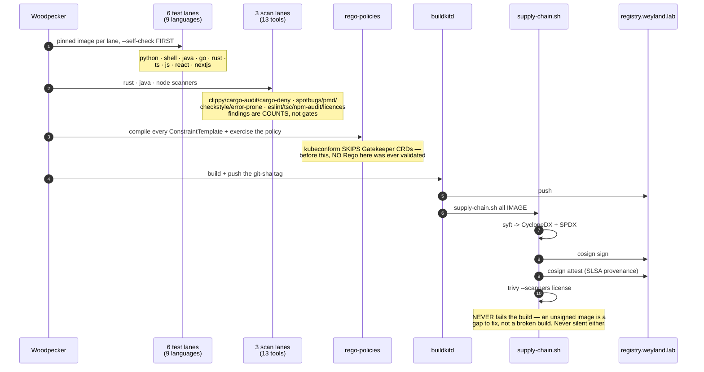
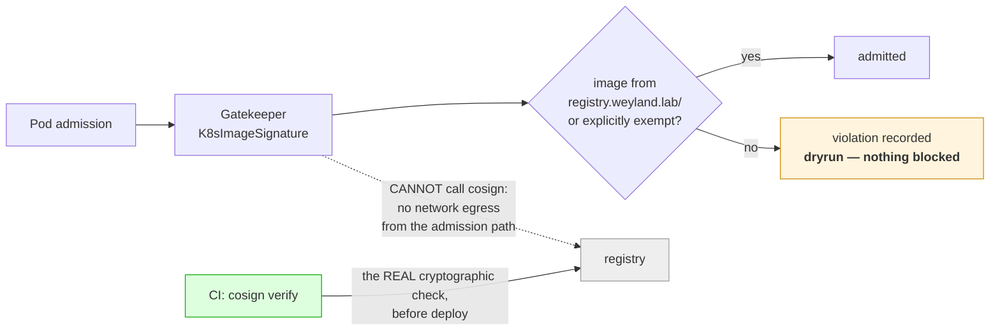

# Flow — per-language build lanes + supply chain (B88)

How one hardcoded test step became nine languages, three scan lanes and a signed supply chain, and
why the exit codes are the load-bearing part. Architecture placement: `arch.md` + the LikeC4 model.

## The defect it replaced

The shell lane scaled; the Python lane did not. B78's Open Food Facts work was about to add
`weyland-dagster`'s first pytest suite — and nothing would have run it. **Green by absence**, in the
test harness itself, where it is hardest to notice.

## Discovery keys on TESTS, not on manifests

**Python and shell need OPPOSITE roots**, and conflating them was a real bug: applying python's
rule to shell resolved `scripts/tests` → `scripts`, where `bats .` finds nothing and exits 1 — a
healthy 289-test suite reported as an estate defect.

Keying on *manifests* instead was worse in both directions: it missed `weyland-guard` (the only
Python suite CI runs, which has `tests/` and no manifest) and matched five services that have a
manifest and no tests, where `pytest` exits **5** → five false failures.

## The exit codes are the design

**Conflating 1 and 2 makes a broken runner read exactly like broken code.** A missing dependency is
not a failing test — `weyland-guard` could not be *collected* (no `prometheus_client`) and the first
version of this called that "the estate has a failing test". Nothing had been tested at all.

**Why every lane ships a hello-world fixture:** a language with no production code yet (Go, Rust)
has nothing to run, and "nothing to run" is one careless line from "green". The fixture deletes that
state — every lane always executes a real test, so the image, toolchain, discovery and runner are
continuously proven. `--self-check` then runs each fixture's *deliberately failing* test and asserts
the runner propagates it: **a lane never seen failing is not a lane.**

## The pipeline

## Admission — what it can and cannot do

**Stated rather than hidden:** Gatekeeper's Rego runs with no network egress, so it cannot verify a
signature. It asserts the checkable thing — provenance by registry — while `cosign verify` does the
real work in CI. Full in-cluster verification needs a controller that can reach the registry
(Kyverno + cosign, or sigstore-policy-controller); that is a separate decision.

The constraint ships in **`dryrun`** because every image running today is unsigned and `deny` would
reject all of them. See [runbooks/supply-chain.md](../runbooks/supply-chain.md) for the
promote-to-deny checklist.
