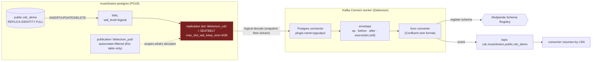

# Flow — Change Data Capture (Debezium → Redpanda)

How a row change in Postgres becomes an event in a topic. This is the *genuinely* event-driven half of the
streaming tier (the producer replay is bounded; CDC is continuous). Source = **musicbrainz-postgres** (isolated,
reproducible — never the core control-plane Postgres). See [flow-streaming.md](flow-streaming.md) +
[runbooks/streaming.md](../runbooks/streaming.md).

**The envelope is the point of CDC** — every event carries `op` + `before`/`after` + `source`:

| `op` | meaning | before | after |
|---|---|---|---|
| `r` | snapshot read (initial) | null | full row |
| `c` | insert | null | new row |
| `u` | update | **old row** | new row |
| `d` | delete | **old row** | null |

`u` (see exactly what changed) and `d` (the old row of a deleted record) are what a batch load can **never**
capture — that's why CDC exists. `source` carries the exact `lsn`/`txId`, so a consumer resumes precisely.

**The three mechanics that make it safe + correct** (all hard-won gotchas):

1. **`wal_level=logical`** (a Postgres restart) turns on logical decoding — the prerequisite. Set as a server
   flag in the deployment args.
2. **`max_slot_wal_keep_size=4GB` — the SEATBELT.** A slot retains WAL until its consumer reads it; a stalled
   Debezium would otherwise grow WAL until the disk fills and the DB dies. This cap makes Postgres **invalidate
   the slot** instead → worst case is *"CDC stops,"* never *"DB down."* This single setting is why CDC on an
   isolated instance is safe. (Never run CDC on the core weyland-postgres — platform-wide blast radius.)
3. **`REPLICA IDENTITY FULL`.** By default Postgres logs only the **primary key** in the old-row image, so
   `before` on update/delete is PK-only. `FULL` logs the whole old row → complete `before`. Trade-off: more WAL
   volume; bake it into real CDC tables' schema.

**Plugin / publication:** `pgoutput` is Postgres's built-in logical-decoding output (no wal2json install);
`publication.autocreate.mode=filtered` scopes the publication to the one captured table (not `FOR ALL TABLES`,
which would need broader privilege + drag in the 39M-row tables).
