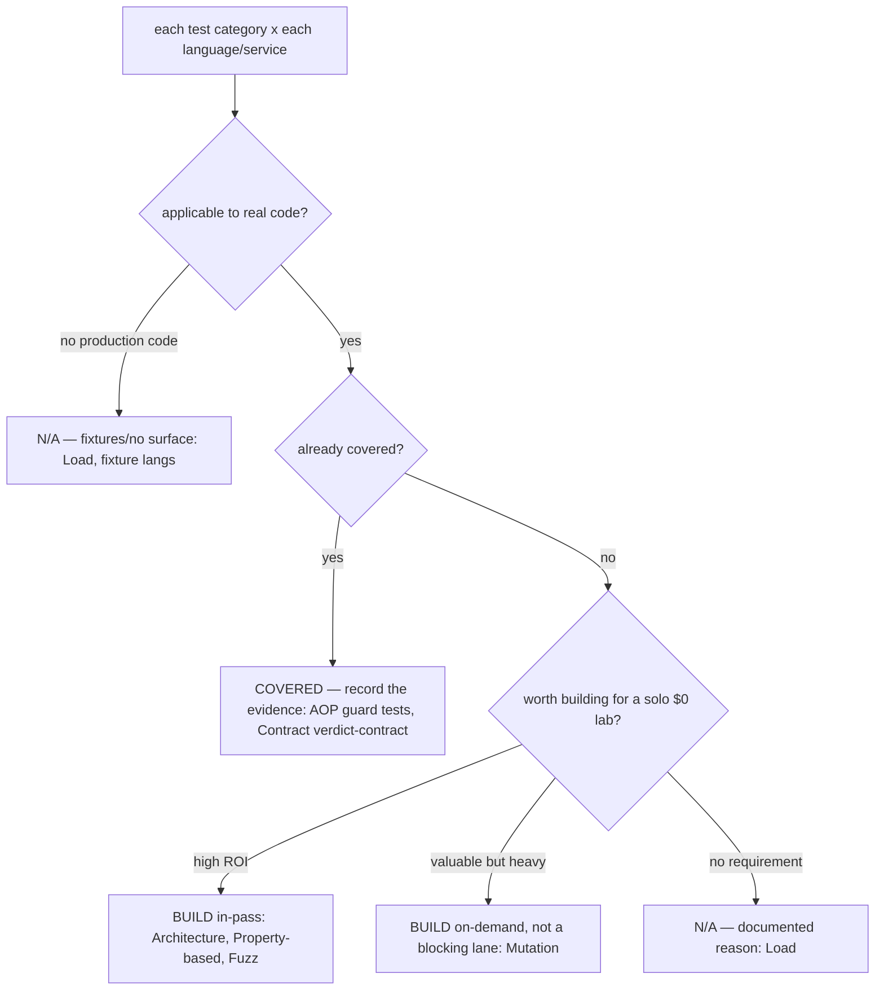
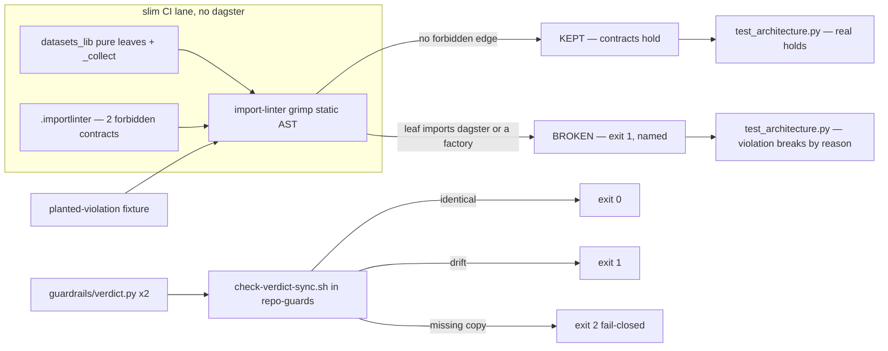

# Flow — CI/CD test-category audit + lanes (B152)

The audit evaluated every test category against every language/service, then built the applicable gaps. See
the matrix [ci-test-categories-audit.md](../concepts/ci-test-categories-audit.md) and demo
[ci-test-categories.md](../demos/ci-test-categories.md). LikeC4 placement is N/A (this deploys nothing); these
two flows capture the non-obvious logic — the per-category decision and the architecture-lane enforcement.

## Per-category decision (applicable? → covered? → gap? → outcome)

## Architecture lane — enforcement (static, dagster-free)

- **Decision flow:** most categories resolved to BUILT (architecture, property-based, fuzz), COVERED (contract, AOP), on-demand (mutation), or documented N/A (load, fixture languages) — every one answered, none deferred.
- **Architecture flow:** import-linter runs by static AST so it needs no dagster runtime — it lives in the slim lane exactly where the leaf boundary matters. The planted fixture proves the contract fails on a real violation; `check-verdict-sync.sh` guards the duplicated wire contract fail-closed (0/1/2).
