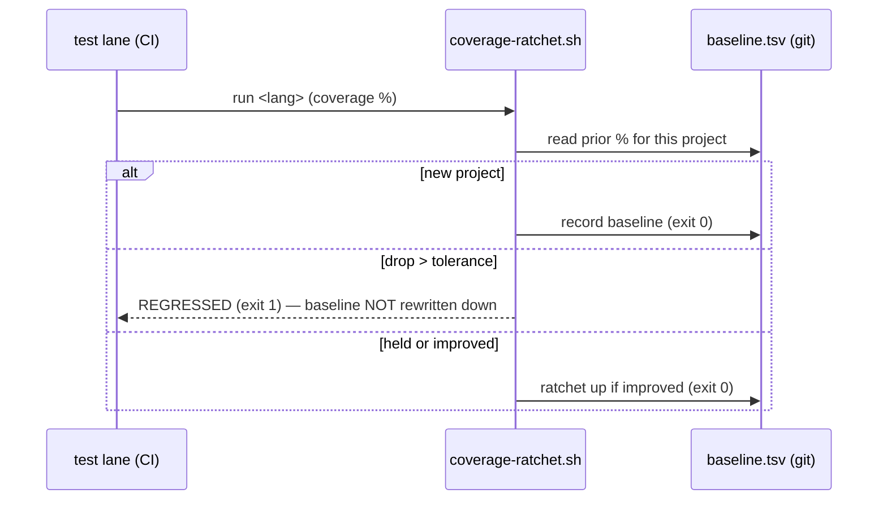
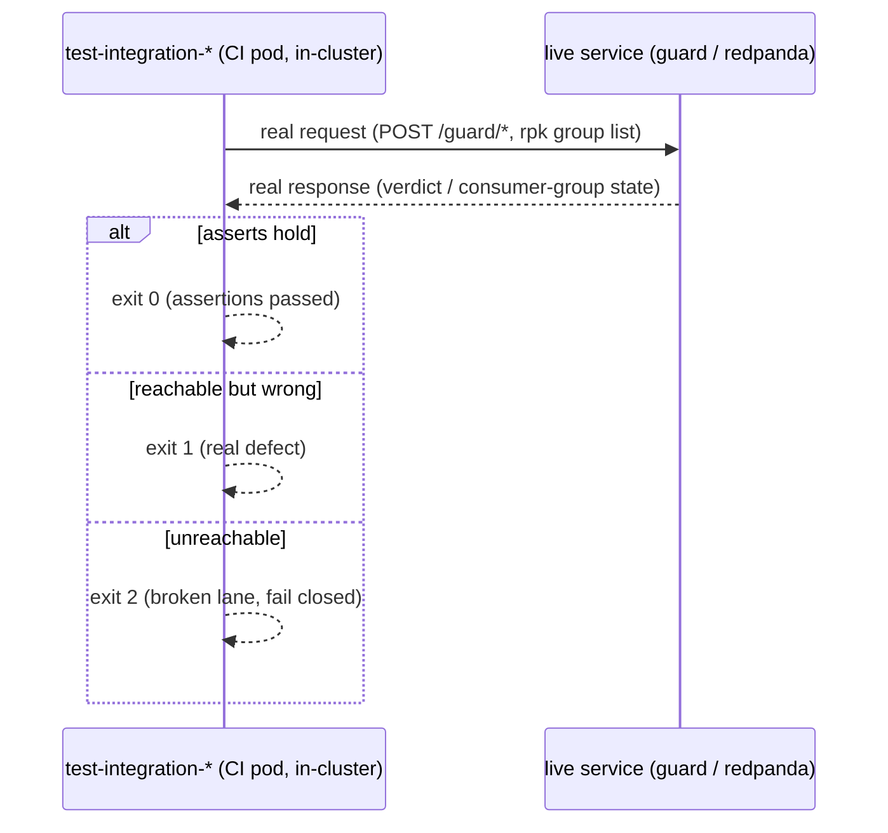
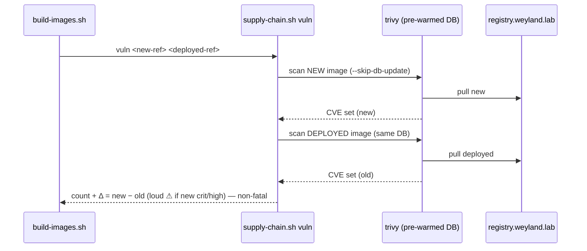
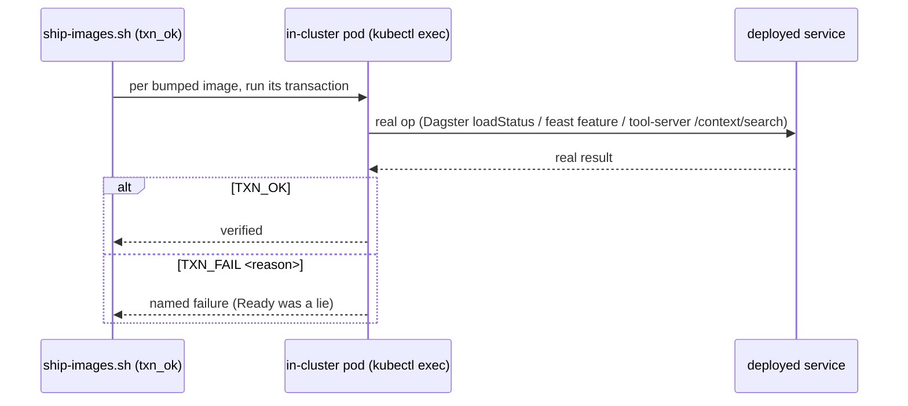
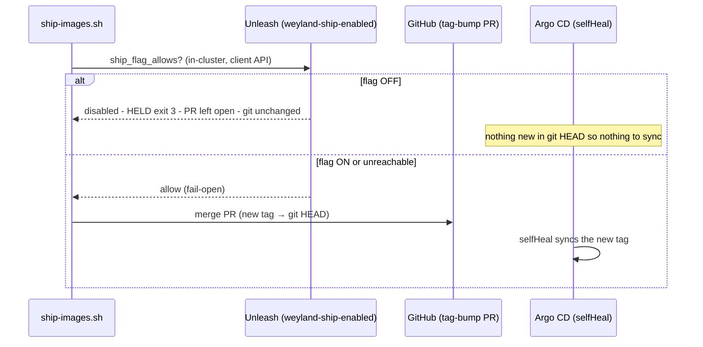

# Flow — CI/CD hardening (B88 Track B, gaps #1–#5)

Sequence diagrams for the mechanisms added in the hardening bucket. Demo (RUN): [cicd-hardening.md](../demos/cicd-hardening.md).

## #1 Coverage ratchet — fail only on a drop vs the committed baseline

## #2 Integration tier — black-box the live service (Ready ≠ correct response)

## #3 Per-build vuln scan + Δ vs deployed (drift-controlled)

## #4 Post-deploy transaction — Ready ≠ works

## #5 Unleash deploy kill-switch — gate the MERGE, not the sync (selfHeal-proof)

