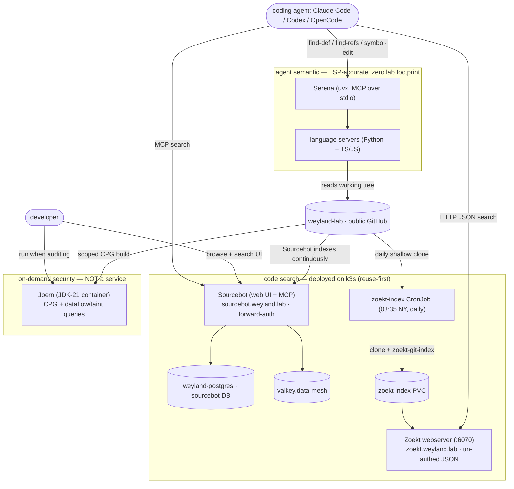

# Flow: code-intelligence / code-graph stack (B166)

The lab's code-intelligence layer, split by the two needs it serves — **agent semantic structure**
(Serena) and **code search/nav** (Sourcebot + standalone Zoekt) — plus an **on-demand security** track
(Joern). Decision (operator, 2026-09-11): adopt Serena + Sourcebot + Zoekt; Joern on-demand; drop
OpenGrok/Hound/Livegrep. Eval: [../concepts/code-intelligence-eval.md](../concepts/code-intelligence-eval.md);
ops: [../runbooks/code-intelligence.md](../runbooks/code-intelligence.md).

Why the split:

- **Serena** answers "who calls this / what breaks if I change X" with **symbol accuracy** grep can't —
  it's the lever B104's coding-agent eval measures. Runs beside the agent on the operator box: **no lab
  service, no node RAM**.
- **Sourcebot** is the human + agent **search** surface (Zoekt speed + web UI + MCP + NL Q&A). A 3-service
  deploy (app + Postgres + Redis), so it **reuses** `weyland-postgres` (a dedicated `sourcebot` DB) and
  `valkey.data-mesh` rather than standing up its own — only the app pod is new RAM.
- **Zoekt (standalone)** is the same engine bare: the **un-authed, lightweight JSON endpoint** for
  scripts/agents. Sourcebot indexes continuously (its own job-manager, not a k8s CronJob); Zoekt is the
  **daily** pre-dawn mirror (Design Rule #5), with a manual `create job --from=cronjob/zoekt-index` for
  immediate freshness.
- **Joern** is a **security/dataflow** tool (CPG + taint), run on demand beside Semgrep (B47) — proven with
  9 payload→sink flows on `weyland-guard` — not the agent-context or nav deliverable, so it hosts nothing.
