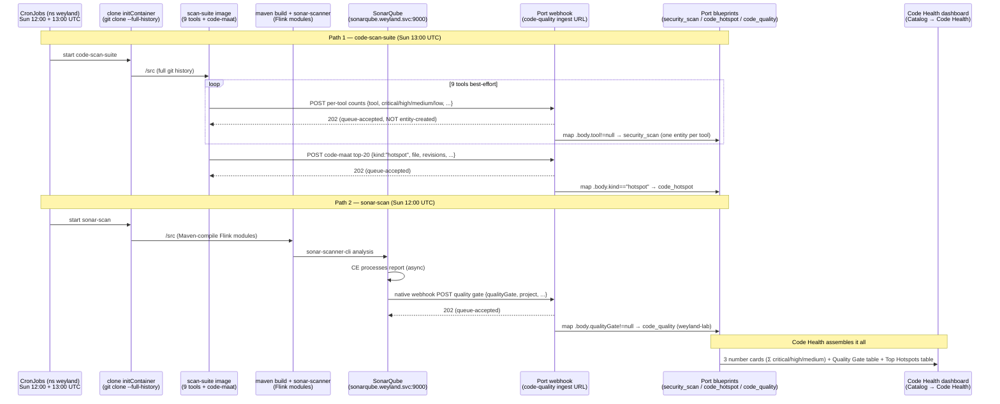

# Flow — Code quality / security scan (scan-suite → Port)

The weekly **code-health** path (B69 scan-suite + B89 triage + B90 dashboard). Two k8s CronJobs in ns `weyland`
feed Port.io, and a **Code Health** Port dashboard assembles the result. The lab is LAN-only and Port is SaaS, so
everything is **outbound**: each scanner POSTs findings to Port's `code-quality` webhook ingest URL (Secret
`port-ingest-url`), and SonarQube's native webhook POSTs its quality gate the same way.

- **`code-scan-suite`** (Sun **13:00 UTC**) — an `initContainer` git-clones the public repo
  (`github.com/edtbl76/weyland-lab`, **full history** for code-maat) into `/src`, then the
  `registry.weyland.lab/scan-suite` image runs **9 tools** best-effort over `/src` — gitleaks, checkov, kubescape,
  hadolint, bandit, osv-scanner, shellcheck, semgrep, trivy — each POSTing per-tool severity counts →
  **`security_scan`** blueprint (one entity per tool). code-maat then computes change-hotspots and POSTs the
  **top-20** to the **same** ingest URL with a `kind:"hotspot"` discriminator → **`code_hotspot`** blueprint.
- **`sonar-scan`** (Sun **12:00 UTC**) — clone → Maven-compile the Flink modules → `sonar-scanner-cli` against the
  in-cluster SonarQube (`sonarqube.weyland.svc:9000`); SonarQube's **native webhook** POSTs the quality gate →
  **`code_quality`** blueprint (one entity: `weyland-lab`).

See [../runbooks/code-quality.md](../runbooks/code-quality.md) and [../schedules.md](../schedules.md).

## Sequence

**Gotcha — `202` ≠ entity created.** The ingest URL returns `202` on *queue-acceptance*; the async mapping can
still silently drop the payload. Two ways it did here: the `security_scan.tool` property was a **string enum**
locked to `["trivy","semgrep"]` (any other tool violated it → dropped — fix = `enum = null`), and a
`code_hotspot` mapping entry referenced a **blueprint that didn't exist yet** (apply the blueprint FIRST). Always
confirm the entity in Port, not just the `202`.

**Mapping-filter routing.** The webhook mapping is a **3-entry array** (UI-only, `operation: create`):
`code_quality` on `.body.qualityGate != null` · `security_scan` on `.body.tool != null` · `code_hotspot` on
`.body.kind == "hotspot"`. All three POST to the *same* ingest URL; the filters fan them out to the right
blueprint.

**Dashboard is Port-only.** The **Code Health** dashboard (Catalog → Code Health, built via Port MCP
`upsert_dashboard_page`) can't be codified in tofu — it lives only in Port, not git. Blueprints ARE codified
(`tofu/port/blueprints.tf`); entities + dashboards are Port/MCP.
