# Flow: coding-agent evaluation grading (B104)

The eval harness (`scripts/coding-agent-eval.sh`) scores a coding agent on a bug-fix task. The logic worth
diagramming is its **fail-closed grading** — every branch that is NOT a clean pass resolves to `pass=0`, so
a crash, a timeout, an absent verdict, or a fixture that was not actually broken can never be recorded as a
success. This is the same anti-fabrication posture the lab's `code-generation` corrections legislate.

```mermaid
flowchart TD
    S[for each &#40;agent, task&#41;] --> C[copy workdir → throwaway git rundir]
    C --> R{Red pre-check:<br/>grader == FAIL before the agent?}
    R -- "no (already passes / no-op test)" --> RB[RED-BROKEN&nbsp;&nbsp;pass=0<br/>no TSV row — nothing evaluated]
    R -- "yes (fixture genuinely fails)" --> A[run agent<br/>stdin=/dev/null, bounded by timeout_s]
    A --> T{exit code 124 / 143 / 137?<br/>&#40;GNU / busybox / -k timeout&#41;}
    T -- yes --> TO[TIMEOUT&nbsp;&nbsp;pass=0]
    T -- no --> G{grader's last verdict line?}
    G -- "no GRADE: line" --> E[ERROR&nbsp;&nbsp;pass=0<br/>absent result ≠ success]
    G -- "GRADE: FAIL" --> F[FAIL&nbsp;&nbsp;pass=0]
    G -- "GRADE: PASS" --> P[PASS&nbsp;&nbsp;pass=1]
    TO --> W[append row → tests/eval/coding-agents.tsv]
    E --> W
    F --> W
    P --> W
```

Why each guard exists:

- **Red pre-check** — a fixture whose test already passes (or whose test is a no-op) would hand every agent a
  free pass. It must fail *before* the agent runs, or the run is `RED-BROKEN` and no row is written.
- **Timeout classification** — `timeout` exits 124 on GNU coreutils but 143 (SIGTERM) on busybox/Alpine (CI);
  both, plus 137 (SIGKILL with `-k`), are `TIMEOUT`, so a hung agent reads the same on the dev box and in CI.
- **Verdict sentinel** — the pass decision is the grader's `GRADE: PASS`/`GRADE: FAIL` line, never a bare exit
  code (a tool's exit is not its verdict). No line at all is `ERROR`, never a pass.

The runner + these branches are locked by `scripts/tests/coding-agent-eval.bats`; the demo
([../demos/coding-agent-eval.md](../demos/coding-agent-eval.md)) runs the pass and the fail paths live.
