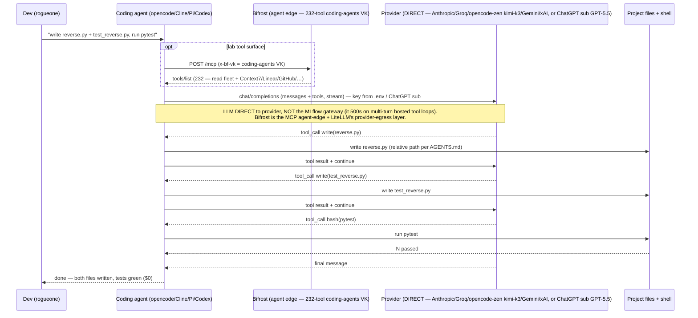

# Flow: Coding Agents (B15 — `$0` agentic coding, direct-to-provider)

A terminal coding agent (opencode / Cline / Pi / Codex) drives a multi-step task — write a function + a pytest, run it —
by looping tool-calls against a **hosted model reached DIRECTLY** for the LLM, not through the MLflow AI Gateway. Two
independent findings force the direct LLM path: the gateway crashes on a hosted multi-turn tool loop (turn-2
`json.loads("")` inside MLflow) and its response-stage guardrails block streaming; and rogueone's 16GB local models
can't drive tools reliably. The funded provider set is now **Anthropic / Groq / opencode-zen (`kimi-k3`) / Gemini /
xAI** (openrouter/cerebras/deepseek are 402-unfunded, openai 429s). The lab **tool surface** comes from **Bifrost**
(the agent edge) — one `coding-agents` VK aggregates 232 tools for Claude Code / Codex / OpenCode. Keys come from the
gitignored `scripts/.env` (or the ChatGPT sub via "Sign in with ChatGPT" for Cline/Codex). See
[runbooks/coding-agents.md](../runbooks/coding-agents.md), [demos/bifrost.md](../demos/bifrost.md).

**Why not the alternatives** (all ruled out — see runbook): the **MLflow AI Gateway** dies on the second tool turn
for hosted providers and buffers-blocks streaming; **local 16GB models** leak tool-calls as text / hallucinate tool
names / can't disable thinking; a **ChatGPT sub is not an API** (use "Sign in with ChatGPT" in Cline/Codex — the raw
`sk-` key is dead), and a **Claude Pro/Max sub via a third-party agent** is the B26 ToS gray area (sanctioned
Claude-coding = Claude Code, B29 — see [flow-agent-mcp.md](flow-agent-mcp.md)). Related:
[flow-mlflow-gateway.md](flow-mlflow-gateway.md) (the gateway that these deliberately bypass).
