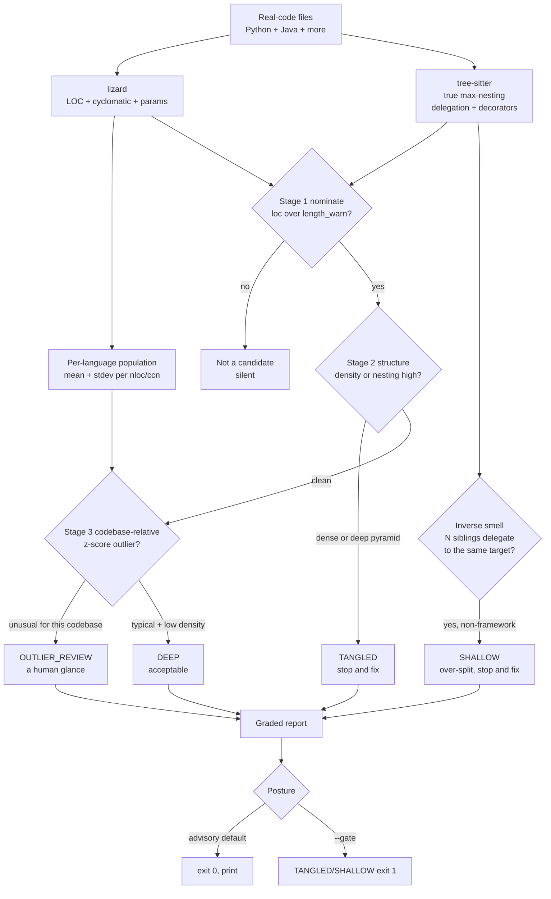

# Flow: complexity triage (B162)

How `scripts/lib/complexity_triage.py` reads a function: length only NOMINATES; structure and the
codebase-relative outlier decide; the inverse smell (shallow / over-split) is caught in the other direction.
Concept: [concepts/reading-complexity.md](../concepts/reading-complexity.md) · runbook:
[runbooks/complexity-triage.md](../runbooks/complexity-triage.md).

Advisory by default (like Graphify's Pillar-8 wiring); `--gate` blocks on `TANGLED`/`SHALLOW` once the thresholds
are trusted. Every threshold is a knob in `scripts/complexity-triage.json`.
