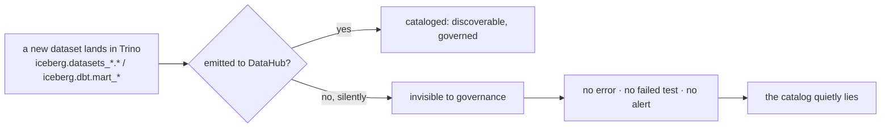
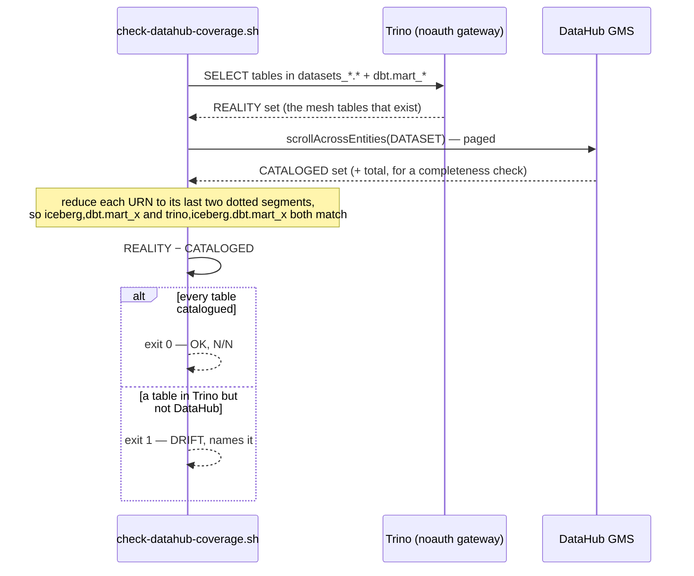
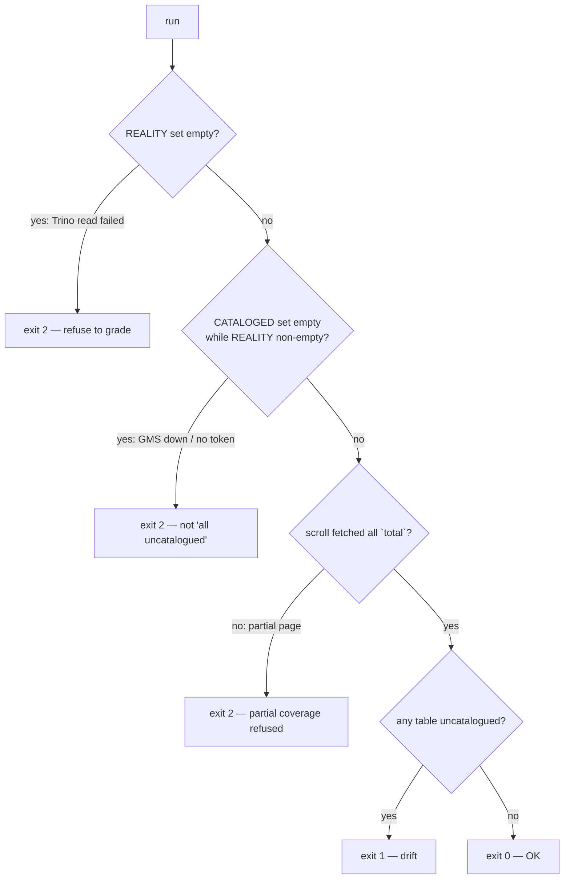

# Flow — DataHub catalog coverage (B158-A): govern the DATA estate by CI

The fourth coverage guard, and the first on the data estate rather than infrastructure. Its siblings prove a
service is SCRAPED / VISUALIZED / ALERTED; this proves every mesh dataset is CATALOGED. See the demo
[datahub-coverage.md](../demos/datahub-coverage.md) and the runbook section in
[observability.md](../runbooks/observability.md#datahub-catalog-coverage--the-guard-b158-follow-up-a-2026-09-05).

## The gap it exists to catch

Data-governance completeness had **no positive signal**: a mesh dataset could exist in Trino and never be
emitted to DataHub, and nothing went red. The B158 audit even caught the `data-mesh-map` product tile
drifting from the emit's real `_PRODUCTS` — by hand, because nothing checked it.

## The guard — two planes, a set diff

## Fail closed — the rule that makes it trustworthy

An absent result must never read as success. The empty-either-side and incomplete-scroll paths are exit 2
(could-not-run), never a clean pass and never "everything is drift".

Two live-only bugs (invisible to the small bats fixtures) were found + fixed by running it: Trino's
`nextUri` returned on its own in-cluster host (re-pointed to the given endpoint), and `awk | grep -Fxq`
under `set -o pipefail` turned a real match into no-match via SIGPIPE (awk output captured to a variable
first). Live baseline 2026-09-05: **111/111 catalogued, 0 drift**.
