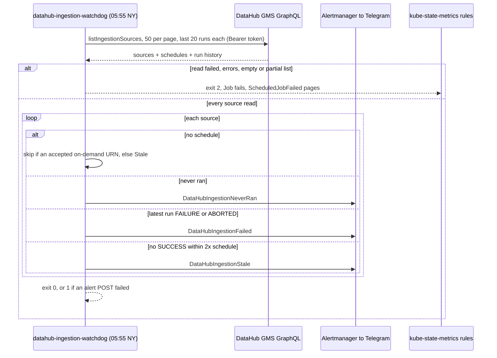

# Flow — DataHub ingestion watchdog (B197)

Once a day at 05:55 NY — after the last daily DataHub ingestion (dbt, 05:00) and the Sunday scans — the watchdog reads
every managed-ingestion source and its recent runs from DataHub's GraphQL API and alerts on the ones that failed,
stopped, or never ran. It reads GMS directly rather than TimescaleDB's nightly copy, so an alert does not wait on (or
inherit the failures of) another job. Operate: [runbooks/datahub.md](../runbooks/datahub.md#ingestion-watchdog-b197-2026-09-28).

