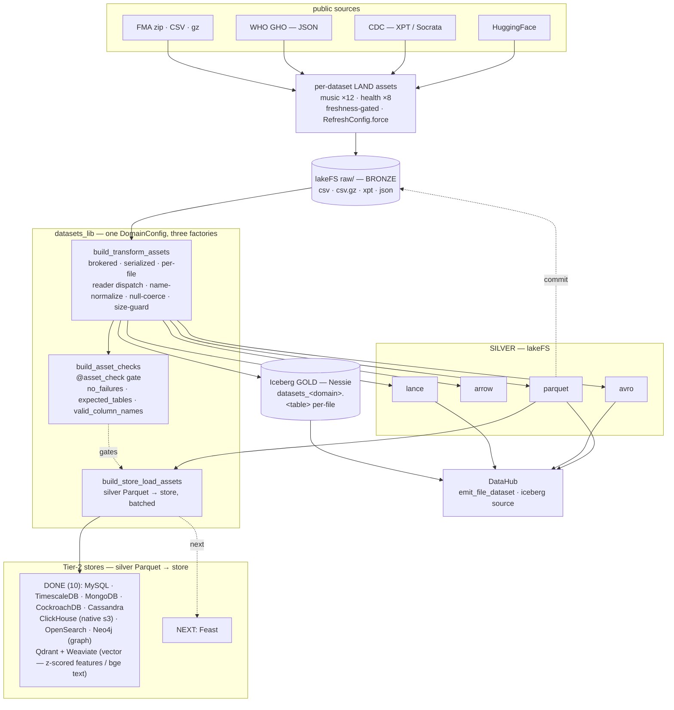
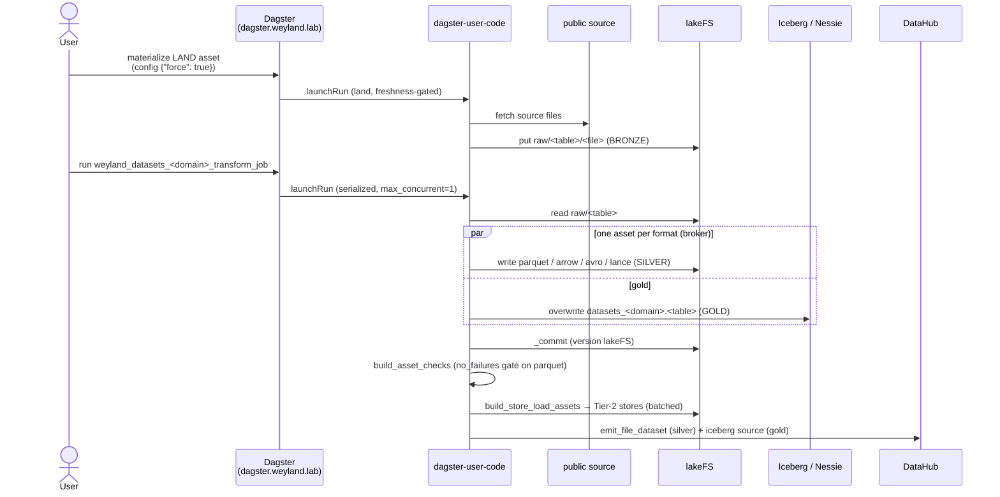

# Flow — Datasets lakehouse (bronze → silver → gold → checks → stores)

The datasets platform (`datasets_lib`, B72/B75). A domain (music, health) is a `DomainConfig` fed through
three asset factories: **transform → asset-checks → store-load**. See
[runbooks/datasets-lake.md](../runbooks/datasets-lake.md) and
[runbooks/datasets-hydration.md](../runbooks/datasets-hydration.md).

**Streaming sink (B1.5):** beyond the batch store hydration, silver also feeds the **streaming** tier — the
`datasets_<dom>_stream_produce` assets replay stream-shaped silver (lastfm, big_five, brfss, nhis) as **Avro
events** into Redpanda topics, and Debezium streams Postgres CDC alongside. That's a separate flow (events, not
tables): [flow-streaming.md](flow-streaming.md) · [flow-cdc.md](flow-cdc.md).

**Layers:** land (bronze) → transform (silver + gold) → quality gate → store hydration. Cleaning
(name-normalize, null-coerce, delimiter fixes) lives in the transform/land; the checks *validate* (they
don't mutate); a bad silver blocks hydration via the `no_failures` check on parquet.

## Sequence

The runtime order for one dataset through the three factories. Demo: [demos/datasets-lakehouse.md](../demos/datasets-lakehouse.md).

