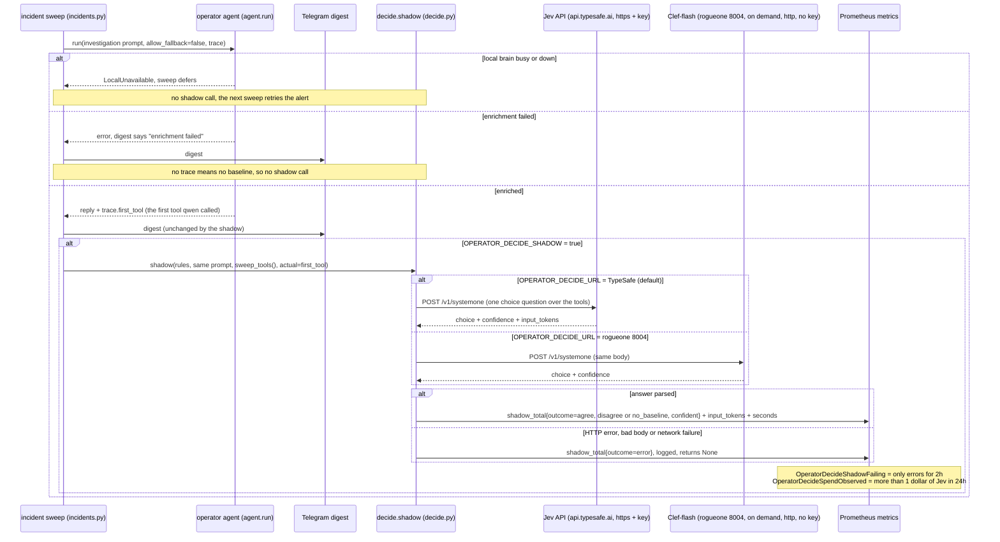

# Flow: decision-model shadow on the incident sweep (`weyland-operator`, B174)

After the incident sweep's agent has enriched an alert and the digest is posted, the operator asks a **decision model**
the same question as one typed `choice`: which tool should it have opened with? It then counts whether that matches the
tool qwen actually called first. It is a **shadow**:
- nothing acts on the pick, and it never reaches the digest;
- a deferred or failed run is not shadowed, since there is no baseline and the paid call would buy nothing;
- every failure is counted as an error, never as agreement.

**Backends:** Jev (TypeSafe's hosted API, paid from the owner's prepaid credit) is the default. Clef-flash on rogueone
`:8004` is the same API, used on demand. The API key rides https only. See
[runbooks/decision-models.md](../runbooks/decision-models.md), [concepts/decision-models.md](../concepts/decision-models.md),
[flow-incident-sweep.md](flow-incident-sweep.md).

