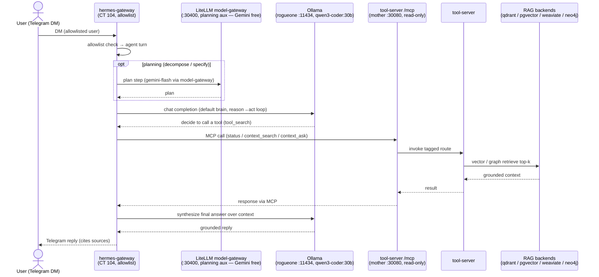

# Flow (E2E) — Agent: Telegram DM → Hermes → LiteLLM plan / Ollama → MCP → tool-server → RAG → reply

Cross-system thread grounded in the Hermes runbook ([../runbooks/agent-hermes.md](../runbooks/agent-hermes.md))
and [flow-agent-mcp](flow-agent-mcp.md): an inbound Telegram DM drives a Hermes agent turn — planning aux lanes
hit the LiteLLM model-gateway (Gemini free), the default brain is local `qwen3-coder` on Ollama (rogueone), and
the system-view is the read-only MCP mount on the tool-server, which fans out to the RAG backends. Demo:
[../demos/agent-e2e.md](../demos/agent-e2e.md).

**Seams made explicit:** the gateway is the front door (headless systemd, polling — no public webhook); the
planning aux lanes are pinned to the LiteLLM model-gateway while the executing brain stays local Ollama; `/mcp` is
**read-only** (act tools live on the separate `/mcp-act` mount, Hermes-only). First turn after a (re)start
cold-prefills the ~17K base prompt (~3.5 min); warm turns are ~6-17 s.
