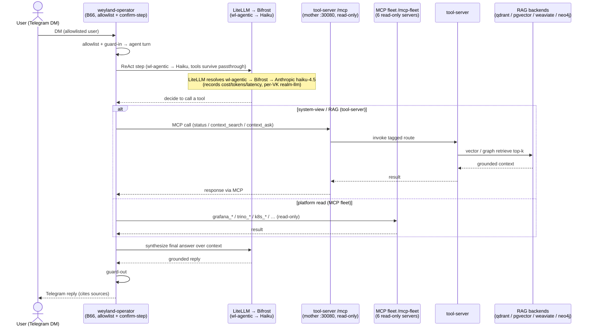

# Flow (E2E) — Operator: Telegram DM → weyland-operator → LiteLLM→Bifrost (Haiku) → MCP / fleet → tool-server → RAG → reply

Cross-system thread grounded in the operator runbook ([../runbooks/operator.md](../runbooks/operator.md))
and [flow-agent-mcp](flow-agent-mcp.md): an inbound Telegram DM drives a **weyland-operator** (B66) turn — the
tool-calling brain is **Haiku** via the `wl-agentic` lane (LiteLLM → Bifrost, a transparent passthrough so tool
schemas survive), and the system-view is the read-only MCP mount on the tool-server (which fans out to the RAG
backends) plus the composed **MCP fleet** (`/mcp-fleet`). Demo: [../demos/operator.md](../demos/operator.md).

**Seams made explicit:** the operator pod is the front door (Telegram long-poll — no public webhook); the
tool-calling brain runs through the **`wl-agentic`** lane (LiteLLM → Bifrost → Haiku, a transparent passthrough so
tool schemas survive — the MLflow AI Gateway would shred them), while the local Ollama lanes (`wl-rag`/`reason`/
`judge`) stay direct to rogueone; `/mcp` is **read-only** (act tools live on the separate `/mcp-act` mount,
operator-only, fronted by the **live B17+B19 MCP gateway** with a Keycloak-verified actor). The operator can also
**`delegate_to_realm`** — an A2A hand-off to the Realm of Agents (Gná → 24 corpus-backed specialists).
