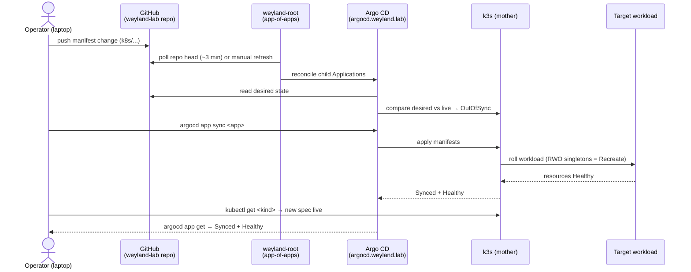

# Flow (E2E) — Deploy: git push → Argo sync → rollout → verify

Cross-system thread of [flow-deploy](flow-deploy.md) and the [deploy](../demos/deploy.md) demo, followed straight
through: a manifest edit becomes a live, verified workload. Argo is pull-based (polls ~3 min, LAN-safe — no
inbound webhook). Demo: [../demos/deploy-e2e.md](../demos/deploy-e2e.md).

**One lane, one flow:** this is the k8s GitOps path only. The image build→runtime handoff (rsync +
`docker save | k3s ctr images import`) is the sibling flow noted in [deploy](../demos/deploy.md) — a manifest
reconcile does not rebuild images. Adoption syncs land on metadata (tracking-id annotation) and do not restart
pods; spec changes roll per the app's strategy.
