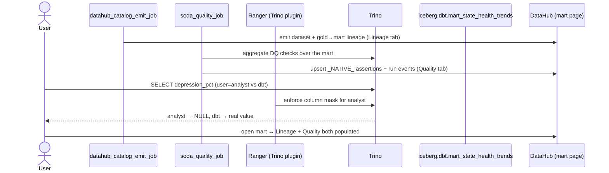

# Flow — Governance end-to-end (lineage + DQ verdict + masking on one dataset)

One dataset — the health mart `iceberg.dbt.mart_state_health_trends` — visibly accrues all three L5 governance
surfaces at once: **lineage** (DataHub catalogs the mart with its gold→mart edges via `datahub_catalog_emit_job`,
see [../demos/catalog-emit.md](../demos/catalog-emit.md)); a **DQ verdict** (Soda
scans the published mart and lands pass/fail as a DataHub `_NATIVE_` Assertion, [flow-e2e-soda.md](flow-e2e-soda.md));
and a **masking policy** (Ranger masks the governed column `depression_pct`, provable with a masked-vs-unmasked
Trino query, [flow-e2e-ranger.md](flow-e2e-ranger.md)). This is a **stitch**, not new mechanism — the point is
that one and the same dataset carries lineage, a quality verdict, and an access policy simultaneously, and the
first two are visible together on the mart's DataHub page while the mask's real-world effect shows in the Trino
query. See [../demos/governance-e2e.md](../demos/governance-e2e.md).

## Sequence

All three legs are non-destructive to the mart (catalog emit and Soda assertions are idempotent upserts; the
Ranger proof is two read-only SELECTs). Net: one dataset simultaneously carrying **lineage + a quality verdict +
an enforced access policy** — the L5 governance layer working as a whole, not three disconnected features.
