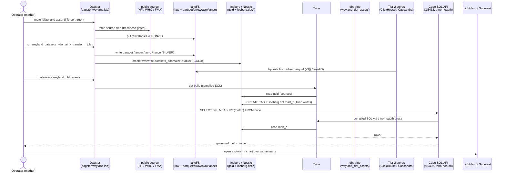

# Flow (E2E) — Lakehouse: land → silver → Iceberg gold → dbt marts → BI

Cross-system thread of three validated component flows —
[flow-datasets-lakehouse](flow-datasets-lakehouse.md) → [flow-flink](flow-flink.md)'s sibling
[dbt] → [flow-semantic-consumption](flow-semantic-consumption.md) — plus the Tier-2 hydration fan-out off
silver. One dataset walked bronze → silver → gold → tested marts → governed metric. Demo:
[../demos/lakehouse-e2e.md](../demos/lakehouse-e2e.md).

**Seams made explicit:** land/transform own bronze→silver→gold ([datasets-lakehouse](../demos/datasets-lakehouse.md));
dbt owns gold→marts, Trino does the writing ([dbt](../demos/dbt.md)); Cube/MetricFlow/Lightdash/Superset serve the
marts as metrics-defined-once ([semantic-consumption](../demos/semantic-consumption.md)). Tier-2 stores read the
**same silver parquet** in parallel — an independent consumer, not a step in the mart chain.
